# goal of this course

- provide a common foundation in software engineering for students from various backgrounds
- provide a shared terminology to be able to work seamlessly with software developers
- introduce the fundamentals of modern software development methodologies and life cycle models
    - with focusing in details on Scrum and Kanban
- introduce **requirements analysis** and **software modelling**
    - both in theory and in practice
- provide an insight to code quality, code review, testing and automation


## practise

- during the practical classes, the students explore and document the requirements of a software system
    - using **user story mapping** in accordance with the agile principles
- then, during the second half of the semester, they design its architecture
    - using the **C4 model**, which is a set of hierarchical diagrams describing the architecture of a software system
- the practical classes are **workshops** in which the **students work in teams**
    - under an instructor's guidance, and can have immediate feedback on the project assignment


# schedule {visibility=hidden}

|week| date       | lecture                                  | practical class       |
|---:|-----------:|:----------------------------------------:|:---------------------:|
|  1 | 2026-09-16 | intro, software architecture             | project assignment    |
|  2 | 2026-09-23 | SDLC, scrum, kanban                      | informal R.A.         |
|  3 | 2026-09-30 | requirements analysis, user story mapping| formal R.A., workshop |
|  4 | 2026-10-07 | UML, C4                                  | project workshop      |
|  5 | 2026-10-14 | design patterns                          | project workshop      |
|  6 | 2026-10-21 | interfaces, implementation planning      | **req. analysis demo**|
|  7 | 2026-10-28 | **school holiday**                       |                       |
|  8 | 2026-11-04 | wireframing, clean code                  | project workshop      |
|  9 | 2026-11-11 | code quality, code review                | project workshop      |
| 10 | 2026-11-18 | testing, legacy code                     | project workshop      |
| 11 | 2026-11-25 | CI, automatization, devops               | project workshop      |
| 12 | 2026-12-02 | summary                                  | project workshop      |
| 13 | 2026-12-09 | **midterm**                              | **design demo**       |
<!-- | 14 | 2026-12-17 | no planned lecture                       |                       | -->


# schedule {.exclude-header}

::: {.exclude}
|week| date       | lecture                                  | practical class       |
|---:|-----------:|:----------------------------:|:---------------------:|
|  1 | 2026-09-16 | intro, software architecture             | project assignment    |
|  2 | 2026-09-23 | SDLC, scrum, kanban                      | informal R.A.         |
|  3 | 2026-09-30 | requirements analysis, user story mapping| formal R.A., workshop |
|  4 | 2026-10-07 | UML, C4                                  | project workshop      |
|  5 | 2026-10-14 | design patterns                          | project workshop      |
|  6 | 2026-10-21 | interfaces, implementation planning      | **req. analysis demo**|
|  7 | 2026-10-28 | **school holiday**                       |                       |

:::

## schedule {.exclude-header}

::: {.exclude}
|week| date       | lecture                                  | practical class       |
|---:|-----------:|:----------------------------:|:---------------------:|
|  8 | 2026-11-04 | wireframing, clean code                  | project workshop      |
|  9 | 2026-11-11 | code quality, code review                | project workshop      |
| 10 | 2026-11-18 | testing, legacy code                     | project workshop      |
| 11 | 2026-11-25 | CI, automatization, devops               | project workshop      |
| 12 | 2026-12-02 | summary                                  | project workshop      |
| 13 | 2026-12-09 | **midterm**                              | **design demo**       |

:::


# evaluation

::: {.r-fit-text}
round(requirements analysis (35%) + design (35%) + midterm (30%))
:::

:::::::::::: {.columns .mt-4}
::::::::: {.column width="60%"}
- requirements analysis, software design: **team work**
    - the team will get the same grades
- midterm: **individual**
    - Moodle test
    - 50 random multiple-choice questions<br>(1 point each)
    - scores to grade conversion in the table
- each part should reach passing grade (2)

:::::::::
::::::::: {.column width="40%"}

|score    |grade|
|--------:|:---:|
|    0-29 |  1  |
|   30-34 |  2  |
|   35-39 |  3  |
|   40-44 |  4  |
|   45-50 |  5  |

:::::::::
::::::::::::

::: notes
The groups submit their requirement analysis and the software design as a set of diagrams (user story map, C4, etc.) and text.
Both the requirement analysis and the software design represent 35% of the overall grade, and the individual midterm provides 30%. 
The midterm consists of 50 multiple-choice questions, with a total of 50 points available. The conversion of exam points to grades is as follows:
:::


# materials {.exclude-header}

:::::::::::: {.columns .exclude}
::::::::: {.column width="60%" .mt-3}
- available online in two formats
    - handout
    - presentation
- [pintergreg.github.io/software-engineering](https://pintergreg.github.io/software-engineering/)
- also uploaded to Moodle as PDFs

:::::::::
::::::::: {.column width="40%"}


:::::::::
::::::::::::

# tools

:::::::::::: {.columns}
::::::::: {.column width="70%"}
- diagram drawing: 
    - [draw.io](https://app.diagrams.net/)
    - [Google Drawings](https://docs.google.com/drawings)
    - [user story map template for Google Sheets](https://www.avion.io/blog/user-story-mapping-template/)
        - probably the least effort
    - [plantuml](https://plantuml.com/)
- whiteboard:
    - [excalidraw](https://excalidraw.com/)
- kanban board
    - [Trello](https://trello.com/)
- code hosting / task management
    - [GitHub](https://github.com/)
    - [you won't really need code hosting for this course]{.text-smaller}

:::::::::
::::::::: {.column width="30%" .exclude}


:::::::::
:::::::::::: 
    
# program vs. software

:::::::::::: {.columns .column-gapless}
::::::::: {.column width="75%"}
> A computer program is a sequence or set of instructions in a programming language for a computer to execute.
> It is one component of software, which also includes documentation and other intangible components.
>
> ISO/IEC 2382:2015 via Wikipedia [@enwiki:1233276268]

:::::::::
::::::::: {.column width="25%"}
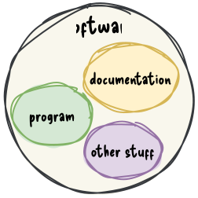

:::::::::
::::::::::::


## program is like a recipe

:::::::::::: {.columns}
::::::::: {.column width="50%"}
There is a metaphor saying that a program is like a recipe.

The computer follows the instructions of a program as the cook follows the instruction in a recipe.

Consequently programming is like creating a recipe.

:::::::::
::::::::: {.column width="50%" .fragment}

```python
for i in range(1, 101):
    if i % 15 == 0:
        print("" + "FizzBuzz")
    elif i % 3 == 0:
        print("" + "Fizz")
    elif i % 5 == 0:
        print("" + "Buzz")
    else:
        print(i)
```

:::::::::
::::::::::::

::: notes
It is easy to read this code snippet and figure out what it does, but constructing an algorithm might be more complicated.

It contains a loop going from 1 to 100 (ranges are not closed in Python, so 101 is excluded and the range step is 1 by default).
If the loop variable is dividable by 15, "FizzBuzz" is printed to the screen.
If it is only dividable by 3 "Fizz" is printed, if only by 5 "Buzz" is printed.
In any other cases the number id printed.


> Writing a computer program requires a nuanced understanding of the problem being solved by the computer program, pros and cons of various approaches, etc.
> It also requires the knowledge and expertise to describe those steps in a manner amenable to execution by a computer.
>
> [Jeff Rabinowitz](https://justabloginthepark.com/2016/01/09/how-programming-is-like-cooking/)

:::


# programming vs. software development

:::::::::::: {.columns}
::::::::: {.column width="50%"}
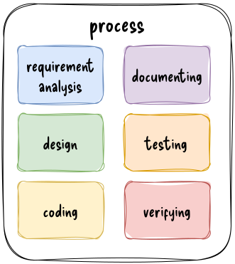{width=400}

:::::::::
::::::::: {.column width="50%" .mt-5}
- does that mean a program is not 
    - planned
    - documented
    - tested
    - verified?
- the main difference is the formality of the process
    - which correlates the complexity of the project

:::::::::
::::::::::::

::: notes
A program code is only a part of a software.
Programming is more or less a synonym to coding.

As a software is more than just the code, software development is more than just coding/programming.
The work is planned, documented, tested, verified, and framed by a process.

If programming is like creating a recipe, software development is more like running a restaurant.
One should come up with recipes, cook the food, but the restaurant also needs constant ingredient logistics and preparation, food serving, marketing, cleaning etc.

:::

## {visibility=hidden}

> Software development is about translating a problem into a solution that a computer can understand and automatically resolve. Preferably in a secure and scalable way.
>
> -- Frederick Vanbrabant

# software engineering in the age of ~~AI~~ LLM

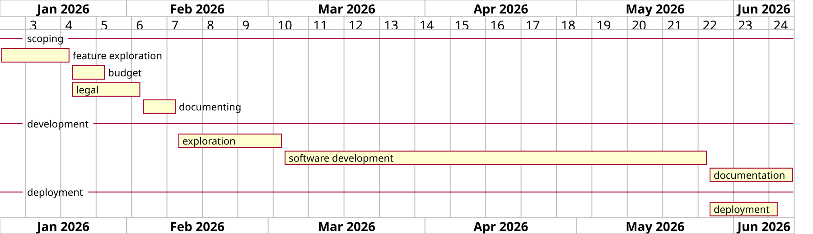

- if your task was to improve project throughput, your first stop would be _software development_
- because that takes the most amount of time

    
## software engineering in the age of ~~AI~~ LLM / 2

:::::::::::: {.columns}
::::::::: {.column width="50%"}
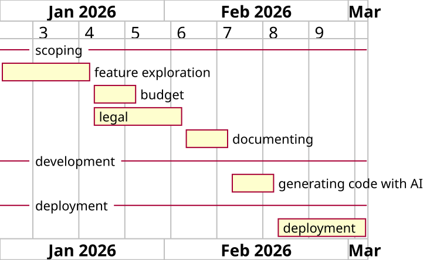

:::::::::
::::::::: {.column width="50%"}
::: {.text-larger}
expectation: AI's going to make it so much faster
:::

::: {.wide-quote .mt-2}
> Every software developer knows that you can’t make projects go faster just by typing faster. If that were the case we would all be taking typing lessons.
>
> [[Frederick Vanbrabant]{.text-smaller}](https://frederickvanbrabant.com/blog/2026-05-15-i-dont-think-ai-will-make-your-processes-go-faster/)
:::

:::::::::
::::::::::::

## software is made between commits

:::::::::::: {.columns}
::::::::: {.column width="75%" .mt-3}
- coding got cheap^*^ with coding agents
    - [^*^price is increasing though]{.text-smaller}
- but coding wasn't the difficult part
    - comprehension and coordination are
- to translate a problem into a solution that a computer can understand, you need a full overview of the problem
    - e.g., with constant iteration with the domain experts <!--(more agile)-->
    - this is often the part that slows down software development

:::::::::
::::::::: {.column width="25%"}


:::::::::
::::::::::::

:::{.text-smaller}
source/reading: [I don't think AI will make your processes go faster](https://frederickvanbrabant.com/blog/2026-05-15-i-dont-think-ai-will-make-your-processes-go-faster/) by Frederick Vanbrabant
:::

## coding agents generate code based on specification

which can get performing a requirement analysis

> What software developers have been begging for since the beginning of the profession: Receiving a detailed outline of the problem and what the end result should look like.
>
> [Frederick Vanbrabant](https://frederickvanbrabant.com/blog/2026-05-15-i-dont-think-ai-will-make-your-processes-go-faster/)

## from today, is software engineering dead?

:::::::::::: {.columns}
::::::::: {.column width="70%"}
::: {.wide-quote}
> From today, painting is dead.
>
> [-- Paul Delaroche, French painter]{.text-smaller}

:::
:::{.text-smaller .mt-2}
- photography didn’t kill painting,
    -  just changed what painting was for 
- nowadays, having cameras in smartphones doesn't make everyone a photographer
- although one doesn't need a photographer to take a photo
- LLMs will change software engineering but won't replace it
    - age of personal software?
    - [software for one](https://www.ajwaxman.com/writing/software-for-one) by Adam Waxman
- painting remained as an art, see software craftmanship
:::
:::::::::
::::::::: {.column width="30%"}


:::::::::
::::::::::::

:::{.text-smaller}
readings: [From Today, Software Engineering is Dead](https://building138.com/from-today-software-engineering-is-dead) by Russell Jennings
:::


# software development is like building a house

:::::::::::: {.columns}
::::::::: {.column width="65%"}
- the software development is often compared to house building
    - which is more like a sequential process
- after the planning (including building permit, budget, etc.), the foundation is built first, then walls and the roof
    - these phases cannot be swapped
- after the construction is finished, the contractor leaves the site
:::::::::
::::::::: {.column width="35%"}
 | public domain](figures/borrowed/sample_floorplan.jpg)

:::::::::
::::::::::::

::: {.fragment .text-size-3}
maintenance?
:::

## software development *not* is like building a house

a software does not have to obey the laws of physics

- in software development you can start with the door of the second floor bathroom
- the size of a room can be changed during the construction -- even several times


# software development is like gardening

::: {.text-smaller}
based on Software Architecture Metaphors by Lisa Stähli [@stahli2021software]
:::

:::::::::::: {.columns .fragment}
::::::::: {.column width="37%" .mt-4}
- a garden needs to be taken care of constantly
- without attention the garden will decay
:::::::::
::::::::: {.column width="35%" .mt-4}
- maintenance is part of software development
- software rots
:::::::::
::::::::: {.column width="28%"}


:::::::::
::::::::::::

::: notes
Another famous metaphor is the gardening.
The most important aspect of the gardening is that a garden needs to be taken care of constantly.
Without attention the garden will decay, which is also true for the software; the software can rot.

There are two types of software rot: dormant rot and active rot.
:::

## what is software rot?

::: {.wide-quote}
> Software rot (or software entropy) is the degradation, deterioration, or loss of the use or performance of software over time [@enwiki:1236668404]. 

:::

:::::::::::: {.columns .mt-2}
::::::::: {.column width="50%"}
**dormant rot**: the software in question is not changed, but as the environment evolves, it eventually becomes dysfunctional

:::::: {.fragment data-fragment-index=1 .mt-3}
::::: {.columns}
:::: {.column width="50%" .text-smaller}
Muni metro's control software is still loaded from floppy disks [@harding2024san]

::::
:::: {.column width="50%"}
{width=200}

::::
:::::
::::::
:::::::::
::::::::: {.column width="50%"}
::: {.fragment data-fragment-index=1}
 [CC BY-NC 2.0](https://creativecommons.org/licenses/by-nc/2.0/)](figures/borrowed/muni_metro.jpg){width=450}

:::
:::::::::
::::::::::::


::: notes
Environment change can be either software or hardware.
The operating system, a software framework or even a hardware can be outdated to

The photo shows the San Fransico Muni metro, which still uses floppy disks to load its Automatic Train Control System every morning.
It is planned to replace by the end of the decade.
The system works without any problems, but the risk of failure is getting higher. [@harding2024san]

:::

## what is software rot? {.exclude-header}

:::::::::::: {.columns}
::::::::: {.column width="50%"}
**active rot**

- the software has undergone constant modifications but gradually loses its integrity
- the constant updates / bug fixing can lead to an evolution process,
    - which makes the program deviate from its original design, 
    - even introducing newer bugs

:::::::::
::::::::: {.column width="50%"}
](figures/borrowed/xkcd/code_lifespan_2x.png)

:::::::::
::::::::::::

::: notes
It is said that nothing is more permanent than a temporary fix.
A quick fix often ignores the architectural design, not documented properly, thus contributes to the software rot.

A change in a production system should be properly planned in every possible details.
For example, because it can have side effects, or can affect the architecture.
Also, the documentation needs to be updated. Both documentations actually since there is a development documentation, that should contain information about the system for the developers and a user documentation (manual) for the operators of the system.

:::

## software development is like gardening - cont.

::: {.text-smaller}
based on Software Architecture Metaphors by Lisa Stähli [@stahli2021software]
:::

:::::::::::: {.columns .mt-3}
::::::::: {.column width="50%"}
- external factors like weather, pests, weeds can influence the garden
:::::::::
::::::::: {.column width="50%"}
- change in user requirements, and the external dependencies such as frameworks, libraries, etc. can affect the software
:::::::::

::::::::::::


::: notes
Another similarity to gardening is that external factors can influence the software.
:::

## software development is like gardening - cont. {.exclude-header}

::: {.text-smaller}
based on Software Architecture Metaphors by Lisa Stähli [@stahli2021software]
:::

:::::::::::: {.columns}
::::::::: {.column width="50%"}
- gardeners has a set of tools, selected for the characteristics of the garden and the gardener
- a beautiful garden is a piece of art
    - which can also serve a function, like producing vegetables / fruits
:::::::::
::::::::: {.column width="50%"}
- software developer also uses tools chosen according to the environment and type of software 
<!--     -  e.g., to automate processes -->
- software is a piece of art, e.g., the UI has to be not just functional, but aesthetic and ergonomic
    - software code/design is also a piece of art; see software craftmanship (later)
:::::::::
::::::::::::


# how big are softwares?

software is often measured by the source lines of code

::: {.wide-quote}
> A line of code (LOC) is any line of text in a code that is not a comment or blank line.
>
> -- [Lines of Code (LOC) in Software Engineering](https://www.geeksforgeeks.org/software-engineering/lines-of-code-loc-in-software-engineering/)

:::

:::::::::::: {.columns .mt-3}
::::::::: {.column width="30%"}
2 lines (Python)

```python
for i in range(10):
    print(i)

```

:::::::::
::::::::: {.column width="30%"}
3 lines (Ruby)

```ruby
for i in 0..9 do
   puts i
end
```

:::::::::
::::::::: {.column width="30%"}
1 line (Ruby)

```ruby
# print numbers from 0 to 9
(0..9).each {|i| puts i}
```

:::::::::
::::::::::::


## how big are softwares?

software is often measured by the source lines of code

<!--- Vanilla Music Player for Android (1.3.2): 48 thousand lines of code (LOC)
- VLC for Android (3.6.5): 264 thousand LOC-->
<!--- Joplin 3.3.13 (note taking app): 1 million lines of code
    - sync capabilities-->

|app                                 |version   |LOC (million)|
|:-----------------------------------|---------:|------------:|
|Vanilla Music Player for Android    |     1.3.2|        0.048|
|VLC for Android                     |     3.6.5|        0.265|
|Telegram for Android (messaging app)|   11.14.1|        6.6  |
|GCC (compiler)                      |      15.1|       15    |
|Firefox (web browser)               |       142|       45    |
|Windows [@quill2024how]             |        10|       50    |
|Linux (kernel)                      |      6.16|       40    |

table: [measurements made with [tokei](https://github.com/XAMPPRocky/tokei), the whole repo is counted]{.text-smaller}

:::{.text-smaller .mt-3}
further read [about size of software](https://interestingengineering.com/lists/whats-the-biggest-software-package-by-lines-of-code) by Christopher McFadden
:::

::: notes
Microsoft does not disclose the actual value, the codebase size of Windows is only a estimation [@quill2024how]. 
:::

## software growth

number of lines of code is increasing

<!--- Windows 10: 50 million (estimated) [@quill2024how]
    - 3 million for the kernel
- Linux 6.16 (kernel): 40 million [LOC]{.tooltip title="lines of code"}
    - [18.8 million C code lines]{.text-smaller}
    - [2.8 M C comment and 3.6 M blank lines]{.text-smaller}
    - monolithic architecture

::: {.fragment}
- web browser (Firefox): 45+ million [LOC]{.tooltip title="lines of code"}
    - [a modern browser has the complexity of an OS]{.text-smaller}
- compiler (GCC): 15+ million [LOC]{.tooltip title="lines of code"}
:::-->

:::::::::::: {.columns}
::::::::: {.column width="50%"}
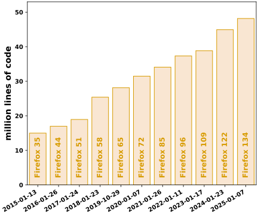

:::::::::
::::::::: {.column width="50%" .fragment}
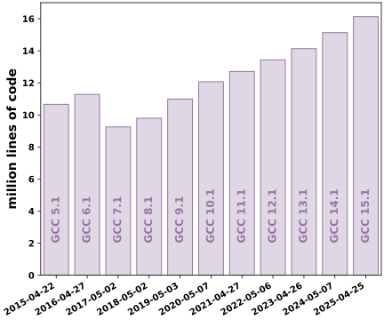

:::::::::
::::::::::::

::: {.text-smaller .mt-2}
[infographic](https://informationisbeautiful.net/visualizations/million-lines-of-code/) about codebase growth
:::


## why does software grow?

::: {.fragment .r-fit-text}
because we want<br> more and more functionality
:::

<!-- Linux kernel is estimated to have over 450k functions (v5.7) according to project lead developer Greg Kroah-Hartman  -->


## software growth -- aircrafts

:::::::::::: {.columns}
::::::::: {.column width="50%"}
::: {.wide-quote .mt-4}
> 24 million lines of code -- operational and support -- needed for the F-35 to be fully operational; when the program started, the estimated number of lines of code required was closer to 15 million
>
> -- Robert N. Charette, F-35 Program Continues to Struggle with Software [@charette2012f35]

:::
:::::::::
::::::::: {.column width="50%"}
![Increasing functionality implemented by software, reproduction of Figure 2.5 of [@firesmith2008method]](figures/increasing_functionality_by_software.drawio.svg)

:::::::::
::::::::::::

::: notes

:::

## software growth -- car industry

:::::::::::: {.columns}
::::::::: {.column width="55%"}
- 1981, GM was using microprocessor-based engine controls executing about 50 000 lines of code [@charette2009this]
- even low-end cars now [*2009*] have 30 to 50 electronic control units (ECUs)
    - that means these cars "execute" tens of millions of lines of software code that control everything from your brakes to your radio volume [@charette2009this]
- in a modern car [*2023*], you can expect to find 50 to over 100 ECUs [@walker2023how]
- for hybrids, the amount of software required for engine control is almost double that of a standard car [@charette2009this]

<!--::: {.text-smaller}
source: [This Car Runs on Code](https://spectrum.ieee.org/this-car-runs-on-code) [@charette2009this]

:::-->

:::::::::
::::::::: {.column width="45%"}
![electronics systems of total car cost [@charette2021how]](figures/es_as_total_car_cost.drawio.svg)

:::::::::
::::::::::::


# measuring code lines?

::: {.text-smaller}
source: [www.folklore.org](https://www.folklore.org/Negative_2000_Lines_Of_Code.html) by Andy Hertzfeld | [CC-BY-NC](https://creativecommons.org/licenses/by-nc/1.0/)
:::

:::::::::::: {.columns}
::::::::: {.column width="65%"}
- in 1982, some managers of the Lisa team decided to track each developer's weekly code output
    - [developers had to report every Friday the number of LOC they wrote that week]{.text-smaller}
- Bill Atkinson was working on optimizing Quickdraw's region calculation at that time, and he had completely rewritten the region engine using a simpler, more general algorithm, which got almost **six times faster**
    - [as a by-product, the rewrite saved about 2000 LOC]{.fragment data-fragment-index=1 .text-smaller}
- [that week's output, in terms of lines, was -2000]{.fragment data-fragment-index=1}

:::::::::
::::::::: {.column width="35%"}
 <br> [CC-BY-SA](https://creativecommons.org/licenses/by-sa/4.0/deed.en)](figures/borrowed/Apple-lisa-1.jpg)

[Quickdraw: 2D graphics library]{.text-smaller}
:::::::::
::::::::::::


## the more, the better?

> if we wish to count lines of code, we should not regard them as "lines produced" but as "lines spent"
>
> E. W. Dijkstra [EWD 1036](https://www.cs.utexas.edu/users/EWD/transcriptions/EWD10xx/EWD1036.html)

::: {.fragment}
> Every line of code written comes at a price: maintenance. To avoid paying for a lot of code, we build reusable software. The problem with code re-use is that it gets in the way of changing your mind later on.
>
> tef - [Write code that is easy to delete, not easy to extend](https://programmingisterrible.com/post/139222674273/write-code-that-is-easy-to-delete-not-easy-to)

:::

::: notes
Some people may consider the code as the product.
In this regard, more lines of code means more product.
If you write more code you work better, which is not true.
You should work smarter, not harder.

As Dijkstra said, lines should considered an expense, which you want to minimize, not maximize.
More code means more plants in your garden to take care of.
It requires more resources, but at the same time it also increases complexity.
:::

## keep it simple

::: {.wide-quote}
> We don't add stuff "just because we can". We need to have a damn good reason for it. 
>
> -- [Linus Torvalds](https://lore.kernel.org/all/CAHk-=wiGk+1eNy4Vk6QsEgM=Ru3jE40qrDwgq_CSKgqwLgMdRg@mail.gmail.com/)

:::

::: {.wide-quote .fragment .mt-1}
> A designer knows he has achieved perfection not when there is nothing left to add, but when there is nothing left to take away.
>
> -- [Antoine de Saint-Exupéry](https://en.wikiquote.org/wiki/Antoine_de_Saint_Exup%C3%A9ry) (29 June 1900 – 31 July 1944)

:::

::: {.fragment .mt-2}
- KISS, an acronym for "Keep it simple, stupid!"
    - a variations: keep it stupidly simple
    - the acronym got popular in the 70s
:::

::: notes
<!-- According to Saint-Exupéry (who was the author of The Little Prince by the way) -->

The design, the code should be kept as simple as possible.
When you want to simplify a design, keep only those parts that are absolutely necessary to get the job done.

And it is nothing new.
There is a concept in philosophy, called Occam's razor, which is the problem-solving principle that recommends searching for explanations constructed with the smallest possible set of elements.
Attributed to William of Ockham, a 14th-century English philosopher and theologian.
The principle is sometimes paraphrased as "of two competing theories, the simpler explanation of an entity is to be preferred." [@enwiki:1305790618]
:::

## Zawinski's law of software envelopment

> Every program attempts to expand until it can read mail. Those programs which cannot so expand are replaced by ones which can.
>
> -- Jamie Zawinski

- programs experience pressure to evolve into toolkits and application platforms
- often interpreted as a comment on software bloat

## users only care about 20% of your application


- 80% of the users will only ever use about 20% of your application's features
- but not enough to implement only 20%
- because each user uses a different 20%

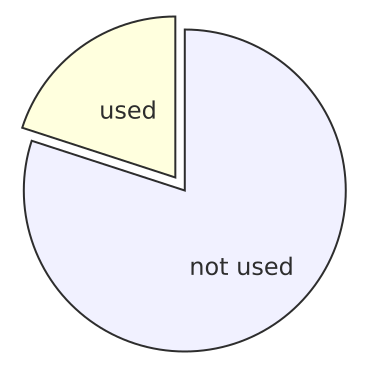{width=150}
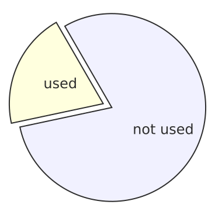{width=150}
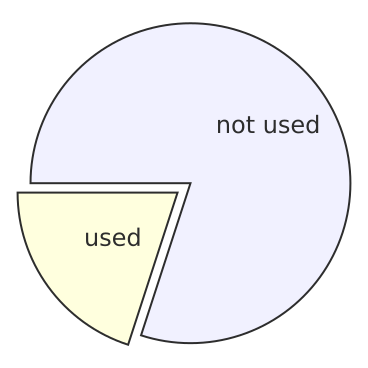{width=150}
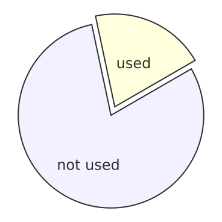{width=150}
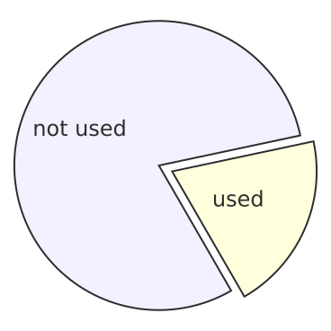{width=150}


::: {.text-smaller}
further reading: [Simplicity](https://www.joelonsoftware.com/2006/12/09/simplicity/) by Joel Spolsky,<br>[Users Only Care About 20% of Your Application](https://idiallo.com/blog/users-only-care-about-20-percent) by Ibrahim Diallo
:::

# Linux 5.8 -- 800,000 new lines of code

::: {.text-smaller}
> [Linux Torvalds](https://lore.kernel.org/lkml/CAHk-=whfuea587g8rh2DeLFFGYxiVuh-bzq22osJwz3q4SOfmA@mail.gmail.com/): despite not really having any single thing that stands out... 5.8 looks to be one of our biggest releases of all time

:::

- how is it manageable?
    - process
    - version control
- each change must do only one thing
    - proper documentation
- changes cannot break the software
    - rigorous and automated testing

::: {.text-smaller .mt-2}
a more technical read: [Why Linux’s biggest ever kernel release is really no big deal](https://www.linux.com/news/why-linuxs-biggest-ever-kernel-release-is-really-no-big-deal/)
:::

## version control

:::::::::::: {.columns}
::::::::: {.column width="55%" .mt-4}
- version control (a.k.a. revision control) is system for recording and managing changes made in files
- commonly used to manage source code
    - however, it can be used to tracking changes to any kind of files
- people often employ their own version control system, without realising it
:::::::::
::::::::: {.column width="45%"}
](figures/intuitive_version_tracking.svg)

:::::::::
::::::::::::

::: {.text-smaller .mt-3}
based on Simon Mutch's [Version Control materials](http://smutch.github.io/VersionControlTutorial/pages/0-intro.html)
:::

::: notes
[Simon Mutch | [CC BY-SA 3.0](https://creativecommons.org/licenses/by-sa/3.0/deed.en) | [source](https://gist.github.com/smutch/4951871)](figures/borrowed/vc-xkcd.jpg)

:::

## why you should use version control (for everything)

::: {.wide-quote}
> In practice, everything that has been created manually should be put in version control, including programs, original field observations, and the source files for papers.
>
> -- Best Practices for Scientific Computing; Wilson et al. 2012 ([arXiv:1210.0530](https://arxiv.org/abs/1210.0530))

:::

::: {.mt-5}
this presentation is under version control as well
:::

::: notes
Many services have some kind of version control built in. 
For example Google Docs or Microsoft Word also provides some level of version control.
:::


## benefits of version control systems

- generate backups
- separates experiments from the working version
    - branching, deployment strategies (much later in the course)
- keep history and track changes
    - traceability
- foster collaboration and contribution
    - team work

The current level of software complexity is not manageable without allowing many people to work on the same code base, and the separation of the development versions from the production one.
    
::: {.mt-3}
**later on the course**: the types and operation of version control systems
:::

# complexity

:::::::::::: {.columns}
::::::::: {.column width="70%" .mt-5}
- more functions mean more lines of code
- more lines of code increases the complexity
    - and the cost of maintenance
    
<!--::: {.r-fit-text .mt-2 .fragment}
how can we deal with the complexity?
:::-->

<!-- - software development processes to handle the complexity -->

:::::::::
::::::::: {.column width="30%"}


:::::::::
::::::::::::


## 

:::::::::::: {.columns}
::::::::: {.column width="50%"}
 by Randall Munroe | [CC&nbsp;BY-NC&nbsp;2.5](https://creativecommons.org/licenses/by-nc/2.5/)](figures/borrowed/xkcd/dependency_2x.png){width=350}

:::::::::
::::::::: {.column width="50%" .fragment}
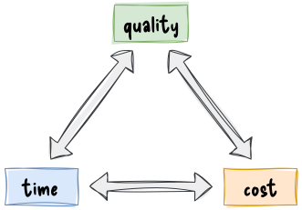

[if you want to deliver product fast, and the developer time is expensive, reuse components]{.text-smaller}

::: {.fragment}
is it possible to decrease the dependency stack?
:::
:::::::::
::::::::::::

## is it possible to decrease the dependency stack?

:::::::::::: {.columns}
::::::::: {.column width="50%"}
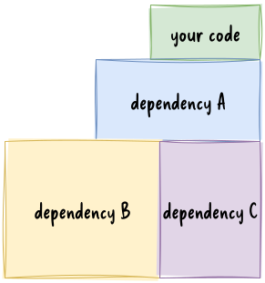

:::::::::
::::::::: {.column width="50%" .fragment}
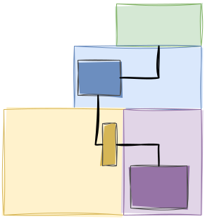

<!-- why don't you reimplement it? -->
:::::::::
::::::::::::

:::::: {.fragment}
::: {.r-fit-text}
choose your dependencies wisely
:::

which is actually an architecture decision
::::::

## dependencies for transposing a spreadsheet

:::::::::::: {.columns .text-smaller}
::::::::: {.column width="50%"}
|     |     |     |     |     |     |
|----:|----:|----:|----:|----:|----:|
|   1 |   2 |   3 |   4 |   5 |   6 |
|   7 |   8 |   9 |  10 |  11 |  12 |
|  13 |  14 |  15 |  16 |  17 |  18 |
|  19 |  20 |  21 |  22 |  23 |  24 |
|  25 |  26 |  27 |  28 |  29 |  30 |
|  31 |  32 |  33 |  34 |  35 |  36 |
|  37 |  38 |  39 |  40 |  41 |  42 |

:::::::::
::::::::: {.column width="50%"}
|     |     |     |     |     |     |     |
|----:|----:|----:|----:|----:|----:|----:|
|   1 |   7 |  13 |  19 |  25 |  31 |  37 |
|   2 |   8 |  14 |  20 |  26 |  32 |  38 |
|   3 |   9 |  15 |  21 |  27 |  33 |  39 |
|   4 |  10 |  16 |  22 |  28 |  34 |  40 |
|   5 |  11 |  17 |  23 |  29 |  35 |  41 |
|   6 |  12 |  18 |  24 |  30 |  36 |  42 |

:::::::::
::::::::::::


```python
import pandas as pd


def transpose_with_pandas(path: str) -> pd.DataFrame:
    df = pd.read_excel(path)
    return df.transpose()
```

8 dependencies: numpy, pandas, python-dateutil, pytz, six, tzdata, et-xmlfile, openpyxl


## dependencies for transposing a spreadsheet / 2

```python
import numpy as np
from openpyxl import load_workbook


def transpose_without_pandas(path: str) -> np.ndarray:
    wb = load_workbook(filename=path, read_only=True)
    arr = np.array(
        [[cell for cell in row] for row in wb.active.iter_rows(values_only=True)]
    )
    return np.transpose(arr)
```

3 dependencies: numpy, et-xmlfile, openpyxl


## dependencies for transposing a spreadsheet / 3

```python
from openpyxl import load_workbook


def transpose_without_numpy(path: str) -> list:
    wb = load_workbook(filename=path, read_only=True)
    sheet = wb["Sheet1"]

    mx = []
    for row in sheet.iter_rows(values_only=True):
        mx.append(list(row))

    # https://stackoverflow.com/a/6473724/4737417
    return list(map(list, zip(*mx)))
```

2 dependencies: et-xmlfile, openpyxl

dependencies are used only to open an XLSX spreadsheet, the transposition is achieved only using the standard library

not trivial to understand the `list(map(list, zip(*mx)))`,<br>read the explanation at [Stack Overflow](https://stackoverflow.com/a/6473724/4737417)

## why don't you reimplement it (from scratch)?

<!-- - what if you don't actually use everything from a dependency? -->

<!--:::::::::::: {.columns}
::::::::: {.column width="50%"}-->

trade-off between 

- implementation speed (or ease of coding) and the number of dependencies
- reading/understanding the code and the number of dependencies

::: {.mt-4 .text-smaller}
[advice:]{.text-color-lightblue} you don't want to reimplement datetime / timezone handling
:::
<!--
:::::::::
::::::::: {.column width="50%" .fragment}


:::::::::
::::::::::::-->

## how much code a developer write


:::::::::::: {.columns}
::::::::: {.column width="50%" .wide-quote}
Mythical man month: 10 lines per developer day [@brooks1974mythical]

:::{.text-smaller}
> Redis is composed of 100k lines of code, I wrote at least 70k of that in 10 years. [...] assuming I work 22 days every month for 11 months:
>
>    70000/(22*11*10) = ~29 LOC / day
>
> Which is not too far from 10 [...], so the Mythical Man Month book is indeed quite accurate.
>
> -- [Salvatore "antirez" Sanfilippo](https://news.ycombinator.com/item?id=22308360), creator of the Redis in-memory database

:::
:::::::::
::::::::: {.column width="50%" .text-smaller .mt-2}
|years of coding|avg. lines per day|lines per year|
|:-------------:|-----------------:|-------------:|
|           1-5 |              100 |       25,000 |
|          5-10 |               80 |       20,000 |
|         10-15 |               60 |       15,000 |
|         15-20 |               40 |       10,000 |
|           20+ |               20 |        5,000 |

table: how much code does a developer write? [@mcenery2020how]

:::::::::
::::::::::::

## reimplementation costs

:::::::::::: {.columns}
::::::::: {.column width="50%"}
[estimation by the Linux Foundation [@linuxfoundation2008linux]]{.text-smaller}

- Linux kernel (2008) 6.8 million LOC
- COnstructive COst MOdel (COCOMO) for cost estimation
- using 2008 US salaries: $1.4 billion
- development effort estimation exceeds 7500 Person-Years

::: {}
Linux 6.16 (released 2025-08-07) has about 40 million LOC
:::

:::::::::
::::::::: {.column width="50%" .text-smaller .mt-2}
|years of coding|avg. lines per day|lines per year|
|:-------------:|-----------------:|-------------:|
|           1-5 |              100 |       25,000 |
|          5-10 |               80 |       20,000 |
|         10-15 |               60 |       15,000 |
|         15-20 |               40 |       10,000 |
|           20+ |               20 |        5,000 |

table: how much code does a developer write? [@mcenery2020how]

:::::::::
::::::::::::

## recalculating reimplementation costs

- with Opus 4.5 and enabling Agent Teams, the average net lines added by Claude per commit is 1,000 lines of code per commit
- which is ~2 magnitudes higher than what a human programmer writes per day

:::{.text-smaller .mt-3}
source: [The Cathedral, the Bazaar, and the Winchester Mystery House](https://www.dbreunig.com/2026/03/26/winchester-mystery-house.html) by Drew Breunig
:::

:::{.r-fit-text .mt-2}
implementation costs are changing
:::

practically decreasing


# complexity classes

::: {.text-smaller}
> There are known knowns; there are things we know we know. We also know there are known unknowns; that is to say we know there are some things we do not know. But there are also unknown unknowns -- there are things we do not know we don't know.
>
> -- Donald Rumsfeld (13th & 21st United States Secretary of Defense)

:::

| complexity class | known | unknown | knowns | unknowns |
|:-----------------|-------|---------|--------|----------|
| simple           | ✓     | x       | ✓      | x        |
| complicated      | ✓     | x       | ✓      | ✓        |
| complex          | x     | ✓       | ✓      | x        |
| chaotic          | x     | ✓       | x      | ✓        |

[source: [@bykovski2020simple]]{.text-smaller}


## complexity classes

[from Michael Bykovski's essay [@bykovski2020simple]]{.text-smaller}

- in a simple system, we know the knowns, everything is predictable, it's easy to understand the system
- in a complicated system, we know the knowns and unknowns
    - it requires analysis to know the unknowns, but the system is measurable
    - it is the province of engineers, surgeons, intelligence analysts, lawyers, and other experts [@enwiki:1300921689]
- in a complex system, the knowns are unknown to us, but we are aware of our uncertainty
- a chaotic system is a system of unknown unknowns


## project complexity -- Cynefin framework

:::::::::::: {.columns}
::::::::: {.column width="45%" .text-smaller .mt-4}
- Cynefin framework is a conceptual framework used to aid decision-making
    - cynefin (/kəˈnɛvɪn/ kuh-NEV-in) is a Welsh word for 'habitat'
    - created by Dave Snowden
- defines five decision-making contexts or "domains"
    - [clear (aka simple)]{.text-smaller}
    - [complicated]{.text-smaller}
    - [complex]{.text-smaller}
    - [chaotic]{.text-smaller}
    - [confusion (or disorder)]{.text-smaller}
- you can read more on [Wikipedia](https://en.wikipedia.org/wiki/Cynefin_framework)
    
:::::::::
::::::::: {.column width="55%"}
 | [CC-BY-SA](https://creativecommons.org/licenses/by-sa/4.0/deed.en)](figures/borrowed/wikipedia/Cynefin_framework_2022.jpg)

:::::::::
::::::::::::


## project complexity

:::{.text-smaller}
Stacey matrix [@stacey2007strategic]
:::

:::::: {.r-stack}
::: {.exclude}
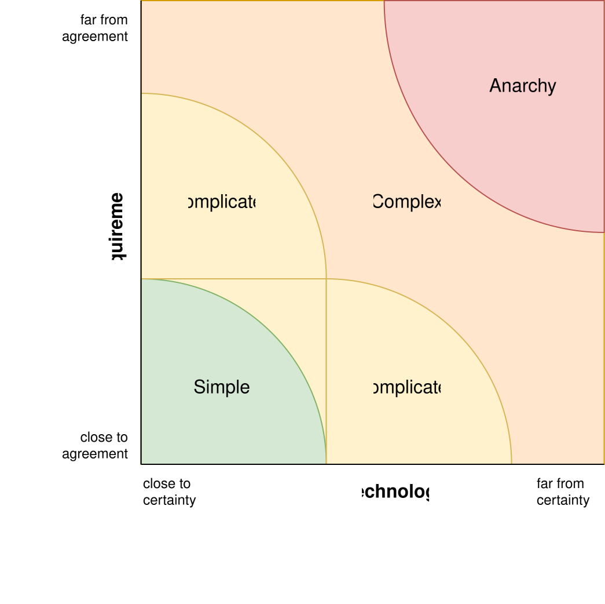{width=55%}
:::
::: {.fragment}
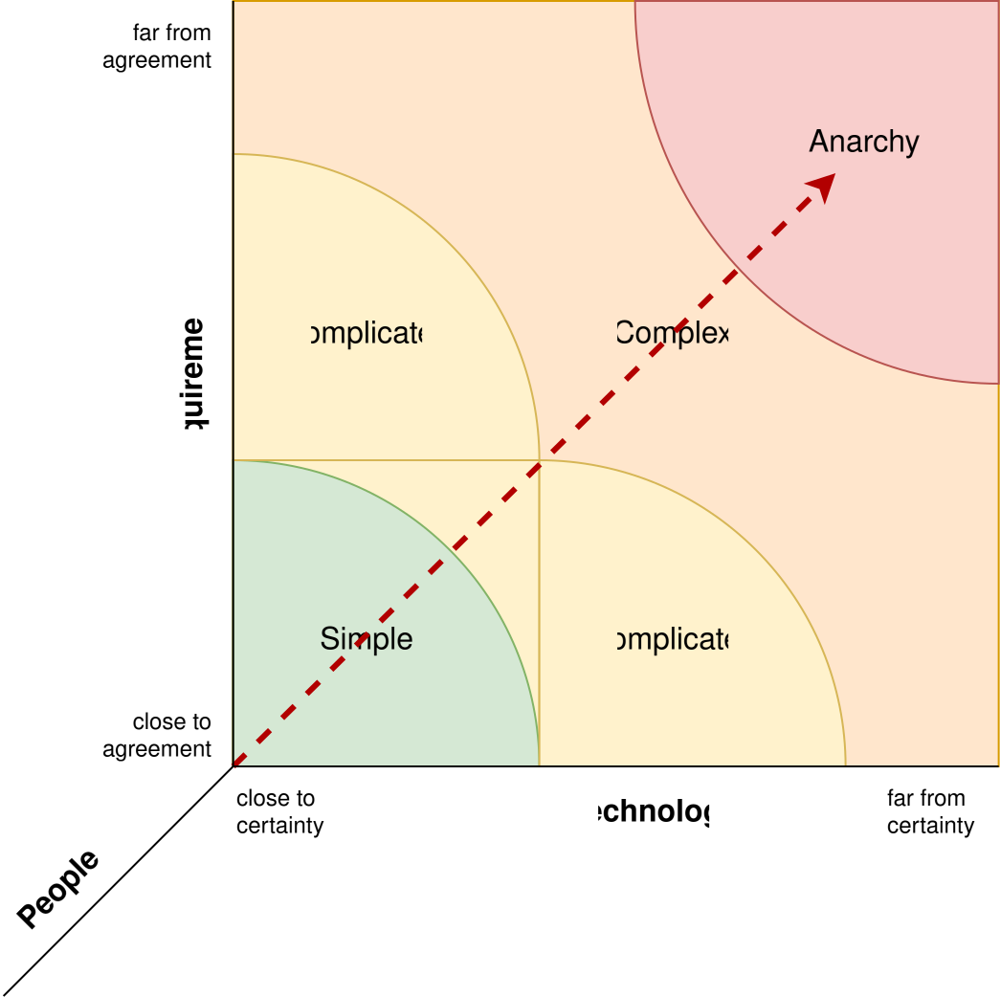{width=55%}
:::
::::::

::: notes
:::


# what is software architecture?

> "Architecture" is a term that lots of people try to define, with little agreement. There are two common elements: One is the highest-level breakdown of a system into its parts; the other, decisions that are hard to change.
>
> -- Martin Fowler - Patterns of Enterprise Application Architecture

##

> In most successful software projects, the expert developers working on that project have a shared understanding of the system design. This **shared understanding** is called ‘architecture’. This understanding includes how the system is divided into components and how the components interact through interfaces. These components are usually composed of smaller components, but the architecture only includes the components  and interfaces that are understood by all the developers.
> 
> Ralph Johnson, XP mailing list

## 

> All architecture is design but not all design is architecture. Architecture represents the significant **design decisions** that shape a system, where significant is measured by cost of change.
>
> -- Grady Booch

## so, architecture

:::::::::::: {.columns}
::::::::: {.column width="50%" .mt-3}
- represents design decisions
- shared understanding
- [the architecture decisions<br>have to be recorded]{ data-fragment-index=1}

<!--  -->

:::::::::
::::::::: {.column width="50%" .text-smaller  data-fragment-index=1}
#### architechture decision record

```markdown
# Title

## Status

What is the status, such as proposed, accepted,
rejected, deprecated, superseded, etc.?

## Context

What is the issue that we're seeing that is
motivating this decision or change?

## Decision

What is the change that we're proposing and/or doing?

## Consequences

What becomes easier or more difficult to do
because of this change?
```

::: {.text-small}
ADR template by Michael Nygard from [Documenting architecture decisions](http://thinkrelevance.com/blog/2011/11/15/documenting-architecture-decisions)
:::

:::::::::
::::::::::::


## what are these decisions?

::: {.text-smaller}
topologies, for example
:::

:::::::::::: {.columns}
::::::::: {.column width="30%"}
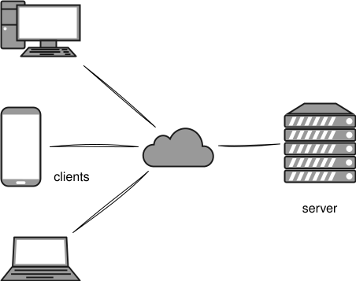

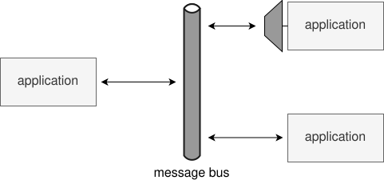

:::::::::
::::::::: {.column width="30%"}
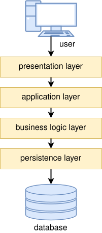

:::::::::
::::::::: {.column width="30%"}
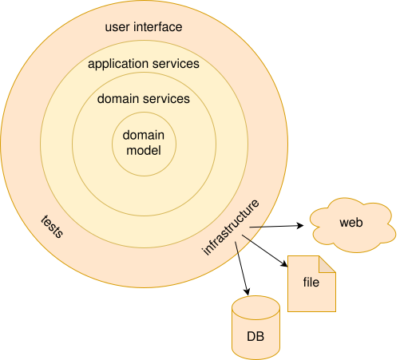

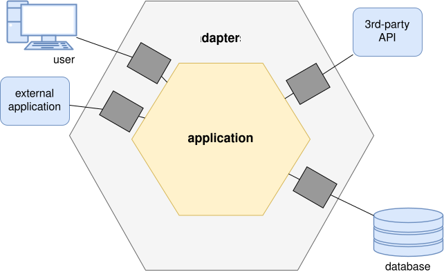

:::::::::
::::::::::::

::: {.text-small}
based on: [Introduction to Software Architecture](https://www.codeproject.com/Articles/1064240/Introduction-to-Software-Architecture)
:::

## 

::: {.wide-quote}
> Architecture is the decisions that you wish you could get right early in a project.
>
> -- Ralph Johnson

:::

![the rising costs of finding and fixing defects based on Figure 3.4 of [@ambler2002agile] (Ambler, 2002)](figures/cost_of_fixing.drawio.svg){height=200}

::: {.mt-2}
to do that, you need to know all the unknowns, so you need **requirements analysis**, and **learning** the new/unknown technology

:::

## design is compromise

> Compromise is neither good nor bad, it’s something we do every day. It’s decision making. Prioritizing. Deciding that one thing is more important than another. It’s finding the right balance between two competing desires.
>
> Which compromises you make   — that’s what matters. Choosing the right compromises is what defines good design.
>
> -- [Steph Ango](https://stephango.com/design-is-compromise)

## constructing a software design

> There are two ways of constructing a software design: 
>
> One way is to make it so simple that there are _obviously_ no deficiencies and 
> the other way is to make it so complicated that there are no _obvious_ deficiencies.
>
> The first method is far more difficult.
>
> -- C.A.R. Hoare [@hoare2007emperor]

::: {.text-smaller .mt-2}
see KISS philosophy...
:::

# summary: software engineering often compared to house building

:::::::::::: {.columns .column-gapless}
::::::::: {.column width="60%"}
- because it is an engineering discipline
- however software doesn't have to obey<br>the laws of physics
- software design should focus on the data structures and the connection between the modules
    - not the implementation details

:::::::::
::::::::: {.column width="40%"}
{width=250}
:::::::::
::::::::::::

## software development is more like gardening

:::::::::::: {.columns}
::::::::: {.column width="60%"}
- a garden might be planned
- external factors influence the result
    - weather, pests
- garden needs constant care to bloom
- sometimes also experimentation
    - methods, tools
- garden is like an art (with function)

:::::::::
::::::::: {.column width="40%"}
{width=250}
:::::::::
::::::::::::

## software growth

:::::::::::: {.columns}
::::::::: {.column width="60%"}
- number of lines of code is increasing
    - which increases complexity
- "every line of code written comes at a price: maintenance" [@tef2016write]
    - larger garden, more gardening
- software development processes to handle the complexity
    - the course focuses on requirement analysis and design 

:::::::::
::::::::: {.column width="40%"}
{width=250}
:::::::::
::::::::::::

# references

::: {#refs .text-smaller}
:::
