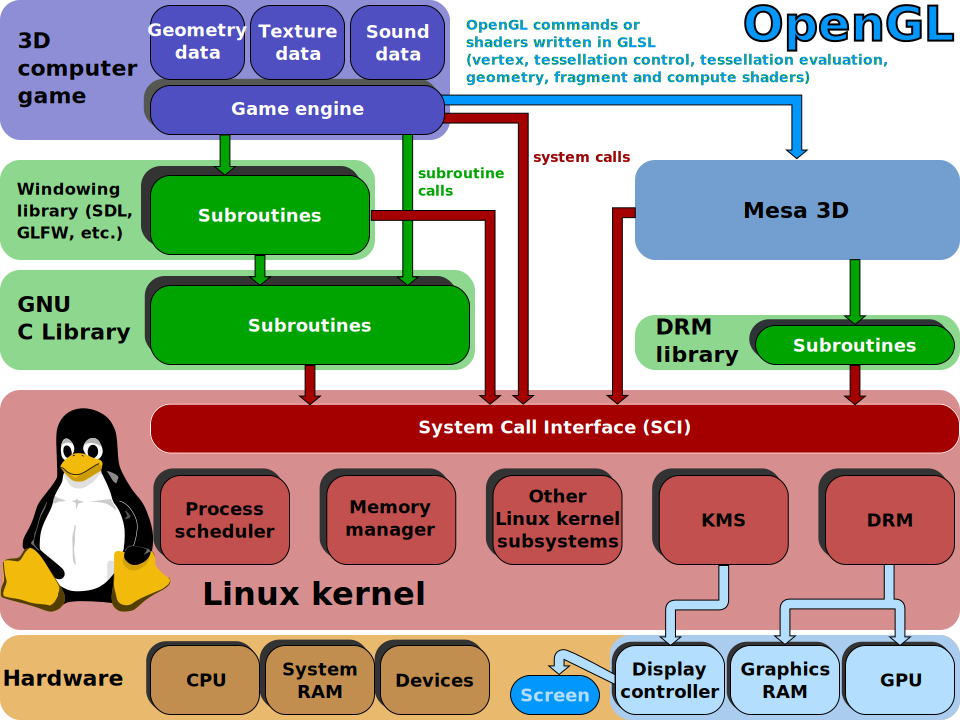

# goal of this course

- provide a common foundation in software engineering for students from various backgrounds
- provide a shared terminology to be able to work seamlessly with software developers
- introduce the fundamentals of modern software development methodologies and life cycle models
    - with a focusing in detail on Scrum and Kanban
- introduce **requirements analysis** and **software architecture**
    - both in theory and in practice
- provide an insight to code quality, code review, testing and automation

<!--During the practical classes, the students explore and document the requirements of a software system.
Then, during the second half of the semester, they design its architecture.
For requirements analysis, the course applies user story mapping in accordance with the agile principles.
For the software design, the course uses the C4 model, which is a set of hierarchical diagrams describing the architecture of a software system.
The practical classes are workshops in which the students work in teams on the project assignment under an instructor's guidance.-->

# schedule {visibility=hidden}

|week| date       | lecture                                  | practical class       |
|---:|-----------:|:----------------------------------------:|:---------------------:|
|  1 | 2025-09-17 | intro, software architecture, SDLC       | project assignment    |
|  2 | 2025-09-24 | scrum, kanban                            | project workshop      |
|  3 | 2025-10-01 | requirement analysis, user story mapping | project workshop      |
|  4 | 2025-10-08 | UML, C4                                  | project workshop      |
|  5 | 2025-10-15 | design patterns                          | project workshop      |
|  6 | 2025-10-22 | interfaces, implementation planning      | **req. analysis demo**|
|  7 | 2025-10-29 | **school holiday**                       |                       |
|  8 | 2025-11-05 | wireframing, clean clode                 | project workshop      |
|  9 | 2025-11-12 | code quality, code review                | project workshop      |
| 10 | 2025-11-19 | testing, legacy code                     | project workshop      |
| 11 | 2025-11-26 | CI, automatization, devops               | project workshop      |
| 12 | 2025-12-03 | summary, course feedback                 | project workshop      |
| 13 | 2025-12-10 | **midterm**                              | **design demo**       |
| 14 | 2025-12-17 | no planned lecture                       |                       |


# schedule {.exclude-header}

::: {.exclude}
|week| date       | lecture                                  | practical class       |
|---:|-----------:|:----------------------------------------:|:---------------------:|
|  1 | 2025-09-17 | intro, software architecture, SDLC       | project assignment    |
|  2 | 2025-09-24 | scrum, kanban                            | project workshop      |
|  3 | 2025-10-01 | requirement analysis, user story mapping | project workshop      |
|  4 | 2025-10-08 | UML, C4                                  | project workshop      |
|  5 | 2025-10-15 | design patterns                          | project workshop      |
|  6 | 2025-10-22 | interfaces, implementation planning      | **req. analysis demo**|
|  7 | 2025-10-29 | **school holiday**                       |                       |

:::

## schedule {.exclude-header}

::: {.exclude}
|week| date       | lecture                                  | practical class       |
|---:|-----------:|:----------------------------------------:|:---------------------:|
|  8 | 2025-11-05 | wireframing, clean clode                 | project workshop      |
|  9 | 2025-11-12 | code quality, code review                | project workshop      |
| 10 | 2025-11-19 | testing, legacy code                     | project workshop      |
| 11 | 2025-11-26 | CI, automatization, devops               | project workshop      |
| 12 | 2025-12-03 | summary, course feedback                 | project workshop      |
| 13 | 2025-12-10 | **midterm**                              | **design demo**       |
| 14 | 2025-12-17 | no planned lecture                       |                       |

:::

# materials {.exclude}

:::::::::::: {.columns}
::::::::: {.column width="60%" .mt-3}
- available online in two formats
    - handout
    - presentation
- [pintergreg.github.io/software-engineering](https://pintergreg.github.io/software-engineering/)

:::::::::
::::::::: {.column width="40%"}


:::::::::
::::::::::::

# tools

- diagram drawing: 
    - [draw.io](https://app.diagrams.net/)
    - [Google Drawings](https://docs.google.com/drawings)
    - [plantuml](https://plantuml.com/)
- whiteboard:
    - [excalidraw](https://excalidraw.com/)
- kanban board
    - [Trello](https://trello.com/)
- code hosting / task management
    - [GitHub](https://github.com/)
    
::: notes
:::
    
# program vs. software

:::::::::::: {.columns .fragment}
::::::::: {.column width="75%"}
> A computer program is a sequence or set of instructions in a programming language for a computer to execute.
> It is one component of software, which also includes documentation and other intangible components.
>
> ISO/IEC 2382:2015 via Wikipedia [@enwiki:1233276268]

:::::::::
::::::::: {.column width="25%"}


:::::::::
::::::::::::


## program is like a recipe

:::::::::::: {.columns}
::::::::: {.column width="50%"}
There is a metaphor saying that a program is like a recipe.

The computer follows the instructions of a program as the cook follows the instruction in a recipe.

Consequently programming is like creating a recipe.

:::::::::
::::::::: {.column width="50%" .fragment}

```python
for i in range(1, 101):
    if i % 15 == 0:
        print("" + "FizzBuzz")
    elif i % 3 == 0:
        print("" + "Fizz")
    elif i % 5 == 0:
        print("" + "Buzz")
    else:
        print(i)
```

:::::::::
::::::::::::

::: notes
It is easy to read this code snippet and figure out what it does, but constructing an algorithm might be more complicated.

It contains a loop going from 1 to 100 (ranges are not closed in Python, so 101 is excluded and the range step is 1 by default).
If the loop variable is dividable by 15, "FizzBuzz" is printed to the screen.
If it is only dividable by 3 "Fizz" is printed, if only by 5 "Buzz" is printed.
In any other cases the number id printed.


> Writing a computer program requires a nuanced understanding of the problem being solved by the computer program, pros and cons of various approaches, etc.
> It also requires the knowledge and expertise to describe those steps in a manner amenable to execution by a computer.
>
> [Jeff Rabinowitz](https://justabloginthepark.com/2016/01/09/how-programming-is-like-cooking/)

:::


# programming vs. software development

:::::::::::: {.columns}
::::::::: {.column width="50%"}
{width=400}

:::::::::
::::::::: {.column width="50%" .mt-5 .column-align-left}
::: {.fragment}
- does that mean a program is not 
    - planned
    - documented
    - tested
    - verified?
:::
::: {.fragment}
- the main difference is the formality of the process
    - which correlates the complexity of the project
:::

:::::::::
::::::::::::

::: notes
A program code is only a part of a software.
Programming is more or less a synonym to coding.

As a software is more than just the code, software development is more than just coding/programming.
The work is planned, documented, tested, verified, and framed by a process.

If programming is like creating a recipe, software development is more like running a restaurant.
One should come up with recipes, cook the food, but the restaurant also needs constant ingredient logistics and preparation, food serving, marketing, cleaning etc.

:::


# software development is like building a house

:::::::::::: {.columns}
::::::::: {.column width="65%"}
- the software development is often compared to house building
    - which is more like a sequential process
- after the planning (including building permit, budget, etc.), the foundation is built first, then walls and the roof
    - these phases cannot be swapped
- after the construction is finished, the contractor leaves the site
:::::::::
::::::::: {.column width="35%"}
 | public domain](figures/borrowed/sample_floorplan.jpg)

:::::::::
::::::::::::

::: {.fragment .text-size-3}
maintenance?
:::

## software development *not* is like building a house

a software does not have to obey the laws of physics

- in software development you can start with the door of the second floor bathroom
- the size of a room can be changed during the construction -- even several times


# software development is like gardening

::: {.text-smaller}
based on Software Architecture Metaphors by Lisa Stähli [@stahli2021software]
:::

:::::::::::: {.columns .fragment}
::::::::: {.column width="37%" .mt-4}
- a garden needs to be taken care of constantly
- without attention the garden will decay
:::::::::
::::::::: {.column width="35%" .mt-4}
- maintenance is part of software development
- software rots
:::::::::
::::::::: {.column width="28%"}


:::::::::
::::::::::::

::: notes
Another famous metaphor is the gardening.
The most important aspect of the gardening is that a garden needs to be taken care of constantly.
Without attention the garden will decay, which is also true for the software; the software can rot.

There are two types of software rot: dormant rot and active rot.
:::

## what is software rot?

::: {.wide-quote}
> Software rot (or software entropy) is the degradation, deterioration, or loss of the use or performance of software over time [@enwiki:1236668404]. 

:::

:::::::::::: {.columns .mt-2}
::::::::: {.column width="50%"}
**dormant rot**: the software in question is not changed, but as the environment evolves, it eventually becomes dysfunctional

:::::: {.fragment data-fragment-index=1 .mt-3}
::::: {.columns}
:::: {.column width="50%" .text-smaller}
Muni metro's control software is still loaded from floppy disks [@harding2024san]

::::
:::: {.column width="50%"}
{width=200}

::::
:::::
::::::
:::::::::
::::::::: {.column width="50%"}
::: {.fragment data-fragment-index=1}
 [CC BY-NC 2.0](https://creativecommons.org/licenses/by-nc/2.0/)](figures/borrowed/muni_metro.jpg){width=450}

:::
:::::::::
::::::::::::


::: notes
Environment change can be either software or hardware.
The operating system, a software framework or even a hardware can be outdated to

The photo shows the San Fransico Muni metro, which still uses floppy disks to load its Automatic Train Control System every morning.
It is planned to replace by the end of the decade.
The system works without any problems, but the risk of failure is getting higher. [@harding2024san]

:::

## what is software rot? {.exclude-header}

:::::::::::: {.columns}
::::::::: {.column width="50%"}
**active rot**

- the software has undergone constant modifications but gradually loses its integrity
- the constant updates / bug fixing can lead to an evolution process,
    - which makes the program deviate from its original design, 
    - even introducing newer bugs

:::::::::
::::::::: {.column width="50%"}
](figures/borrowed/xkcd/code_lifespan_2x.png)

:::::::::
::::::::::::

::: notes
It is said that nothing is more permanent than a temporary fix.
A quick fix often ignores the architectural design, not documented properly, thus contributes to the software rot.

A change in a production system should be properly planned in every possible details.
For example, because it can have side effects, or can affect the architecture.
Also, the documentation needs to be updated. Both documentations actually since there is a development documentation, that should contain information about the system for the developers and a user documentation (manual) for the operators of the system.

:::

## software development is like gardening - cont.

::: {.text-smaller}
based on Software Architecture Metaphors by Lisa Stähli [@stahli2021software]
:::

:::::::::::: {.columns .mt-3}
::::::::: {.column width="50%"}
- external factors like weather, pests, weeds can influence the garden
:::::::::
::::::::: {.column width="50%"}
- change in user requirements, and the external dependencies such as frameworks, libraries, etc. can affect the software
:::::::::
<!-- ::::::::: {.column width="20%"} -->

<!-- ::::::::: -->
::::::::::::


::: notes
Another similarity to gardening is that external factors can influence the software.
:::

## software development is like gardening - cont. {.exclude-header}

::: {.text-smaller}
based on Software Architecture Metaphors by Lisa Stähli [@stahli2021software]
:::

:::::::::::: {.columns}
::::::::: {.column width="50%"}
- gardeners has a set of tools, selected for the characteristics of the garden and the gardener
- a beautiful garden is a piece of art
    - which can also serve a function, like producing vegetables / fruits
:::::::::
::::::::: {.column width="50%"}
- software developer also uses tools chosen according to the environment and type of software 
<!--     -  e.g., to automate processes -->
- software is a piece of art, e.g., the UI has to be not just functional, but aesthetic and ergonomic
    - software code/design is also a piece of art; see software craftmanship (later)
:::::::::
::::::::::::


# software growth


## software growth -- cont.

:::::::::::: {.columns}
::::::::: {.column width="50%"}
::: {.wide-quote .mt-4}
> 24 million lines of code -- operational and support -- needed for the F-35 to be fully operational; when the program started, the estimated number of lines of code required was closer to 15 million
>
> -- Robert N. Charette, F-35 Program Continues to Struggle with Software [@charette2012f35]

:::
:::::::::
::::::::: {.column width="50%"}
![Increasing functionality implemented by software, reproduction of Figure 2.5 of [@firesmith2008method]](figures/increasing_functionality_by_software.drawio.svg)

:::::::::
::::::::::::

::: notes

:::

## software growth -- car industry

:::::::::::: {.columns}
::::::::: {.column width="55%"}
- 1981, GM was using microprocessor-based engine controls executing about 50 000 lines of code [@charette2009this]
- even low-end cars now [*2009*] have 30 to 50 electronic control units (ECUs)
    - that means these cars "execute" tens of millions of lines of software code that control everything from your brakes to your radio volume [@charette2009this]
- in a modern car [*2023*], you can expect to find 50 to over 100 ECUs [@walker2023how]
- for hybrids, the amount of software required for engine control is almost double that of a standard car [@charette2009this]

<!--::: {.text-smaller}
source: [This Car Runs on Code](https://spectrum.ieee.org/this-car-runs-on-code) [@charette2009this]

:::-->

:::::::::
::::::::: {.column width="45%"}
![electronics systems of total car cost [@charette2021how]](figures/es_as_total_car_cost.drawio.svg)

:::::::::
::::::::::::


# measuring code lines?

::: {.text-smaller}
source: [www.folklore.org](https://www.folklore.org/Negative_2000_Lines_Of_Code.html) by Andy Hertzfeld | [CC-BY-NC](https://creativecommons.org/licenses/by-nc/1.0/)
:::

:::::::::::: {.columns}
::::::::: {.column width="65%"}
- in 1982, some managers of the Lisa team decided to track each developer's weekly code output
    - [developers had to report every Friday the number of LOC they wrote that week]{.text-smaller}
- Bill Atkinson was working on optimizing Quickdraw's region calculation at that time, and he had completely rewritten the region engine using a simpler, more general algorithm, which got almost **six times faster**
    - [as a by-product, the rewrite saved about 2000 LOC]{.fragment data-fragment-index=1 .text-smaller}
- [that week's output, in terms of lines, was -2000]{.fragment data-fragment-index=1}

:::::::::
::::::::: {.column width="35%"}
 <br> [CC-BY-SA](https://creativecommons.org/licenses/by-sa/4.0/deed.en)](figures/borrowed/Apple-lisa-1.jpg)

[Quickdraw: 2D graphics library]{.text-smaller}
:::::::::
::::::::::::


## the more, the better?

> if we wish to count lines of code, we should not regard them as "lines produced" but as "lines spent"
>
> E. W. Dijkstra [EWD 1036](https://www.cs.utexas.edu/users/EWD/transcriptions/EWD10xx/EWD1036.html)

::: {.fragment}
> Every line of code written comes at a price: maintenance. To avoid paying for a lot of code, we build reusable software. The problem with code re-use is that it gets in the way of changing your mind later on.
>
> tef - [Write code that is easy to delete, not easy to extend](https://programmingisterrible.com/post/139222674273/write-code-that-is-easy-to-delete-not-easy-to)

:::

::: notes
Some people may consider the code as the product.
In this regard, more lines of code means more product.
If you write more code you work better, which is not true.
You should work smarter, not harder.

As Dijkstra said, lines should considered an expense, which you want to minimize, not maximize.
More code means more plants in your garden to take care of.
It requires more resources, but at the same time it also increases complexity.
:::

## keep it simple

::: {.wide-quote}
> We don't add stuff "just because we can". We need to have a damn good reason for it. 
>
> -- [Linus Torvalds](https://lore.kernel.org/all/CAHk-=wiGk+1eNy4Vk6QsEgM=Ru3jE40qrDwgq_CSKgqwLgMdRg@mail.gmail.com/)

:::

::: {.wide-quote .fragment .mt-1}
> A designer knows he has achieved perfection not when there is nothing left to add, but when there is nothing left to take away.
>
> -- [Antoine de Saint-Exupéry](https://en.wikiquote.org/wiki/Antoine_de_Saint_Exup%C3%A9ry) (29 June 1900 – 31 July 1944)

:::

::: {.fragment .mt-2}
- KISS, an acronym for "Keep it simple, stupid!"
    - a variations: keep it stupidly simple
    - the acronym was popular in the 70s
:::

::: notes
<!-- According to Saint-Exupéry (who was the author of The Little Prince by the way) -->

The design, the code should be kept as simple as possible.
When you want to simplify a design, keep only those parts that are absolutely necessary to get the job done.

And it is nothing new.
There is a concept in philosophy, called Occam's razor, which is the problem-solving principle that recommends searching for explanations constructed with the smallest possible set of elements.
Attributed to William of Ockham, a 14th-century English philosopher and theologian.
The principle is sometimes paraphrased as "of two competing theories, the simpler explanation of an entity is to be preferred." [@enwiki:1305790618]
:::


## Linux 5.8 -- 800,000 new lines of code

::: {.text-smaller}
> [Linux Torvalds](https://lore.kernel.org/lkml/CAHk-=whfuea587g8rh2DeLFFGYxiVuh-bzq22osJwz3q4SOfmA@mail.gmail.com/): despite not really having any single thing that stands out... 5.8 looks to be one of our biggest releases of all time

:::

- how is it manageable?
    - process
    - version control
- each change must do only one thing
    - proper documentation
- changes cannot break the software
    - rigorous and automated testing
    
# version control

:::::::::::: {.columns}
::::::::: {.column width="55%" .mt-4}
- version control (a.k.a. revision control) is system for recording and managing changes made in files
- commonly used to manage source code
    - however, it can be used to tracking changes to any kind of files
- people often employ their own version control system, without realising it
:::::::::
::::::::: {.column width="45%"}
](figures/intuitive_version_tracking.svg)

:::::::::
::::::::::::

::: {.text-smaller .mt-3}
based on Simon Mutch's [Version Control materials](http://smutch.github.io/VersionControlTutorial/pages/0-intro.html)
:::

::: notes
[Simon Mutch | [CC BY-SA 3.0](https://creativecommons.org/licenses/by-sa/3.0/deed.en) | [source](https://gist.github.com/smutch/4951871)](figures/borrowed/vc-xkcd.jpg)

:::

## why you should use version control (for everything)

::: {.wide-quote}
> In practice, everything that has been created manually should be put in version control, including programs, original field observations, and the source files for papers.
>
> -- Best Practices for Scientific Computing; Wilson et al. 2012 ([arXiv:1210.0530](https://arxiv.org/abs/1210.0530))

:::

::: {.mt-5}
this presentation is under version control as well
:::

::: notes
Many services have some kind of version control built in. 
For example Google Docs or Microsoft Word also provides some level of version control.
:::


## benefits of version control systems

- generate backups
- separates experiments from the working version
    - branching, deployment strategies (much later in the course)
- keep history and track changes
    - traceability
- foster collaboration and contribution
    - team work

The current level of software complexity is not manageable without allowing many people to work on the same code base, and the separation of the development versions from the production one.
    
::: {.mt-3}
**later on the course**: the types and operation of version control systems
:::

# project complexity

:::::: {.r-stack}
::: {.exclude}
{width=55%}
:::
::: {.fragment}
{width=55%}
:::
::::::

::: notes
:::

# what is software architecture?

> "Architecture" is a term that lots of people try to define, with little agreement. There are two common elements: One is the highest-level breakdown of a system into its parts; the other, decisions that are hard to change.
>
> -- Martin Fowler - Patterns of Enterprise Application Architecture

##

> In most successful software projects, the expert developers working on that project have a shared understanding of the system design. This **shared understanding** is called ‘architecture’. This understanding includes how the system is divided into components and how the components interact through interfaces. These components are usually composed of smaller components, but the architecture only includes the components  and interfaces that are understood by all the developers.
> 
> Ralph Johnson, XP mailing list

## 

> All architecture is design but not all design is architecture. Architecture represents the significant **design decisions** that shape a system, where significant is measured by cost of change.
>
> -- Grady Booch


# topologies

:::::::::::: {.columns}
::::::::: {.column width="33%"}
{width=250}

{width=250}

:::::::::
::::::::: {.column width="33%"}
{width=200}

:::::::::
::::::::: {.column width="33%"}
{width=250}

{width=250}

:::::::::
::::::::::::

::: {.text-smaller}
[Introduction to Software Architecture](https://www.codeproject.com/Articles/1064240/Introduction-to-Software-Architecture)
:::


<!--## Layered Architechture

{height=450}

- [Layered Architecture: Introduction](http://serena-yeoh.blogspot.com/2013/06/layered-architecture-for-net.html)
- [Layered Architecture: Component Interactions](http://serena-yeoh.blogspot.com/2014/01/layered-architecture-components.html)


## message bus

:::::::::::: {.columns}
::::::::: {.column width="50%" .mt-2}

- shared communication channel that connects multiple components or services
- simple, extensible

:::::::::
::::::::: {.column width="50%"}
{width=325}

:::::::::
::::::::::::


## server/client architecture

:::::::::::: {.columns}
::::::::: {.column width="50%"}
- consists of two parts
    - client and server
- distributed
- always the client initiates a connection to the server
- while the server process always waits for requests from any client
:::::::::
::::::::: {.column width="50%"}
{width=325}
:::::::::
::::::::::::-->


# references

::: {#refs}
:::
