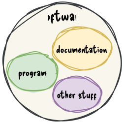

# schedule

| week | date       | lecture                          | practical class |
|-----:|:----------:|:--------------------------------:|:---------------:|
|    1 | 2024-09-10 | software development life cycles | SCRUM           |
|    2 | 2024-09-17 | software architecture            |                 |
|    3 | 2024-09-24 | requirements analysis            | user story map  |
|    4 | 2024-10-01 | UML, C4                          | UML in practice |
|    5 | 2024-10-08 | 
|    6 | 2024-10-15 |
|    7 | 2024-10-22 | 
|    9 | 2024-11-05 | 
|   10 | 2024-11-12 | 
|   11 | 2024-11-19 | 
|   12 | 2024-11-26 | 
|   13 | 2024-12-03 | 

testing, communication

# materials

- hangout, presentation website introduction
- also, moodle?


# program vs. software

:::::::::::: {.columns}
::::::::: {.column width="75%"}
> A computer program is a sequence or set of instructions in a programming language for a computer to execute.
> It is one component of software, which also includes documentation and other intangible components.
>
> ISO/IEC 2382:2015 via Wikipedia [@enwiki:1233276268]

:::::::::
::::::::: {.column width="25%"}


:::::::::
::::::::::::


## program is like a recipe

:::::::::::: {.columns}
::::::::: {.column width="50%"}
There is a metaphor saying that a program is like a recipe.

The computer follows the instructions of a program as the cook follows the instruction in a recipe.

Consequently programming is like a creating a recipe.

:::::::::
::::::::: {.column width="50%" .fragment}

```python
for i in range(1, 101):
    if i % 15 == 0:
        print("" + "FizzBuzz")
    elif i % 3 == 0:
        print("" + "Fizz")
    elif i % 5 == 0:
        print("" + "Buzz")
    else:
        print(i)
```

:::::::::
::::::::::::

::: notes
It is easy to read this code snippet and figure out what it does, but constructing an algorithm might be more complicated.

> Writing a computer program requires a nuanced understanding of the problem being solved by the computer program, pros and cons of various approaches, etc.
> It also requires the knowledge and expertise to describe those steps in a manner amenable to execution by a computer.
>
> [Jeff Rabinowitz](https://justabloginthepark.com/2016/01/09/how-programming-is-like-cooking/)
:::


# program vs. software -- code aspect

:::::::::::: {.columns}
::::::::: {.column width="60%"}
| program      | software     |
|:------------:|:------------:|
| less complex | more complex |

:::::::::
::::::::: {.column width="30%"}


:::::::::
::::::::::::

::: notes
In contrast of the previous definition and from the code aspect, I like to think of computer program as a more general expression and consider the software as a special program, where the main difference is the life cycle and the crafting process of the program.
In this sense, software is usually more complex, developed by a team as a product for people who are not often not proficient in programming and only users of the program. In this case the user interface and the documentation should be prepared for not proper use.

Wikipedia says: In computing, a script is a relatively short and simple set of instructions that typically automate an otherwise manual process [@enwiki:1234532469].

:::


# software development is like building a house

:::::::::::: {.columns}
::::::::: {.column width="65%"}
- the software development is often compared to house building
    - which is more like a sequential process
- after the planning (including building permit, budget, etc.), the foundation is built first, then walls and the roof
    - these phases cannot be swapped
- after the construction is finished, the contractor leaves the site
:::::::::
::::::::: {.column width="35%"}
 | public domain](figures/sample_floorplan.jpg)

:::::::::
::::::::::::

::: {.fragment .text-size-3}
maintenance?
:::

## software development *not* is like building a house

a software does not have to obey the laws of physics

- in software development you can start with the door of the second floor bathroom
- the size of a room can be changed during the construction -- even several times


# software development is like gardening

:::::::::::: {.columns}
::::::::: {.column width="55%"}
- a garden needs to be taken care of constantly
- without attention the garden will decay
<!-- - external factors like weather, pests, weeds can influence the garden -->
:::::::::
::::::::: {.column width="45%"}
- maintenance is part of software development
- software rots
<!-- - change in user requirements, but importantly the external dependencies such as frameworks, libraries, etc. can affect the software -->
:::::::::
::::::::::::

::: {.text-smaller .mt-5}
based on Software Architecture Metaphors by Lisa Stähli [@stahli2021software]
:::

::: notes
Another famous metaphor is the gardening.
The most important aspect of the gardening is that a garden needs to be taken care of constantly.
Without attention the garden will decay, which is also true for the software; the software can rot.

There are two types of software rot: dormant rot and active rot.
:::

## what is software rot?


:::::::::::: {.columns}
::::::::: {.column width="50%"}
**dormant rot**: the software in question is not changed, but as the environment evolves, it eventually becomes dysfunctional

:::::::::
::::::::: {.column width="50%" .fragment}
 [CC BY-NC 2.0](https://creativecommons.org/licenses/by-nc/2.0/)](figures/borrowed/muni_metro.jpg)

:::::::::
::::::::::::

::: notes
Environment change can be either software or hardware.
The operating system, a software framework or even a hardware can be outdated to

The photo shows the San Fransico Muni metro, which still uses floppy disks to load its Automatic Train Control System every morning.
It is planned to replace by the end of the decade.
The system works without any problems, but the risk of failure is getting higher. [@harding2024san]

:::

## what is software rot? {.exclude-header}

:::::::::::: {.columns}
::::::::: {.column width="50%"}
**active rot**

- the software has undergone constant modifications but gradually loses its integrity
- the constant updates / bug fixing can lead to an evolution process,
    - which makes the program deviate from its original design, 
    - even introducing newer bugs

:::::::::
::::::::: {.column width="50%"}
](figures/borrowed/code_lifespan_2x.png)

:::::::::
::::::::::::

::: notes
It is said that nothing is more permanent than a temporary fix.
A quick fix often ignores the architectural design, not documented properly, thus contributes to the software rot.
:::

## software development is like gardening - cont.

:::::::::::: {.columns}
::::::::: {.column width="55%"}
<!-- - a garden needs to be taken care of constantly -->
<!-- - without attention the garden will decay -->
- external factors like weather, pests, weeds can influence the garden
:::::::::
::::::::: {.column width="45%"}
<!-- - maintenance is part of software development -->
<!-- - software rots -->
- change in user requirements, but importantly the external dependencies such as frameworks, libraries, etc. can affect the software
:::::::::
::::::::::::

::: {.text-smaller .mt-5}
based on Software Architecture Metaphors by Lisa Stähli [@stahli2021software]
:::

::: notes
Another similarity to gardening is that external factors can influence the software.
:::

## software development is like gardening - cont. {.exclude-header}

:::::::::::: {.columns}
::::::::: {.column width="50%"}
- gardeners has a set of tools, selected for the characteristics of the garden and the gardener
- a beautiful garden is a piece of art
    - which can serve a function, like producing vegetables or fruits
:::::::::
::::::::: {.column width="50%"}
- software developer also uses tools chosen according to the environment and type of software 
<!--     -  e.g., to automate processes -->
- software is a piece of art, e.g., the UI has to be not just functional, but aesthetic and ergonomic
    - software code/design is also a piece of art; see software craftmanship (later)
:::::::::
::::::::::::

::: {.text-smaller}
based on Software Architecture Metaphors by Lisa Stähli [@stahli2021software]
:::

# references
