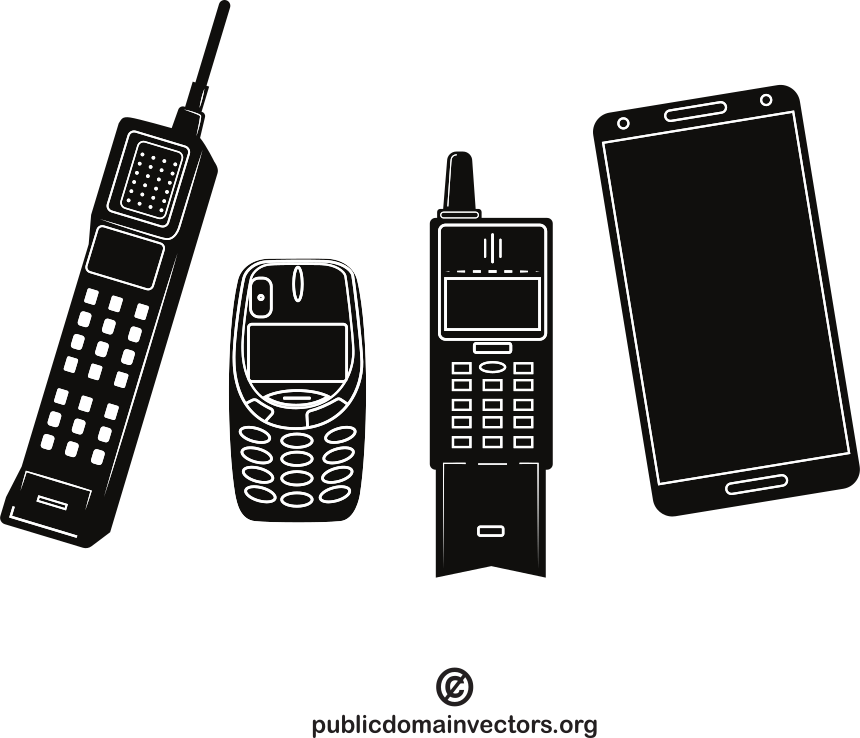

# program is like a recipe

:::::::::::: {.columns}
::::::::: {.column width="60%" .column-align-left}
- executing a program is following a recipe
- programming is like creating a recipe

::: {.fragment data-fragment-index="1"}
- software development is like running a restaurant
    - come up with recipes,
    - cook the food,
    - ingredient logistics and preparation,
    - food serving,
    - marketing,
    - cleaning

:::
:::::::::
::::::::: {.column width="40%"}
:::::: {.r-stack}
::: {.fragment .fade-out data-fragment-index="1"}
{width=250}
:::
::: {.fragment data-fragment-index="1"}
{width=250}
:::
::::::
:::::::::
::::::::::::

# software development often compared to house building

:::::::::::: {.columns}
::::::::: {.column width="60%"}
- because it is an engineering discipline
- but software does not have to obey the laws of physics
- software design should focus only on the data structures and the connection between the modules
    - not the implementation details (e.g., hardware)

:::::::::
::::::::: {.column width="40%"}
:::::: {.r-stack}
{width=250}
::::::
:::::::::
::::::::::::

# software development is more like gardening

:::::::::::: {.columns}
::::::::: {.column width="60%"}
- a garden might be planned
- external factors influence the result
    - weather, pests
- garden needs constant care to bloom
- sometimes also experimentation
    - methods, tools
- garden is like an art (with function)

:::::::::
::::::::: {.column width="40%"}
:::::: {.r-stack}
{width=250}
::::::
:::::::::
::::::::::::

# software growth

:::::::::::: {.columns}
::::::::: {.column width="60%"}
- number of lines of code is increasing
    - which increases complexity
- "every line of code written comes at a price: maintenance" [@tef2016write]
    - larger garden, more gardening
- software development processes to handle the complexity

:::::::::
::::::::: {.column width="40%"}
:::::: {.r-stack}
{width=250}
::::::
:::::::::
::::::::::::

# evolution of software life cycle models (incomplete)

:::::::::::: {.columns}
::::::::: {.column width="50%"}
- software life cycle models 
    - waterfall
        - improved waterfall
    - V model
    - iterative
    - agile
- regarding to change management

:::::::::
::::::::: {.column width="50%"}
:::::: {.r-stack}
{width=500}
::::::
:::::::::
::::::::::::

## waterfall model

:::::::::::: {.columns}
::::::::: {.column width="50%"}
- sequential, rigid model
    - (originally) not possible to step back to a previous phase
- testing is after the implementation, errors are found late in the process
- not possible to make changes during the development
- could take years

:::::::::
::::::::: {.column width="50%"}
:::::: {.r-stack}
{width=500}

{width=500 .fragment}
::::::
:::::::::
::::::::::::

## V model

:::::::::::: {.columns}
::::::::: {.column width="50%"}
- still rigid
- each phase has output and a review process
    - errors are found at early stage
    - decreases the risk of failure
- large to small: testing is done in a hierarchical perspective

:::::::::
::::::::: {.column width="50%"}
:::::: {.r-stack}
{width=500}
::::::
:::::::::
::::::::::::

## iterative model

:::::::::::: {.columns}
::::::::: {.column width="50%"}
- software is built incrementally,
    - with each iteration adding new features or refining existing ones
- possible to get feedback after each iteration
- can be rigid within an iteration

:::::::::
::::::::: {.column width="50%"}
:::::: {.r-stack}
{width=500}
::::::
:::::::::
::::::::::::

## agile model

:::::::::::: {.columns}
::::::::: {.column width="50%"}
- continuous collaboration and fast response to change, while the iterative model takes a more gradual approach, building up the final product over multiple iterations
- scrum is an agile methodology

:::::::::
::::::::: {.column width="50%"}
:::::: {.r-stack}
{width=500}
::::::
:::::::::
::::::::::::

# references

::: {#refs}
:::
