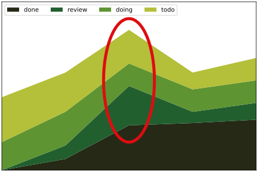

this presentation is based on The Scrum Guide (2020) by Ken Schwaber and Jeff Sutherland [@schwaber2020scrum]

available from [scrumguides.org](https://scrumguides.org/) under [CC BY-SA 4.0](https://creativecommons.org/licenses/by-sa/4.0/)

or download directly [from here](../resources/2020-Scrum-Guide-US.pdf)

# what is scrum?

Scrum is a lightweight framework that helps people, teams and organizations generate value through adaptive solutions for complex problems.

Scrum employs an iterative, incremental approach to optimize predictability and to control risk.
Scrum engages groups of people who collectively have all the skills and expertise to do the work and share or acquire such skills as needed.

## scrum in a nutshell

::: {.text-smaller}
scrum requires a scrum master to foster an environment where:

1. a product owner orders the work for a complex problem into a product backlog
2. the scrum team turns a selection of the work into an increment of value during a sprint
3. the scrum team and its stakeholders inspect the results and adjust for the next sprint
4. repeat

:::

{height=300}

# scrum team

- the scrum team consists of
    - one scrum master, 
    - one product owner, 
    - and developers 
- there are no sub-teams or hierarchies

::: notes
These are more roles, not necessarily people.
The scrum master and the product owner can also be a developer.
:::

## size of a scrum team

- small enough to remain nimble and large enough to complete work in a sprint
    - typically 10 or fewer people
    - 3 to 9 people is optimal
    - smaller teams communicate better and are more productive
- if a team becomes too large, they should consider reorganizing into multiple cohesive scrum teams
    - each focused on the same product
    - therefore, they should share the same product goal, product backlog, and product owner

## communication within a team

:::::::::::: {.columns}
::::::::: {.column width="50%"}
{width=200}

::: {.text-size-3 .mt-6}
\\[ \frac{3(3 − 1)}{2} = 3 \\]

:::
:::::::::
::::::::: {.column width="50%"}
{width=200}

::: {.text-size-3 .mt-3}
\\[ \frac{4(4 − 1)}{2} = 6 \\]

:::
:::::::::
::::::::::::

## communication within a team {.exclude-header}

:::::::::::: {.columns}
::::::::: {.column width="50%"}
:::::: {.r-stack}
{width=300}

{.fragment data-fragment-index="1"}

::::::
:::::::::
::::::::: {.column width="50%" .center-content}
:::::: {.r-stack}
::: {.text-size-4 .fragment .fade-out data-fragment-index="1"}
\\[ \frac{5(5 − 1)}{2} = 10 \\]

:::

::: {.fragment .text-size-4 data-fragment-index="1"}
\\[ \frac{n(n − 1)}{2} \\]

:::

::::::
:::::::::
::::::::::::

## team size {visibility=hidden}

:::::::::::: {.columns}
::::::::: {.column width="50%"}
{width=350}
:::::::::
::::::::: {.column width="50%" .fragment}
{width=350}
:::::::::
::::::::::::
    
## scrum teams are cross-functional

{width=500}

- the members have all the skills necessary to create value each sprint
- they are also self-managing, meaning they internally decide who does what, when, and how

## developers

:::::::::::: {.columns}
::::::::: {.column width="80%"}
- committed to creating any aspect of a usable increment each sprint
- the specific skills needed by the developers are often broad and will vary with the domain of work
- developers are accountable for
    - creating a plan for the sprint, the sprint backlog,
    - instilling quality by adhering to a definition of done,
    - adapting their plan each day toward the sprint goal, and
    - holding each other accountable as professionals

:::::::::
::::::::: {.column width="20%"}

:::::::::
::::::::::::

## definition of done

:::::::::::: {.columns}
::::::::: {.column width="60%"}
- checklist
- defines steps to complete the sprint goal
- helps to track the progress of the sprint
- the sprint is done, if every element of the checklist is done

:::::::::
::::::::: {.column width="40%"}

<!--course definition of done:

- [x] attended all classes
- [x] homeworks completed
- [x] midterm exam passed
- [x] project work completed-->

:::::::::
::::::::::::

## product owner

- accountable for maximizing the value of the product resulting from the work of the scrum team
- also accountable for effective product backlog management, which includes:
    - developing and explicitly communicating the product goal,
    - creating and clearly communicating product backlog items,
    - ordering product backlog items, and
    - ensuring that the product backlog is transparent, visible and understood

The product owner may do the above work or may delegate the responsibility to others. Regardless, the product owner remains accountable.

## scrum master

- accountable for 
    - establishing scrum as defined in the Scrum Guide
        - by helping everyone understand the theory and practice, both within the scrum team and the organization
    - for the scrum team's effectiveness
        - by enabling the scrum team to improve its practices, within the scrum framework

::: notes
You can watch a parody about a the scrum master role: [Scrum Master - Funny movie about The Power of Scrum](https://www.youtube.com/watch?v=P6v-I9VvTq4) (5m 23s)
:::

## scrum master serves the scrum team

- coaching the team members in self-management and cross-functionality,
- helping the scrum team focus on creating high-value increments that meet the definition of done,
- causing the removal of impediments to the scrum team's progress, and
- ensuring that all scrum events take place and are positive, productive, and kept within the timebox

## scrum master serves the product owner

- helping find techniques for effective product goal definition and product backlog management,
- helping the scrum team understand the need for clear and concise product backlog items,
- helping establish empirical product planning for a complex environment, and
- facilitating stakeholder collaboration as requested or needed

## scrum master serves the organization

- leading, training, and coaching the organization in its scrum adoption,
- planning and advising scrum implementations within the organization,
- helping employees and stakeholders understand and enact an empirical approach for complex work, and
- removing barriers between stakeholders and scrum teams

# quiz {.exclude-header}

::::::::::::::: {.exclude}
Is there a project manager role in scrum?

:::::: {.r-stack}
::: {.fragment .fade-out data-fragment-index="1"}
- yes
- no
:::
::: {.fragment .fade-in data-fragment-index="1"}
- yes
- [no]{.background-color-lightblue}
:::
::::::
:::::::::::::::

# quiz {.exclude-header}

::::::::::::::: {.exclude}
What is the optimal size of a scrum team?

:::::: {.r-stack}
::: {.fragment .fade-out data-fragment-index="1"}
- at most 5 people
- 3 to 9 people
- 10-20 people
- there is no limit, the more the merrier
:::
::: {.fragment .fade-in data-fragment-index="1"}
- at most 5 people
- [3 to 9 people]{.background-color-lightblue}
- 10-20 people
- there is no limit, the more the merrier
:::
::::::
:::::::::::::::

# scrum events

:::::::::::: {.columns}
::::::::: {.column width="40%"}
- sprint
- sprint planning
- daily scrum
- sprint review
- sprint retrospective

:::::::::
::::::::: {.column width="60%"}

:::::::::
::::::::::::

::: notes
Besides people there are events in scrum.
:::

# sprint

> Sprints are the heartbeat of Scrum, where ideas are turned into value.

- fixed length events (maximum one month) to create consistency
- a new sprint starts immediately after the end of the previous

## during the sprint

- no changes are made that would endanger the sprint goal,
- quality does not decrease,
- the Product Backlog is refined as needed, and
- scope may be clarified and renegotiated with the product owner as more is learned

::: notes
:::

## about sprints

- in the case of a long sprint
    - the sprint goal may become invalid
    - complexity may rise, and 
    - risk may increase
- each sprint may be considered a short project
- a sprint could be cancelled if the sprint goal becomes obsolete
- only the product owner has the authority to cancel the sprint

## tracking progress - burndown chart

> burndown chart is a graphical representation of work left to do versus time [@enwiki:1219224248]

:::::::::::: {.columns}
::::::::: {.column width="50%"}
:::::: {.r-stack}
::: {.fragment .fade-out data-fragment-index="1"}
{width=500}

:::
::: {.fragment .fade-in data-fragment-index="1"}
{width=500}

:::
::::::
:::::::::
::::::::: {.column width="50%" .column-align-left}
::: {}
- two week sprint
- 26 tasks
- ideal work line (green)
:::
::: {.fragment .fade-in data-fragment-index="1"}
- actual work line (red)
    - not realistic
- finished tasks per day (blue bars)
:::
:::::::::
::::::::::::

::: notes
Various practices exist to forecast progress, like burn-downs, burn-ups, or cumulative flows.

Let's assume a 2-week sprint with 26 tasks.
The burndown chart shows the work left to do compared to the time (days of the sprint).

Often used in agile software development methodologies such as Scrum.
However, burndown charts can be applied to any project with measurable progress over time [@enwiki:1219224248]. 

Remaining work can be represented in either the number of tasks or the amount of time required to finish the tasks.
The ideal work line often assumes a linear progress, which is not realistic, as tasks are often not finished at the beginning of the sprint.
Partly because planning is necessary to solve tasks, partly because it may be required to learn a new technology to complete a task. 

<!-- The ideal work line can give an estimation actual work line may -->

Read more about burndown chart at [Feel The Burn, Getting the Most out of Burn Charts](https://idiacomputing.com/pub/BetterSoftware-BurnCharts.pdf) by George Dinwiddie (PDF, 6 pages).
:::

## tracking progress - cumulative flow diagram

{width=70%}

::: notes
Another diagram used to track progress is cumulative flow diagram (CDF).
It is a stacked area chart that shows the various statuses of the tasks.
It can help to identify bottlenecks.

Although it often used for kanban-style workflow, it can also work for scrum.

Read more about CDF from[Pawel Brodzinski](http://brodzinski.com/2013/07/cumulative-flow-diagram.html).
:::

## tracking progress - cumulative flow diagram {.exclude-header}

:::::::::::: {.columns}
::::::::: {.column width="50%"}

::: {.text-smaller}
widening of bands: bottleneck; more tasks enter that phase than leaving
:::
:::::::::
::::::::: {.column width="50%"}

::: {.text-smaller}
narrowing of bands: throughput is higher than the number of tasks entering the workflow
:::
:::::::::
::::::::::::

::: {.text-smaller}
figures are based on [@boogaard2021how]
:::

::: notes
Read more from [Kat Boogaard](https://www.wrike.com/blog/how-to-use-cumulative-flow-diagram/).
:::

# sprint planning

:::::::::::: {.columns}
::::::::: {.column width="80%"}
- sprint planning initiates the sprint
- collaborative work of the entire scrum team 
- the product owner ensures that attendees are prepared to discuss the most important product backlog items and how they map to the product goal
- the scrum team may invite other people to provide advice
- sprint planning lasts a maximum of eight hours for a one-month sprint
    - for shorter sprints the event is shorter

:::::::::
::::::::: {.column width="20%"}

:::::::::
::::::::::::

## topics of sprint planning - why is this sprint valuable?

- the product owner proposes how the product could increase its value and utility in the current sprint
- the whole scrum team then collaborates to define a sprint goal that communicates why the sprint is valuable to stakeholders
- the sprint goal must be finalized prior to the end of sprint planning

## topics of sprint planning - what can be done this sprint?

- in agreement with the product owner, the developers select items from the product backlog to include in the current sprint agenda
- the scrum team may refine these items during this process
<!--     - which increases understanding and confidence -->
- not easy to select how much can be completed within a sprint
- the more the developers know about
    - their past performance (e.g., burndown charts),
    - their upcoming capacity (e.g., vacation, holidays), and
    - the definition of done,
    - the more confident they will be in their sprint forecasts

## topics of sprint planning - wow will the chosen work get done?

- for each selected item, the developers plan the work necessary to create an increment that meets the DoD
- often done by decomposing product backlog items into smaller work items of one day or less
    - tasks completable in 1-4 hours may be preferred
- how this is done is up to the developers
    - no one else tells them how to turn product backlog items into increments

## sprint planning - summary

1. select the sprint goal
2. select product backlog items to achieve the sprint goal
3. plan how they shall be implemented

> The sprint goal, the product backlog items selected for the sprint, plus the plan for delivering them are together referred to as the sprint backlog.

# daily scrum

- the purpose of the daily scrum is to inspect progress toward the sprint goal and adapt the sprint backlog as necessary, and discussing the upcoming planned work
- the daily scrum is a **15-minute** event for the developers
- to reduce complexity, it is held at the **same time and place** every working day of the sprint
- if the product owner or scrum master are actively working on items in the sprint backlog, they participate as developers

## daily stand-up

- the developers can select whatever structure and techniques they want
- also called daily stand-up, because they stand up from the desks and go to a meeting place
    - as it is limited to 15 minute, no need to book a meeting room; 
<!-- this creates focus and improves self-management -->
- daily scrums improve communications, identify impediments, promote quick decision-making, and consequently eliminate the need for other meetings

::: notes
Daily scrum can eliminate the need for unnecessary meetings, where the whole team has to attend.
However, daily stand-up is a perfect occasion to arrange a one-to-one meeting with an other developer to solve an issue.
:::

## three questions

:::::::::::: {.columns}
::::::::: {.column width="70%"}
each team member participating the daily scrum answers three questions:

1. what was done since the last daily scrum?
2. what will be done till the next daily scrum?
3. are there any impediments that prevent the work?

:::::::::
::::::::: {.column width="30%"}
{width=150}

:::::::::
::::::::::::

## keep daily stand-up short

:::::::::::: {.columns}
::::::::: {.column width="55%"}
- answer the three question only
    - do not start finding solutions for the problems
- the daily scrum is not the only time developers are allowed to discuss the sprint backlog
- they can meet throughout the day for more detailed discussions
:::::::::
::::::::: {.column width="45%" .center-content}
 | used with the author's permission](figures/borrowed/how_to_run_short_and_effective_meetings.jpg)

:::::::::
::::::::::::

# sprint review

:::::::::::: {.columns}
::::::::: {.column width="50%"}
<!-- - the purpose of the sprint review is to inspect the outcome of the sprint and determine future adaptations -->
- the scrum team presents the their work to key stakeholders
    - and the progress toward the product goal is discussed
<!-- - the scrum team and stakeholders review what was accomplished in the sprint -->
- the attendees collaborate on what to do next
- the product backlog may also be adjusted to meet new opportunities
<!--- should not limiting it to a presentation, the working product should be demonstrated and discussed
- timeboxed to a maximum of four hours for a one-month sprint
    - for shorter sprints, the event is usually shorter-->
:::::::::
::::::::: {.column width="50%"}
](figures/borrowed/sprint_review.png)

:::::::::
::::::::::::
    
::: notes
Also known as "demo", when the scrum team demonstrates the sprint goal to the stakeholders.
:::

## sprint review II {.exclude-header}

:::::::::::: {.columns}
::::::::: {.column width="50%"}
- should not limiting it to a presentation, the working product should be demonstrated and discussed
- timeboxed to a maximum of four hours for a one-month sprint
    - for shorter sprints, the event is usually shorter
:::::::::
::::::::: {.column width="50%"}
](figures/borrowed/sprint_review.png)

:::::::::
::::::::::::
    
::: notes
Also known as "demo", when the scrum team demonstrates the sprint goal to the stakeholders.
:::

# sprint retrospective

- he purpose of the sprint retrospective is to increase quality and effectiveness
- the sprint retrospective concludes the sprint
- it is timeboxed to a maximum of three hours for a one-month sprint 
    - for shorter sprints, the event is usually shorter

## sprint retrospective II {.exclude-header} 

:::::::::::: {.columns}
::::::::: {.column width="50%"}
- the scrum team inspects how the last sprint went with regards to 
    - individuals,
    - interactions,
    - processes,
    - tools, and 
    - their definition of done
:::::::::
::::::::: {.column width="50%"}
- the scrum team discusses 
    - what went well during the sprint,
    - what problems it encountered, and 
    - how those problems were (or were not) solved
:::::::::
::::::::::::

## retrospective starfish

:::::::::::: {.columns}
::::::::: {.column width="50%"}

:::::::::
::::::::: {.column width="50%"}
- divide the whiteboard to 5 parts
- every team member adds sticky notes to the respective parts
:::::::::
::::::::::::

::: notes
During the sprint retrospective, it could discussed what the team should start doing to increase the effectiveness.
What needs to be stopped because it decreases the effectiveness.
What was good, but needs to do more, what was not so good, so needs to do less.
And what is good as is, so the team should keep doing without change.

For example, less online meeting, because it is not so efficient as face-to-face ones. For a given team, for another team, the opposite might be true.
:::

# {.exclude-header}

::::::::::::::: {.exclude}
:::::::::::: {.columns}
::::::::: {.column width="75%"}
Which of the following is not a Scrum event?

:::::: {.r-stack}
::: {.fragment .fade-out data-fragment-index="1"}
1. Sprint Planning
2. Sprint Review
3. Sprint Retrospective
4. Sprint Estimation

:::
::: {.fragment .fade-in data-fragment-index="1"}
1. Sprint Planning
2. Sprint Review
3. Sprint Retrospective
4. [Sprint Estimation]{.background-color-lightblue}

:::
::::::
:::::::::
::::::::: {.column width="25%"}
:::::: {.r-stack}
{.fragment .fade-out data-fragment-index="1"}

{.fragment data-fragment-index="1"}
::::::

:::::::::
::::::::::::
:::::::::::::::

## {.exclude-header}

::::::::::::::: {.exclude}
:::::::::::: {.columns}
::::::::: {.column width="75%"}
What happens during Sprint Planning?

:::::: {.r-stack}
::: {.fragment .fade-out data-fragment-index="1"}
1. The team inspects the product increment
2. The team plans the work for the upcoming Sprint
3. The Product Backlog is finalized
4. The Sprint is reviewed

:::
::: {.fragment .fade-in data-fragment-index="1"}
1. The team inspects the product increment
2. [The team plans the work for the upcoming Sprint]{.background-color-lightblue}
3. The Product Backlog is finalized
4. The Sprint is reviewed

:::
::::::
:::::::::
::::::::: {.column width="25%"}
:::::: {.r-stack}
{.fragment .fade-out data-fragment-index="1"}

{.fragment data-fragment-index="1"}
::::::

:::::::::
::::::::::::
:::::::::::::::

## {.exclude-header}

::::::::::::::: {.exclude}
:::::::::::: {.columns}
::::::::: {.column width="75%"}
What is the purpose of the Sprint Retrospective?

:::::: {.r-stack}
::: {.fragment .fade-out data-fragment-index="1"}
1. Review the product backlog
2. Plan the next Sprint
3. Inspect how the last Sprint went with regards to people, relationships, process, and tools
4. Refine the Definition of Done

:::
::: {.fragment .fade-in data-fragment-index="1"}
1. Review the product backlog
2. Plan the next Sprint
3. [Inspect how the last Sprint went with regards to people, relationships, process, and tools]{.background-color-lightblue}
4. Refine the Definition of Done

:::
::::::
:::::::::
::::::::: {.column width="25%"}
:::::: {.r-stack}
{.fragment .fade-out data-fragment-index="1"}

{.fragment data-fragment-index="1"}
::::::

:::::::::
::::::::::::
:::::::::::::::

## {.exclude-header}

::::::::::::::: {.exclude}
:::::::::::: {.columns}
::::::::: {.column width="75%"}
How long should a Sprint Review be for a one-month Sprint?

:::::: {.r-stack}
::: {.fragment .fade-out data-fragment-index="1"}
- 1 hour
- 2 hours
- 4 hours
- 8 hours

:::
::: {.fragment .fade-in data-fragment-index="1"}
- 1 hour
- 2 hours
- [4 hours]{.background-color-lightblue}
- 8 hours

:::
::::::
:::::::::
::::::::: {.column width="25%"}
:::::: {.r-stack}
{.fragment .fade-out data-fragment-index="1"}

{.fragment data-fragment-index="1"}
::::::
:::::::::
::::::::::::
:::::::::::::::

# scrum artifacts

- scrum artifacts represent work or value 
- they are designed to maximize transparency of information
- the product backlog
    - progress towards the product goal
- sprint backlog
    - progress within the sprint goal
- definition of done
    - state of the product increment

# product backlog

- ordered list of what is needed to improve the product
- describes a future state of the product 
<!-- - it is the single source of work undertaken by the scrum team -->
- product owner is responsible for its content and prioritization

## product backlog refinement

> product backlog refinement is the act of breaking down and further defining product backlog items into smaller more precise items.

## sprint backlog

:::::::::::: {.columns}
::::::::: {.column width="70%"}
- composed of the sprint goal (why),
- the set of product backlog items selected for the sprint (what),
- a plan for delivering the increment (how)
    - by and for the developers
- visible, real-time snapshot of the sprint progress

:::::::::
::::::::: {.column width="30%"}

:::::::::
::::::::::::

::: notes
The sprint goal is created during the sprint planning event and then added to the sprint backlog. 
If the work turns out to be different than the developers expected, they collaborate with the product owner to negotiate the scope of the sprint backlog within the sprint without affecting the sprint goal.
:::

## sprint backlog {.exclude-header}

:::::::::::: {.columns}
::::::::: {.column width="70%"}
- if the work may turn out different than expected
    - because software development is like gardening
- then the developers negotiate the scope with the product owner without affecting the sprint goal
:::::::::
::::::::: {.column width="30%"}

:::::::::
::::::::::::

# increment

- an increment is a step toward the product goal 
- each increment is additive to all prior increments
    - and verified, ensuring that all increments work together
- in order to provide value, the increment must be usable
- multiple increments may be created within a sprint
- work cannot be considered part of an increment unless it meets the definition of done

::: notes
Writing some functions that might be useful later does not produce an increment.
Increment is useful for the customer/user.
:::

# scrum of scrums

:::::::::::: {.columns}
::::::::: {.column width="60%"}
- each scrum team delegates an "ambassador" to attend the scrum of scrums meetings
- meetings are not as frequent as daily scrum
- synchronizes state of the scrum teams
- agenda: same 3 questions but regarding a team
    - plus, issues that (can) affect the other scrum teams
:::::::::
::::::::: {.column width="40%"}

:::::::::
::::::::::::

::: notes
Also known as meta scrum.
:::

# zombie scrum

:::::::::::: {.columns}
::::::::: {.column width="50%"}
> Zombie Scrum is Scrum, but without the beating heart of working software.

in details
~ - [the rise of zombie scrum](https://medium.com/the-liberators/the-rise-of-zombie-scrum-cd98741015d5)
~ - [zombie scrum symptoms causes and treatment](https://www.scrum.org/resources/blog/zombie-scrum-symptoms-causes-and-treatment)

:::::::::
::::::::: {.column width="50%"}

:::::::::
::::::::::::

::: notes
At first sight, zombie scrum seems to be a normal scrum. But it lacks a beating heart.
The Scrum teams do all the Scrum events but a potentially releasable increment is rarely the result of a Sprint.
The team also doesn’t have any intention to improve their situation. Actually, nobody cares about this team. The stakeholders have forgotten the existence of this team a long time ago.

:::

## mindset

:::::::::::: {.columns}
::::::::: {.column width="55%"}
::: {.column-align-left}
zombie scrum

: although every sprint can result in a  new version, only the final version delivers real value

:::

::: {.column-align-left .fragment}
healthy scrum

: every sprint delivers value

:::

:::::::::
::::::::: {.column width="45%"}

:::::::::
::::::::::::

## working software

::: {.column-align-left}
zombie scrum

: working software is nice to have

:::

::: {.column-align-left .fragment}
healthy scrum

: working software is essential

:::

## what is work

:::::::::::: {.columns}
::::::::: {.column width="55%"}
::: {.column-align-left}
zombie scrum

: writing code is work, everything else is a waste of time

:::

::: {.column-align-left .fragment}
healthy scrum

: writing code is important part of work, but building good software requires frequent interaction with the team, stakeholders, and peers

:::

:::::::::
::::::::: {.column width="45%"}

:::::::::
::::::::::::

## treatments

::: {.incremental}
- Zombie Scrum teams often benefit from a shortened Sprint length. Instead of three to four-week iterations decrease the length to two weeks or even just one.
- Focus the Sprint Planning on answering the question of what type of impact the team would like to achieve within the upcoming Sprint.
- Start the Daily Scrum by reviewing the Sprint Goal and asking what achievements the team has made towards reaching that goal.
- Use the roadmap to provide context for the insights from the Review meeting. And for heaven’s sake, invite some real customers or stakeholders!
- Use the Retrospective not to drag out the same old problems but to dream big. A transformational approach might be better suited than an incremental one.
:::

# references

::: {#refs}
:::
