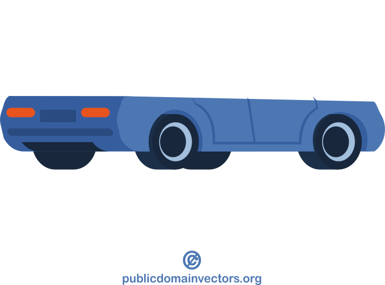
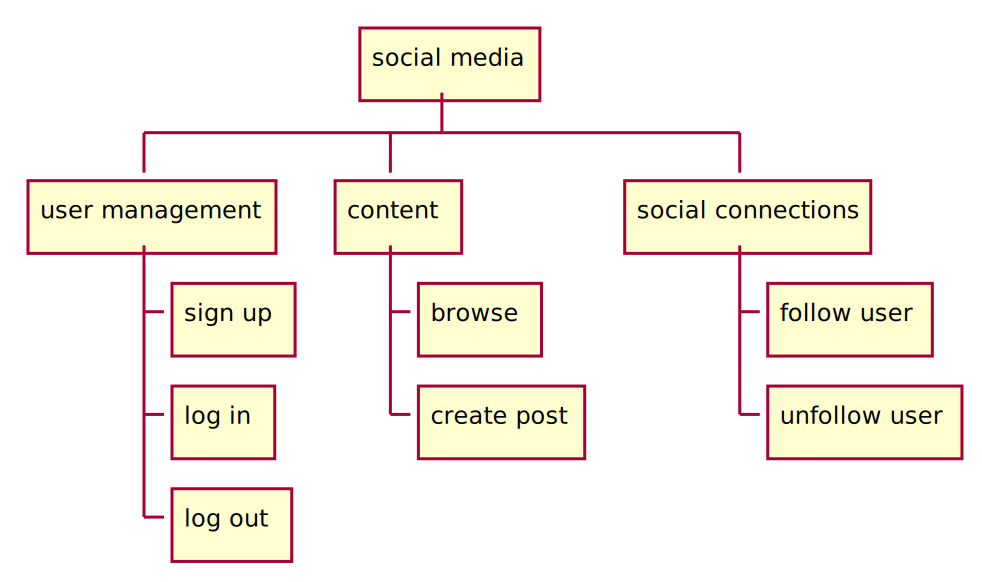
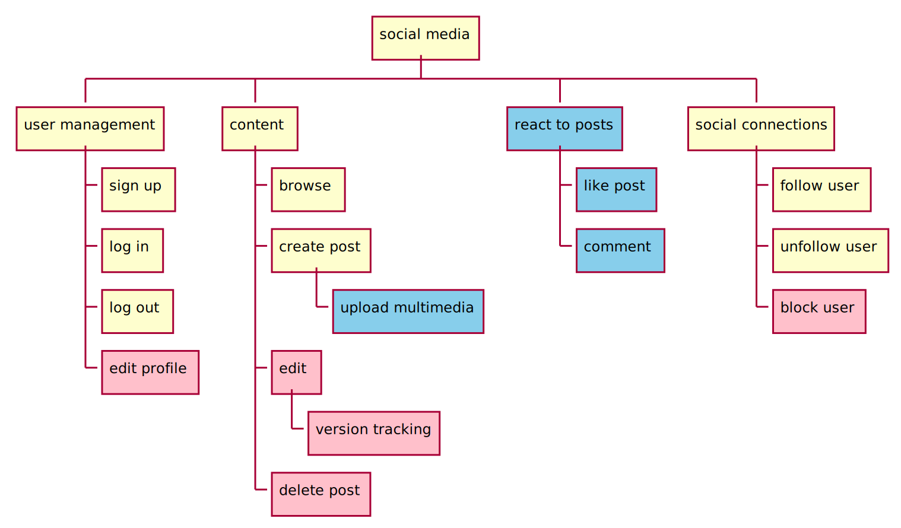

# requirement analysis

> Requirement analysis is all about understanding what software is supposed to do and the constraints it must operate within [@krysik2023sdlc].

- first step of the software development life cycle (SDLC)
- about understanding the task to avoid costly mistakes


![[the decreasing probability of introducing defects<br>based on Figure 3.3 of [@ambler2002agile]]{.text-smaller}](figures/introducing_defects.drawio.svg){data-preview-image="figures/introducing_defects.drawio.svg" data-preview-fit="contain" height=200}

## steps of requirement analysis

1. stakeholder identification
2. elicitation of requirements (gathering data)
3. documentation of requirements
4. analysis and negotiation
5. validation and verification

<!--::: {.mt-2}
![based on [@krysik2023sdlc]](figures/requirement_analysis_steps.drawio.svg){height=75}

:::-->


## 1. stakeholder identification

- not just the customers who commission the software
- also end users
    - different roles / groups
    

## 2. elicitation of requirements

> the team actively gathers detailed information about what the software needs to do from the identified stakeholders [@krysik2023sdlc]

:::::::::::: {.columns}
::::::::: {.column width="65%"}
- interviews
    - [one-on-one conversations with stakeholders<br>to understand their needs]{.text-smaller}
- questionnaires
    - [gather information from a larger group]{.text-smaller}
- user observation
    - [how potential users interact with existing systems<br>to identify unspoken needs or problems]{.text-smaller}
    - [telemetry]{.text-smaller}

:::::::::
::::::::: {.column width="30%"}


:::::::::
::::::::::::


## 3. documentation of requirements

:::::::::::: {.columns}
::::::::: {.column width="35%"}
for who

:    - future self
     - colleagues
     - every stakeholder of the project

:::::::::
::::::::: {.column width="65%"}
how

:    - searchable
         - organization-wide knowledge sharing (e.g., wiki)
     - version tracked
     - traceable
         - who wrote / edited / approved it

:::::::::
::::::::::::


## 4. analysis and negotiation

:::::::::::: {.columns}
::::::::: {.column width="70%"}
reviewing the documented requirements to make sure they are realistic and its implications are understood

- how difficult will it be to implement?
- does it conflict with any other requirements?
- is it actually necessary for the software's success?

:::::::::
::::::::: {.column width="30%"}


:::::::::
::::::::::::

::: {.fragment}
Negotiation comes into play when there are conflicting requirements or limitations in resources like time or budget. 
<br>[...]<br>
The goal here is to finalize a set of requirements that is achievable and aligns with the overall objectives of the project. [@krysik2023sdlc]

:::


## 5. validation and verification

:::::::::::: {.columns}
::::::::: {.column width="50%"}
validation

:    - is about confirming that the requirements actually meet the needs of the stakeholders
     - every stakeholder of the project
     - [are we building the right thing?]{.background-color-lightblue}

:::::::::
::::::::: {.column width="50%"}
verification

:    - making sure that the requirements are documented correctly and consistently
        - like proofreading and quality checking
     - to ensure that all requirements are clear, unambiguous, and consistent
     - [are we building the thing right?]{.background-color-lightblue}

:::::::::
::::::::::::


## requirement smells 

- based on the idea of code smells (later in the course)
- (language based) signs in the requirements that are not necessarily wrong but could be problematic, e.g.,:
    - subjective language
        - ["The architecture as well as the programming must ensure a **simple** and **efficient** maintainability."]{.text-smaller}
    - ambiguous adverbs and adjectives
        - ["If the (...) quality is **too low**, a fault must be written to the error memory."]{.text-smaller}
    - non-verifiable terms
        - ["The system may only be activated, if all required sensors (...) work with **sufficient** measurement accuracy."]{.text-smaller}

::: {.text-smaller}
examples from [@femmer2017rapid]
:::


# requirement analysis document example 

:::::::::::: {.columns}
::::::::: {.column width="55%" .mt-4}
- it is a living document
- often updated throughout the project<br>as new information becomes available or requirements evolve
- its main goal is to provide a clear, detailed, and agreed-upon set of requirements that guide the software development process

:::::::::
::::::::: {.column width="45%"}
**contents**

- introduction
- stakeholder identification
- methodology
- detailed requirements
    - functional requirements
    - non-functional requirements
- data flow diagrams or models
- prioritization of requirements
- constraints and assumptions
- acceptance criteria (DoD)
- appendices
- version history and approvals
    
:::::::::
::::::::::::


## functional and non-functional requirements

::: {.wide-quote}
functional requirements define what a system is supposed to do<br>and non-functional requirements define how a system is supposed to operate [@enwiki:1245895117]

:::

:::::::::::: {.columns .mt-3}
::::::::: {.column width="50%"}
functional

- [what]{.background-color-lightblue}
- features
- the webserver can serve pages via HTTP2

:::::::::
::::::::: {.column width="50%}
non-functional

- [how]{.background-color-lightblue}
- quality goals, quality of service requirements
- webserver is available 99.9% of time<br>(yearly about 8h 41m downtime)
- can serve at least 5.000 queries per sec


:::::::::
::::::::::::

[more examples on [Wikipedia](https://en.wikipedia.org/wiki/Non-functional_requirement)]{.text-smaller}

::: notes
non-functional requirements specifies criteria that can be used to evaluate the operation of a system, rather than specific behaviours
:::

# dependencies

::::::::::::::: {.r-stack}
:::::::::::: {.columns .fragment .fade-out data-fragment-index=1}
::::::::: {.column width="25%"}
{height=250}

:::::::::
::::::::: {.column width="25%"}
{height=250}

:::::::::
::::::::: {.column width="25%"}
{height=250}

:::::::::
::::::::: {.column width="25%"}
{height=250}

:::::::::
::::::::::::

:::::::::::: {.columns .fragment .fade-in data-fragment-index=1}
::::::::: {.column width="25%"}
{height=250}

:::::::::
::::::::: {.column width="25%"}
{height=250}

:::::::::
::::::::: {.column width="25%"}
{height=250}

:::::::::
::::::::: {.column width="25%"}
{height=200}

:::::::::
::::::::::::
:::::::::::::::


## dependencies within a software

- dependencies between the software components are not always obvious
    - and can change over time
- the core functionalities should be determined at the start of the project
    - that can serve as a foundation for the rest of the software
    - this requires comprehensive understanding of the project
        - requirement analysis

        
## minimum viable product

<!--
- is the simplest version of your idea that solves the core problem or provides a key benefit
- it's a way to quickly launch a basic version of your product to gather feedback from users
-->

> a new product or service is created with the minimum features necessary to satisfy early adopters and gather feedback for future development

## minimum viable product


:::::::::::: {.columns}
::::::::: {.column width="30%"}
{height=150}

:::::::::
::::::::: {.column width="30%"}
{height=150}

:::::::::
::::::::: {.column width="30%"}
{height=150}

:::::::::
::::::::::::

:::::::::::: {.columns .fragment}
::::::::: {.column width="30%"}
{height=150}

:::::::::
::::::::: {.column width="30%"}
{height=150}

:::::::::
::::::::: {.column width="30%"}
{height=150}

:::::::::
::::::::::::

::: {.text-smaller}
based on [Making sense of MVP (Minimum Viable Product)](https://blog.crisp.se/2016/01/25/henrikkniberg/making-sense-of-mvp) by Henrik Kniberg
:::

<!-- ## minimum marketable product -->


# social media platform - example

{width=85%}


## social media platform - example


{width=85%}


## social media platform - example

{width=85%}

## social media platform - example

{width=85%}


# what is a user story?

::: {}
- a popular tool in requirements analysis, particularly in agile software development methodologies
- simple description of a software feature
    - from the perspective of the end user or customer
- usually recorded on cards or digital tools
- and are often accompanied by acceptance criteria (DoD),
    - which define the conditions that must be met to be considered complete
:::

::: {.mt-4}
as a `[type of user]`, I want to `[action/function]` in order to `[benefit/value]`

:::


# behaviour-driven development

- BDD is an extension of Test-Driven Development
    - later in the course
- using behaviour-driven development (BDD) can help you to turn an idea for a requirement into implemented, tested, production-ready code,
    - as long as the requirement is specific enough that everyone knows what's going on [@north2007what]
- BDD starts from a user story and focuses on adding the acceptance criteria


## the structure of a story

::: {.text-larger}
```
Title (one line describing the story)

Narrative:
As a [role]
I want [feature]
So that [benefit]

Acceptance Criteria: (presented as Scenarios)

Scenario 1: Title
Given [context]
  And [some more context]...
When  [event]
Then  [outcome]
  And [another outcome]...

Scenario 2: ...
```

:::

BDD uses natural-language constructs that can express the behavior and the expected outcomes


::: {.text-smaller}
taken from [@north2007what] by Daniel Terhorst-North | CC-BY 4.0
:::


## ATM example

```
Story: Account Holder withdraws cash

As an Account Holder
I want to withdraw cash from an ATM
So that I can get money when the bank is closed
```

::: {.fragment}
[Acceptance Criteria:]{.text-smaller}

```
Scenario 1: Account has sufficient funds
Given the account balance is $100
 And the card is valid
 And the machine contains enough money
When the Account Holder requests $20
Then the ATM should dispense $20
 And the account balance should be $80
 And the card should be returned
```

```
Scenario 2: Account has insufficient funds
```

```
Scenario 3: Card has been disabled
```

```
Scenario 4: The ATM has insufficient funds
```

:::

::: {.text-smaller}
taken from [@north2007what] by Daniel Terhorst-North | CC-BY 4.0

you can read [the rest of the scenarios](https://dannorth.net/blog/whats-in-a-story/)
:::


## it may be difficult to extract knowledge

- the scenarios (and tests) may require exact thresholds
    - [not like: *if the temperature is too hot*]{.text-smaller}
    - [but: *if the temperature is over 40°C*]{.text-smaller}
- need to interview domain specialists
- communication barrier, lack of common dictionary

<!--
- experts might not be able to tell how they work
    - "bake the meat until it is ready"
-->


# benefits of requirements analysis

- clear project scope and objectives
- improved stakeholder satisfaction
- reduced development costs and time
- enhanced product quality
- better risk management
- better prioritization
- improved communication and collaboration


# requirements analysis techniques

- user stories and user story mapping
- gantt charts
- flowcharts
- data flow diagram
- etc.


# gantt chart

- project management tool
- illustrates a project schedule
- practical to construct the schedule from the deadline and go backward
<!-- - a task is often scheduled to start immediately when its prerequisites -->

::: {.fragment}


:::

# flowchart

:::::::::::: {.columns}
::::::::: {.column width="50%" .mt-4}
- represents a workflow or process
- diagrammatic representation of an algorithm, a step-by-step approach to solving a task
- ISO 5807
    - published in 1985
    - last reviewed in 2019
- [Wikipedia / Flowchart](https://en.wikipedia.org/wiki/Flowchart)
    
:::::::::
::::::::: {.column width="50%"}


:::::::::
::::::::::::


## flowchart example

{height=500}


# data flow diagram (DFD) {visibility=hidden}

:::::::::::: {.columns}
::::::::: {.column width="60%" .mt-3}

- use comprehensible entity names
- processes should be numbered for easier mapping and referral to specific processes
- should be clear, the number of processes (functions) in one DFD is recommended to be from 6 to 9 (minimum is 3)
- multi-level DFDs can be created
    
:::::::::
::::::::: {.column width="40%"}
 | public domain]{.text-smaller}](figures/borrowed/wikipedia/Data-flow-diagram-notation.svg)

:::::::::
::::::::::::

# data flow diagram (DFD)

- use comprehensible entity names
- processes should be numbered for easier mapping and referral to specific processes
- should be clear, the number of processes (functions) in one DFD is recommended to be from 6 to 9 (minimum is 3)
- multi-level DFDs can be created

{data-preview-image="figures/dfd.drawio.svg" data-preview-fit="contain" height=200}

## data flow diagram example


# references

::: {#refs}
:::
