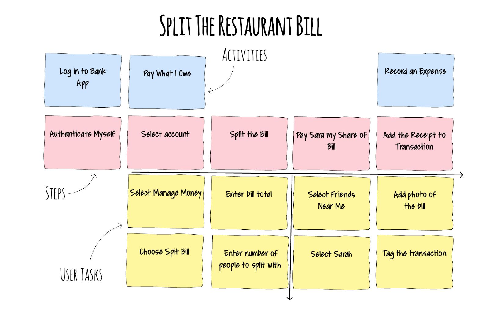

# the problem

- the backlog difficult to prioritize
    - because it's a list
    - difficult to identify dependencies
        - it quickly becomes a network
    - already at this point the tasks need detailed understanding
- the backlog is one dimensional
    - which is priority

# user story mapping

- popularized by Jeff Patton
    - [original blog post](https://jpattonassociates.com/the-new-backlog/)
    - User Story Mapping, O'Reilly, 2014, ISBN-13: 978-1491904909
- performed in workshops including 
    - users,
    - (UI) designers,
    - developers,
    - testers,
    - and other stakeholders
- build a shared understanding of the product and a common language

## other benefits of USM

- helps to understand and prioritise what the user needs
- it can discussed with the customer / users &rarr; feedback
- highlights assumptions and risks that might be missed by a single viewpoint
- uncovering dependencies earlier and faster with multiple viewpoints

# user story map

:::::::::::: {.columns}
::::::::: {.column width="50%"}
- two dimensional
- uses the *user's* perspective to tell a story / narrative
- the user want to achieve a goal
- which consists of one or many activities
:::::::::
::::::::: {.column width="50%" .text-size-2}
{data-preview-image="figures/user_story_map_sketch.drawio.svg" data-preview-fit="contain"}

:::::::::
::::::::::::

# user story map {visibility=hidden}


::: notes
- two dimensional
- consists of three elements
    1. activities
    2. steps
    3. details
:::


## activity

:::::::::::: {.columns}
::::::::: {.column width="50%"}
- is sort of a big thing that people do 
- that can have multiple steps,
- and doesn't always have a precise workflow

activities are still user stories with roles

:::::::::
::::::::: {.column width="50%" .text-size-2}
```
As a social media platform user
I want to follow users
so I can keep up with their posts.
```

:::::::::
::::::::::::

::: notes
An activity is close to an epic in the scrum literature.
:::


## user task

:::::::::::: {.columns}
::::::::: {.column width="55%"}
- in agile a "task" refers to the things that *developers* do
    - to finish user stories
- user story mapping considers the *user*,
    - so a user task is what a user needs to do to complete an activity

:::::::::
::::::::: {.column width="50%"}
for example (follow a user)

:   1. search for a user
    2. add user to the followed list

:::::::::
::::::::::::

<!--## details

search for user

:   - type username
    - browse the result lists
    - click to the "follow" button-->

## 

{width=80%}

::: {.text-smaller}
reading: [Quickstart Guide to User Story Mapping](../resources/quickstart-guide-to-user-story-mapping.pdf)

:::

## user story map as a document

- not final, not set in stone
- it is possible and encouraged to adjust<br>as the more knowledge is acquired about the software
    - versioning
- you are free to move notes up and down
    - change the role (activity &#8596; user task)


# backbone, skeleton, ribs


top-down structure, high-level overview first, then adding details


## iterations


# note that

- there can be several different types of user
- each one could have a different reason for their activities

# story mapping steps

1. set the context, decide on the goal
    - who is the user we are mapping for?
    - what are they trying to achieve with their activity and why?
    - what is the outcome they seek and how will we help them to achieve it?
2. tell a story
    - go wide not deep, details come later
    - focus on the narrative flow
<!--     - the sequence of the activities does not need to be perfect immediately -->
3. create the backbone of steps
4. define user tasks for each step

::: {.text-smaller}
based on the [Quickstart Guide to User Story Mapping](../resources/quickstart-guide-to-user-story-mapping.pdf)
:::

## story mapping steps

1. set the context, decide on the goal
2. tell a story
3. create the backbone of steps
    - activities as a collection of things you do to get the goal done
    - things that get your activity done are steps
    - start your steps with a verb, an action
    - the order of steps may differ by users, think of an ideal sequence
    - discuss different use cases as they come up
4. define user tasks for each step
    - they can include sub-tasks, alternative tasks, exceptions, details and even UX notes
    - if a step has many tasks, is may worth to split into separate steps
    
::: {.text-smaller}
based on the [Quickstart Guide to User Story Mapping](../resources/quickstart-guide-to-user-story-mapping.pdf)
:::

# social media platform example -- sign-up


sign-up feature from a [minimal social media platform]{data-preview-image="figures/social_media_platform/p1_wbs.svg" data-preview-fit="contain"}

<!--:::::::::::: {.columns}
::::::::: {.column width="50%"}

:::::::::
::::::::: {.column width="50%"}

:::::::::
::::::::::::-->


# social media platform example -- user management

{data-preview-image="figures/usm/user_management.svg" data-preview-fit="contain"}

user management features from a [social media platform v2]{data-preview-image="figures/social_media_platform/p1_wbs.svg" data-preview-fit="contain"}

# social media platform example -- create content
{data-preview-image="figures/usm/um_create_content.svg" data-preview-fit="contain"}

create content feature from a [social media platform v2]{data-preview-image="figures/social_media_platform/p2_wbs.svg" data-preview-fit="contain"}


# social media platform - example {visibility=hidden}


# user story mapping mistakes

:::::::::::: {.columns}
::::::::: {.column width="50%"}
{height=450}

:::::::::
::::::::: {.column width="50%"}
:::::: {.r-stack}
::: {.fragment}
{height=450}
:::
::: {.fragment}
{height=450}
:::
::: {.fragment}
{height=450}
:::
::::::
:::::::::
::::::::::::

::: {.text-smaller}
more from Jeff Patton: [5 story mapping mistakes](https://jpattonassociates.com/5-story-mapping-mistakes/)
:::
