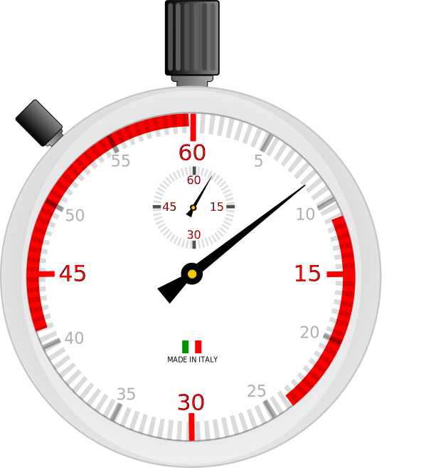
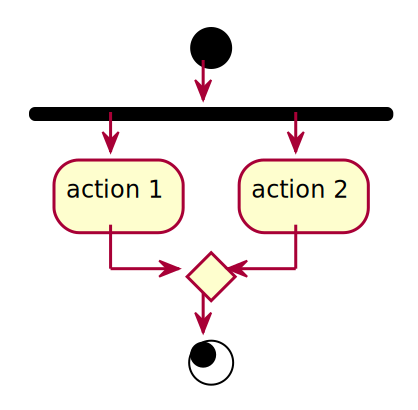
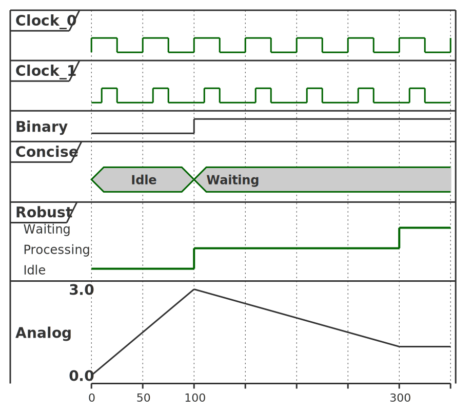

# programming paradigms

- structural
- procedural
- object oriented

# structural

:::::::::::: {.columns}
::::::::: {.column width="20%" .mt-5}
- statement
- [condition]{.fragment data-fragment-index=1}
- [iteration]{.fragment data-fragment-index=2}

:::::::::
::::::::: {.column width="40%"}
:::::: {.r-stack .text-size-2}
::: {.fragment .fade-out data-fragment-index=1 .pre-width-100}
```python
a = 4.2
a = a * 10
```
:::
::: {.fragment .current-visible data-fragment-index=1 .pre-width-100}
```python
if a > 17
    a -= 5
else:
    a += 5
```
:::
::: {.fragment data-fragment-index=2 .pre-width-100}
<br>
```python
for i in range(10):
    print(i)
```

<br>

```js
for (var i = 0; i < 10; i++) {
    console.log(i);
}
```

:::

::::::
:::::::::
::::::::: {.column width="40%"}
:::::: {.r-stack}
::: {.fragment .fade-out data-fragment-index=1}


:::
::: {.fragment .current-visible data-fragment-index=1}

:::
::: {.fragment .current-visible data-fragment-index=2}

:::

::::::
:::::::::
::::::::::::


# procedural

<!-- :::::::::::: {.columns} -->
<!-- ::::::::: {.column width="70%"} -->
- extends structural with procedures
    - a.k.a. functions, subroutines
- the two main concepts
    - modularity: organizing the parts of a program into separate modules
        - reusability
    - scoping
        - limit the scope of the variables

<!--:::::::::
::::::::: {.column width="30%"}


```python
def power(a, b):
    r = a
    for _ in range(b - 1):
        r *= r
    return r

a = 4.2
a = a * 10
power(a, 3)
```

:::::::::-->

## procedural - example

:::::::::::: {.columns}
::::::::: {.column width="50%"}


:::::::::
::::::::: {.column width="50%" .pre-width-100 .mt-4 .text-size-3}
```python
def power(a, b):
    r = a
    for _ in range(b - 1):
        r *= r
    return r

a = 3
a = power(a, 3)
```

:::::::::
::::::::::::


# object oriented programming

- extends procedural programming with the concept of objects
- main properties of OOP
    1. abstraction
    2. encapsulation
    3. inheritance
    4. polymorphism


## 1. abstraction

<!-- Abstraction involves hiding the complex reality while exposing only the necessary parts. It allows programmers to focus on interactions at a higher level without needing to understand the intricate details of the implementation. This is achieved through abstract classes and interfaces, which define a contract for what methods an object must implement without specifying how they should be implemented -->

- hiding the complex reality while exposing only the necessary parts
- allows to focus on interactions at a higher level without needing to understand the details of the implementation
- achieved through abstract classes and interfaces, which define a contract for what methods an object must implement without specifying how they should be implemented


## 2. encapsulation

<!--Encapsulation is the principle of bundling data (attributes) and methods (functions) that operate on that data into a single unit known as a class. This property restricts direct access to some of the object's components, which is a means of preventing unintended interference and misuse of the methods and data. By exposing only necessary parts of an object through public methods (getters and setters), encapsulation enhances security and integrity of the data-->

- bundling data (attributes) and methods (functions) that operate on that data into a single unit known as a class
- this property restricts direct access to some of the object's components
    - private, public, protected
- can preventing unintended interference and misuse of the methods and data
    - by exposing only the necessary parts of an object through public methods


## 3. inheritance

<!--Inheritance is a mechanism that allows one class (subclass or derived class) to inherit attributes and methods from another class (superclass or base class). This promotes code reusability, as common functionality can be defined in a base class and reused in derived classes.-->

- a mechanism that allows one class (subclass or derived class) to inherit attributes and methods from another class (superclass or base class)
- this promotes code reusability, as common functionality can be defined in a base class and reused in derived classes
- results hierarchical relationship which fosters modular design
    - also increases dependency


## class-based inheritance

- every object is defined by a class
    - which is a definition or a blueprint
    - describes the structure and behavior of an object
- most common


## prototype based inheritance

> The object function untangles JavaScript's constructor pattern, achieving true prototypal inheritance.
> It takes an old object as a parameter and returns an empty new object that inherits from the old one.
> If we attempt to obtain a member from the new object, and it lacks that key, then the old object will supply the member.
> Objects inherit from objects.
> What could be more object oriented than that?
>
> [Douglas Crockford](http://crockford.com/javascript/prototypal.html)


## OO without inheritance

- Go does not support inheritance at all, though it is considered object-oriented
    - at least partially [[Go FAQ](https://go.dev/doc/faq#Is_Go_an_object-oriented_language)]
- Bjarne Stroustrup (author of C++) has stated that it is possible to do OOP without inheritance [@stroustrup2015object]


## 4. polymorphism

<!--Polymorphism allows objects to be treated as instances of their parent class, enabling a single interface to control access to different underlying forms (data types). There are two types of polymorphism: compile-time (method overloading) and runtime (method overriding). This property enables flexibility in code, allowing for methods to perform differently based on the object that invokes them. For instance, a method defined in a base class can be overridden in a derived class to provide specific behavior-->

- allows objects to be treated as instances of their parent class
- enables flexibility in code, allowing for methods to perform differently based on the object that invokes them
    - method defined in a base class can be overridden in a derived class to provide specific behavior

# Unified Modeling Language

:::::::::::: {.columns}
::::::::: {.column width="60%" .mt-4}
- UML 2.0 released in 2005
    - latest revision in 2017
- ISO/IEC 19501 standard
- designed to be a complete language of software modelling
- UML 2 has 14 diagrams in two categories: structure and behavior

::: {.fragment}
most software developer do not use UML (in a formal way), but hand drawn sketches which often include UML elements [@baltes2014sketches]
:::
:::::::::
::::::::: {.column width="40%"}


:::::::::
::::::::::::


# use case diagram

:::::::::::: {.columns}
::::::::: {.column width="55%"}
- depicts the interactions between system users (actors) and the system itself
- used to specify the functional requirements
- provides a high-level view
    - helping stakeholders to understand the system's functionality
- it's purpose is similar to the user story

:::::::::
::::::::: {.column width="45%"}
{width=275}

:::::::::
::::::::::::

## elements of the use case diagram

:::::::::::: {.columns}
::::::::: {.column width="40%"}


:::::::::
::::::::: {.column width="50%"}
:::::: {.r-stack}
::: {.fragment .fade-out data-fragment-index=1}

:::
::: {.fragment .current-visible data-fragment-index=1}

:::
::: {.fragment data-fragment-index=2}

:::
::::::

:::::::::
::::::::::::

<!--:::::::::::: {.columns}
::::::::: {.column width="40%"}
::: {.fragment data-fragment-index=3}
{height=100}
:::
:::::::::
::::::::: {.column width="50%"}
stereotype (can be applied to actors as well) 
:::::::::
::::::::::::-->

## use case diagram - example

:::::: {.r-stack}
::: {.fragment .fade-out data-fragment-index=1}
{width=400}
:::
::: {.fragment .current-visible data-fragment-index=1}
{width=400}
:::
::: {.fragment .current-visible data-fragment-index=2}
{width=400}
:::
::::::

# class diagram


# object diagram

- special case of a class diagram
- graphical representation of the objects and their relationships<br>**at a specific moment in time**
- provides a snapshot of the system's structure
- does not show anything architecturally different to class diagram


# component diagram

- depicts the component structure and relations
- highlighting the interfaces

::: {.mt-2}
{height=275}
:::


# state diagram

- a visual representation of the states a system or an object can be in
    also the transitions between those states
- models the dynamic behavior of the system, capturing how it responds to different events over time
- shows the system's life cycle


## state diagram elements

:::::::::::: {.columns}
::::::::: {.column width="50%"}
{width=400}
:::::::::
::::::::: {.column width="50%"}
{width=300}
:::::::::
::::::::::::


## state diagram - example

:::::::::::: {.columns}
::::::::: {.column width="60%"}
{width=350}
:::::::::
::::::::: {.column width="40%" .mt-4}
{width=175}
:::::::::
::::::::::::

<!--
# activity diagram

- graphical representations of workflows
- similar to flowcharts
    - but uses UML notation
    - and can visualize parallel processing

:::::::::::: {.columns}
::::::::: {.column width="50%"}
{height=300}
:::::::::
::::::::: {.column width="50%"}
{height=300}
:::::::::
::::::::::::-->

# activity diagram

:::::::::::: {.columns}
::::::::: {.column width="60%" .mt-4}
- graphical representations of workflows
- similar to flowcharts
    - but uses UML notation
    - and can visualize parallel processing
    - has more features

:::::::::
::::::::: {.column width="20%"}
{height=300}
:::::::::
::::::::: {.column width="20%"}
{height=300}
:::::::::
::::::::::::


## parallel processing

:::::::::::: {.columns}
::::::::: {.column width="50%"}
{height=300}
:::::::::
::::::::: {.column width="50%"}
{height=300}
:::::::::
::::::::::::

a join synchronizes two inflows (waits for the slower)


## merge after condition


## swimlanes

:::::::::::: {.columns}
::::::::: {.column width="65%" .mt-3}
- actions can be separated using "swimlanes"
- swimlanes can represent actors, components or other parts of the software system
:::::::::
::::::::: {.column width="35%"}
{height=400}
:::::::::
::::::::::::


# sequence diagram

:::::::::::: {.columns}
::::::::: {.column width="60%"}

:::::::::
::::::::: {.column width="40%" .mt-3}
- shows process interactions arranged in time sequence
- depicts the processes and objects involved and the sequence of messages exchanged
- instead of the inner parts of a system, message exchange between software systems can be depicted
:::::::::
::::::::::::


# timing diagram

:::::::::::: {.columns}
::::::::: {.column width="60%"}
- focuses on the chronological order of events, showing how different objects interact with each other over time
- especially useful in real-time systems and embedded systems
- more like for documentation rather than modelling

:::::::::
::::::::: {.column width="40%"}
:::::: {.r-stack}
::: {.fragment .fade-out data-fragment-index=1}

:::
::: {.fragment .fade-in data-fragment-index=1}

:::
::::::
:::::::::
::::::::::::

::: {.text-smaller}
source: [PlantUML documentation](https://plantuml.com/timing-diagram)
:::

# references

::: {#refs}
:::
