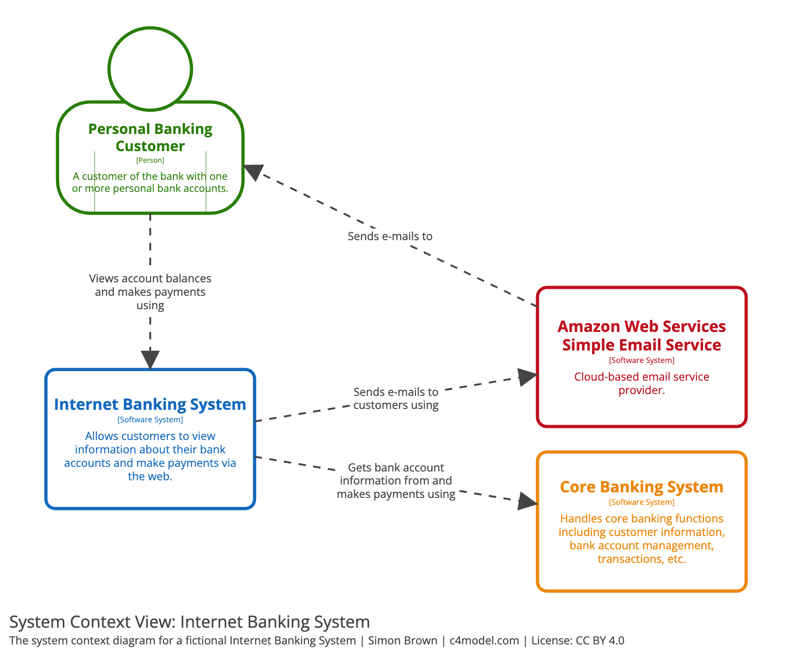

# what is the issue with UML?

- closely connected with OOP, propagates object-oriented modelling
    - however the design and the implementation should be separated

# C4 model

- hierarchical model
- has four levels:
    - context, containers, components and code

- [The C4 model for visualising software architecture](https://c4model.com/)
    - Context, Containers, Components and Code
- [The C4 Model for Software Architecture](https://www.infoq.com/articles/C4-architecture-model/)

# Level 1: System Context diagram

- high level relation with other systems or users
- similar to use case diagram
- technologies, protocols and other low-level details are not important
- understandable for non-technical people

> Shows the software system you are building and how it fits into the world in terms of the people who use it and the other software systems it interacts with.
>
>  Simon Brown - [The C4 Model for Software Architecture](https://www.infoq.com/articles/C4-architecture-model/)

## system context example

{height=550}

# Level 2: Container diagram

> Zooms into the software system, and shows the containers (applications, data stores, microservices, etc.) that make up that software system. Technology decisions are also a key part of this diagram.
>
>  Simon Brown - [The C4 Model for Software Architecture](https://www.infoq.com/articles/C4-architecture-model/)

## container example

{height=550}

# Level 3: Component diagram

> Zooms into an individual container to show the components inside it. These components should map to real abstractions (e.g., a grouping of code) in your codebase.
>
>  Simon Brown - [The C4 Model for Software Architecture](https://www.infoq.com/articles/C4-architecture-model/)

## component example

{height=550}

# Level 4: Code

> Finally, if you really want or need to, you can zoom into an individual component to show how that component is implemented.
>
>  Simon Brown - [The C4 Model for Software Architecture](https://www.infoq.com/articles/C4-architecture-model/)

## notation
