{width=900}


# software design and architecture stack

![based on Khalil Stemmel's figure [@stemmler2019how]](figures/the_software_design_and_architecture_stack_generalized.drawio.svg){height=475}


# gang of four (GoF) design patterns

- GoF: Erich Gamma, Richard Helm, Ralph Johnson, and John Vlissides
- 23 common software design patterns
    - published in "Design Patterns: Elements of Reusable Object-Oriented Software" (1994) [@gamma1994design]
- provides solutions to common design problems
- categorized into three main groups
    1. creational
    2. structural
    3. behavioral


## the 23 (GoF) design patterns

:::::::::::: {.columns}
::::::::: {.column width="30%"}
**creational**

- Factory Method
- Abstract Factory
- Builder
- Prototype 
- Singleton 

:::::::::
::::::::: {.column width="30%"}
**structural**

- Adapter 
- Bridge 
- Composite 
- Decorator 
- Facade 
- Flyweight 
- Proxy 

:::::::::
::::::::: {.column width="40%"}
**behavioral**

- Chain of Responsibility
- Command
- Interpreter
- Iterator
- Mediator
- Memento
- Observer
- State
- Strategy 
- Template Method
- Visitor 

:::::::::
::::::::::::

::: {.text-smaller}
read about the design patterns in details, for example at [refactoring.guru](https://refactoring.guru/design-patterns/catalog)
:::


## bridge pattern (structural)

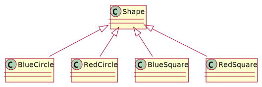{height=175}

:::::: {.r-stack .fragment data-fragment-index=1}
::: {.fragment .fade-out data-fragment-index=2}
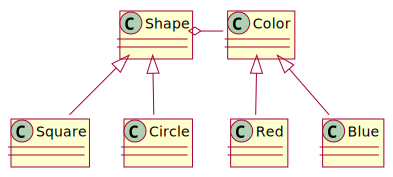{height=200}
:::
::: {.fragment data-fragment-index=2}
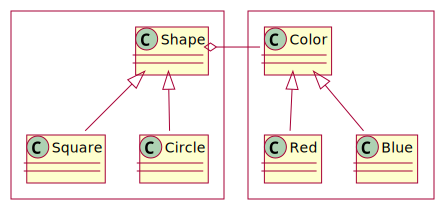{height=225}
:::
:::::


## GoF design patterns in functional programming

| OO pattern        | FP pattern |
|-------------------|------------|
| factory pattern   | function   |
| strategy pattern  | function   |
| decorator pattern | function   |
| visitor pattern   | function   |
| ...               | ...        |

Peter Norvig [demonstrated](http://www.norvig.com/design-patterns/) that 16 out of the 23 patterns are simplified or eliminated by language features in Lisp or Dylan (1998) [@norvig1998design]

[more about](https://fsharpforfunandprofit.com/fppatterns/) it from Scott Wlaschin [@wlaschin2014functional]


# You aren't gonna need it (YAGNI)

:::::::::::: {.columns}
::::::::: {.column width="50%"}
- states that a programmer should not add functionality until deemed necessary
- principle originates from extreme programming (XP)

::: {.wide-quote .mt-3}
> Always implement things when you actually need them, never when you just foresee that you need them.
>
> -- [Ron Jeffries](https://ronjeffries.com/xprog/articles/practices/pracnotneed/)

:::

:::::::::
::::::::: {.column width="55%" .text-size-1}
::: {.r-frame}
**extreme programming**

- advocates frequent releases in short development cycles
- intended to improve productivity and introduce checkpoints at which new customer requirements can be adopted
- features
    - programming in pairs,
    - doing extensive code review,
    - unit testing of all code,
    - not programming features until they are actually needed,
    - flat management structure
- considered a type of agile software development

:::
:::::::::
::::::::::::


# hollywood principle (inversion of control)

::: notes
:::


# coupling

:::::::::::: {.columns}
::::::::: {.column width="55%" .mt-5}
- the degree of interdependence between software modules
- coupling is usually contrasted with cohesion
    - low coupling often correlates with high cohesion, and vice versa
:::::::::
::::::::: {.column width="45%"}
 | public domain](figures/borrowed/CouplingVsCohesion.svg)
:::::::::
::::::::::::

::: {.text-smaller .mt-2}
source [Wikipedia](https://en.wikipedia.org/wiki/Coupling_(computer_programming)) [@enwiki:1245630908]
:::


# SOLID principles

- single responsibility principle
- open-closed principle
- Liskov substitution principle
- interface segregation principle
- dependency inversion principle


::: {.mt-3}
- introduced by Robert C. Martin
    - in his 2000 paper [*Design Principles and Design Patterns*](https://web.archive.org/web/20150906155800/http://www.objectmentor.com/resources/articles/Principles_and_Patterns.pdf) about software rot
- the SOLID acronym was coined around 2004 by Michael Feathers
:::

::: notes
- https://www.freecodecamp.org/news/solid-principles-explained-in-plain-english/
- https://devopedia.org/solid-design-principles#Merson-2020
:::


## single responsibility principle

> a class should do one thing and therefore it should have only a single reason to change

:::::::::::: {.columns}
::::::::: {.column width="50%" .text-smaller}
Unix philosophy

Make each program do one thing well. To do a new job, build afresh rather than complicate old programs by adding new "features".
:::::::::
::::::::: {.column width="50%" .text-smaller}
advantages

- testing is easier
    - fewer test cases required
- less dependencies
    - to other modules or classes
:::::::::
::::::::::::


## open-closed principle

> classes should be open for extension and closed to modification


## Liskov substitution principle

> if class A is a subtype of class B, B should be able to replaced with A without disrupting the behavior of the program


- named after Barbara Liskov


## Liskov substitution principle - example

:::::::::::: {.columns}
::::::::: {.column width="50%" .pre-width-100}
```python
class Rectangle:

    def __init__(self, width: int, height: int):
        self.__width = width
        self.__height = height

    def setWidth(self, width: int):
        self.__width = width

    def setHeight(self, height: int):
        self.__height = height

    def getWidth(self):
        return self.__width

    def getHeight(self):
        return self.__height

    def getArea(self):
        return self.__width * self.__height

```

:::::::::
::::::::: {.column width="50%"}
```python
class Square(Rectangle):

    def __init__(self, width: int):
        super().setWidth(width)
        super().setHeight(width)

    def setWidth(self, width: int):
        super().setWidth(width)
        super().setHeight(width)

    def setHeight(self, height: int):
        super().setWidth(height)
        super().setHeight(height)
```

```python
>>> r = Rectangle(2, 3)
>>> print(r.getArea())
6

>>> s = Square(2)
>>> print(s.getArea())
4
```
:::::::::
::::::::::::


## Liskov substitution principle - example

```python
def getAreaTest(r: Rectangle):
    width = r.getWidth()  # width is 2
    r.setHeight(10)
    return f"Expected area of {width * 10}, got {r.getArea()}"
```

```python
>>> r = Rectangle(2, 3)
>>> print(r.getArea())
6

>>> s = Square(2)
>>> print(s.getArea())
4

>>> print(getAreaTest(r))  # rectangle
Expected area of 20, got 20

>>> print(getAreaTest(s))  # square
Expected area of 20, got 100

```

this example violates the Liskov substitution principle


## interface segregation principle

> states that many client-specific interfaces are better than one general-purpose interface. Clients should not be forced to implement a function they do no need.


## dependency inversion principle

> Dependency inversion principle says that modules should depend upon interfaces or abstract classes, not concrete classes. It's an inversion because implementations depend upon abstractions and not the other way round. [@millington2019solid]

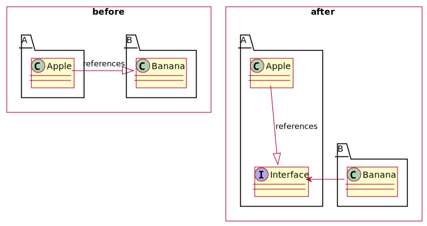{height=300}

::: {.text-smaller}
increases reusability
:::


# topologies


# MVC


# user statistics example

:::::::::::: {.columns}
::::::::: {.column width="55%" .pre-width-100}
`as a user I want to see my activity to see my progress`

display user statistics including

:    - username
     - profile image
     - registration date
     - progress in course
     - daily activity in the current month


:::::::::
::::::::: {.column width="45%"}
{width=300}
:::::::::
::::::::::::


## architecture v1

:::::::::::: {.columns}
::::::::: {.column width="60%"}
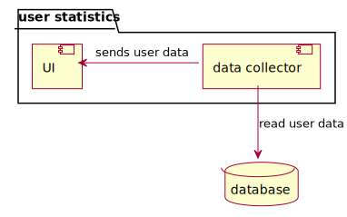
:::::::::
::::::::: {.column width="40%"}
send everything to the UI

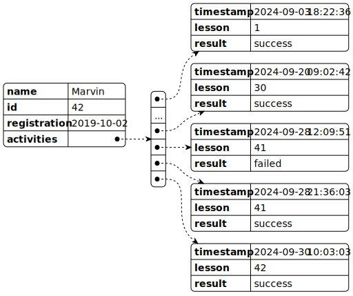

:::::::::
::::::::::::

## architecture v1 - class

:::::::::::: {.columns}
::::::::: {.column width="70%"}
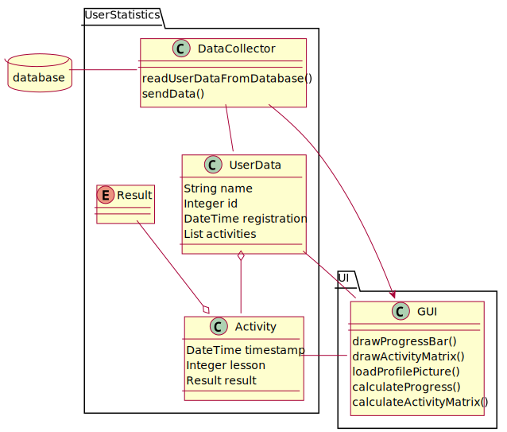{width=600}
:::::::::
::::::::: {.column width="30%" .mt-5 .fragment}
in this case the UI has to calculate the daily activity

::: {.fragment}
- tight coupling
- single responsibility principle violated
:::
:::::::::
::::::::::::


## architecture v2

:::::::::::: {.columns}
::::::::: {.column width="60%"}
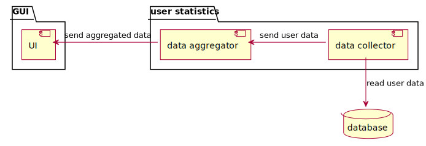
:::::::::
::::::::: {.column width="40%"}
send only the aggregated data

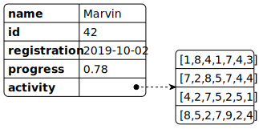

:::::::::
::::::::::::


## architecture v2 - class

:::::::::::: {.columns}
::::::::: {.column width="70%"}
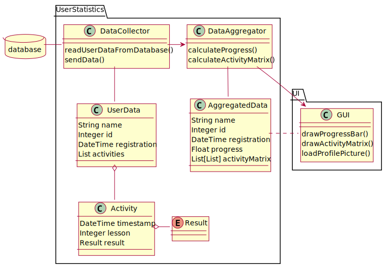{width=600}
:::::::::
::::::::: {.column width="30%" .mt-5}
data collector still has the whole user data but that aligns with its purpose

data aggregator calculates everything and the UI only displays it
:::::::::
::::::::::::


## architecture v2.1 - class

:::::::::::: {.columns}
::::::::: {.column width="70%"}
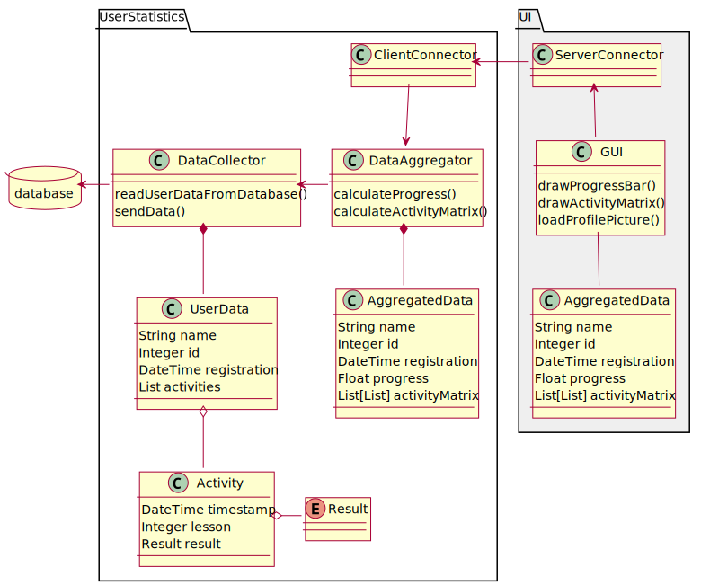{width=600}
:::::::::
::::::::: {.column width="30%" .mt-2}
{height=100}

UI might be on a client

different code base, different language

:::::::::
::::::::::::


## architecture v3

:::::::::::: {.columns}
::::::::: {.column width="60%"}
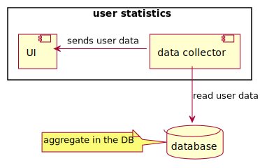
:::::::::
::::::::: {.column width="40%"}
make the database aggregate the data


:::::::::
::::::::::::

## architecture v3 - SQL

:::::::::::: {.columns .column-gapless}
::::::::: {.column width="35%"}

:::::::::
::::::::: {.column width="65%" .pre-width-100}
[for the activity matrix:]{.text-smaller}

```sql
SELECT
    CAST(strftime('%W', timestamp) AS INTEGER) AS week_of_year,
    CAST(strftime('%u', timestamp) AS INTEGER) AS day_of_week,
    count(*) AS count
FROM activity
WHERE
    user_id = 42 AND
    week_of_year > 35 AND
    week_of_year < 40
GROUP BY
    week_of_year,
    day_of_week
;
```
:::::::::
::::::::::::

## architecture v3 - SQL

:::::::::::: {.columns}
::::::::: {.column width="50%"}
:::::: {.r-stack}
::: {.fragment .fade-out data-fragment-index=1}

:::
::: {.fragment data-fragment-index=1}
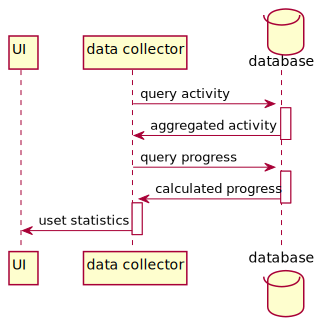
:::
:::::
:::::::::
::::::::: {.column width="50%" .pre-width-100}
[for the progress:]{.text-smaller}

```sql
SELECT
	lesson / 50.0 AS progress
FROM activity
WHERE
    user_id = 42 AND
    result = 'success'
ORDER BY
	lesson DESC
LIMIT 1;
```
:::::::::
::::::::::::

## architecture v3 - issues

- hard dependency on database
    - business logic in persistence layer
    - code depends on the SQL dialect
        - can be mitigated with an object-relational mapping (ORM) framework but that would also be a dependency
- may not suitable for complex aggregations
    - stored functions just increase dependency
- harder to unit test

::: {.fragment .text-color-secondary}
on the other hand, most of these are present in all the three architectures!
:::


# record architecture decisions

::: {.text-small}
in each architecture decision record, write these sections:
:::

```markdown
# Title

## Status

What is the status, such as proposed, accepted, rejected, deprecated, superseded, etc.?

## Context

What is the issue that we're seeing that is motivating this decision or change?

## Decision

What is the change that we're proposing and/or doing?

## Consequences

What becomes easier or more difficult to do because of this change?
```

::: {.text-small}
ADR template by Michael Nygard from [Documenting architecture decisions](http://thinkrelevance.com/blog/2011/11/15/documenting-architecture-decisions)
:::

::: notes
You can use [adr-tools](https://github.com/npryce/adr-tools) to manage the markdown based (Nygard stlye) the ADR files.
:::

# references

::: {#refs}
:::
