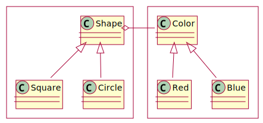

# software design and architecture stack

![based on Khalil Stemmel's figure [@stemmler2019how]](figures/the_software_design_and_architecture_stack_generalized.drawio.svg){height=475}

# gang of four (GoF) design patterns

- GoF: Erich Gamma, Richard Helm, Ralph Johnson, and John Vlissides
- 23 common software design patterns
    - published in "Design Patterns: Elements of Reusable Object-Oriented Software" (1994) [@gamma1994design]
- provides solutions to common design problems
- categorized into three main groups
    1. creational
    2. structural
    3. behavioral

## the 23 (GoF) design patterns

:::::::::::: {.columns}
::::::::: {.column width="30%"}
**creational**

- Factory Method
- Abstract Factory
- Builder
- Prototype 
- Singleton 

:::::::::
::::::::: {.column width="30%"}
**structural**

- Adapter 
- Bridge 
- Composite 
- Decorator 
- Facade 
- Flyweight 
- Proxy 

:::::::::
::::::::: {.column width="40%"}
**behavioral**

- Chain of Responsibility
- Command
- Interpreter
- Iterator
- Mediator
- Memento
- Observer
- State
- Strategy 
- Template Method
- Visitor 

:::::::::
::::::::::::

::: {.text-smaller}
read about the design patterns in details, for example at [refactoring.guru](https://refactoring.guru/design-patterns/catalog)
:::

## bridge pattern (structural)

{height=175}

:::::: {.r-stack .fragment data-fragment-index=1}
::: {.fragment .fade-out data-fragment-index=2}
{height=200}
:::
::: {.fragment data-fragment-index=2}
{height=225}
:::
:::::

# You aren't gonna need it (YAGNI)

:::::::::::: {.columns}
::::::::: {.column width="50%"}
- states that a programmer should not add functionality until deemed necessary
- principle originates from extreme programming (XP)

::: {.wide-quote .mt-3}
> Always implement things when you actually need them, never when you just foresee that you need them.
>
> -- [Ron Jeffries](https://ronjeffries.com/xprog/articles/practices/pracnotneed/)

:::

:::::::::
::::::::: {.column width="55%" .text-size-1}
::: {.r-frame}
**extreme programming**

- advocates frequent releases in short development cycles
- intended to improve productivity and introduce checkpoints at which new customer requirements can be adopted
- features
    - programming in pairs,
    - doing extensive code review,
    - unit testing of all code,
    - not programming features until they are actually needed,
    - flat management structure
- considered a type of agile software development

:::
:::::::::
::::::::::::

# hollywood principle (inversion of control)

::: notes
:::

# SOLID principles

- single responsibility principle
- open-closed principle
- Liskov substitution principle
- interface segregation principle
- dependency inversion principle

::: notes
https://www.freecodecamp.org/news/solid-principles-explained-in-plain-english/
:::

##

https://devopedia.org/solid-design-principles#Merson-2020
