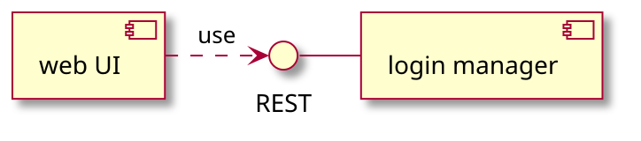
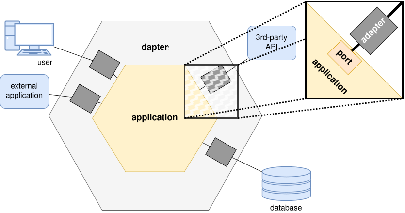
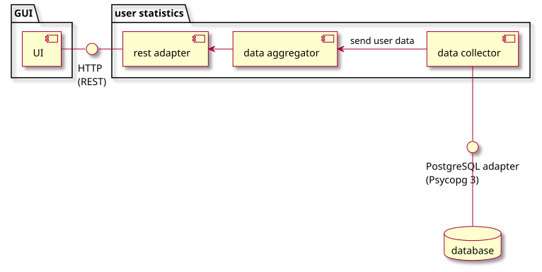
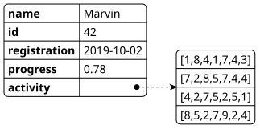
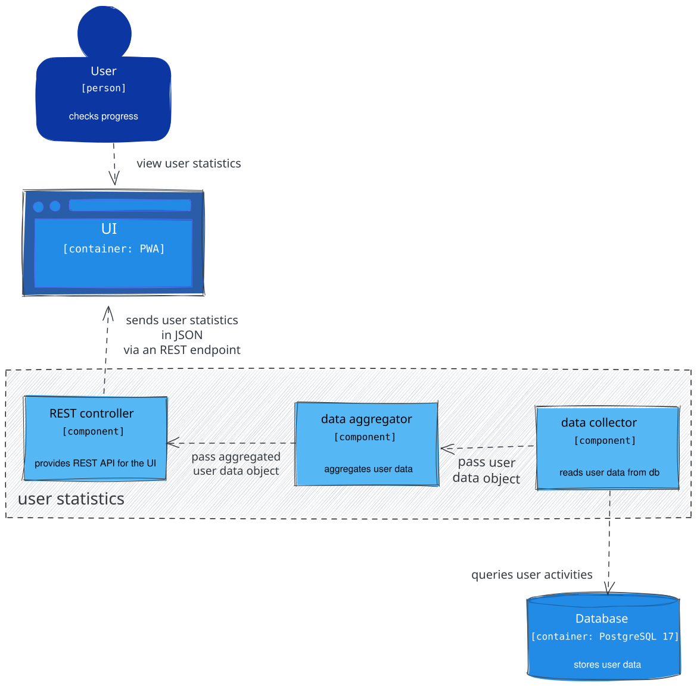
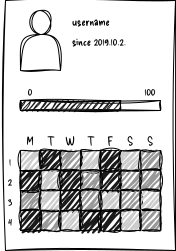
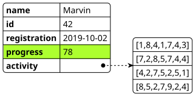
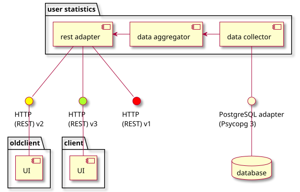
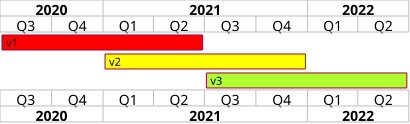
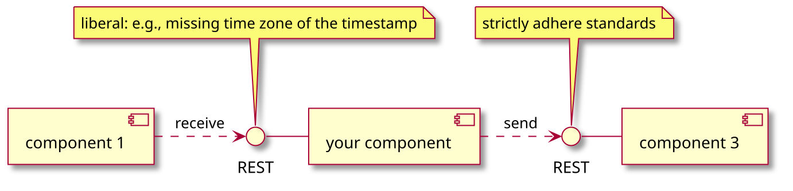

an interface is a shared boundary across which two or more separate components of a computer system [@enwiki:1244878409]

:::::::::::: {.columns .mt-2}
::::::::: {.column width="50%"}
 | [CC BY-SA](https://creativecommons.org/licenses/by-sa/4.0/)](figures/borrowed/RJ-45_Ethernet_socket_on_Lenovo_T410_Laptop.jpg){width=450}

[Ethernet 1000BASE-T | DisplayPort 1.2 | USB 2.0]{.text-smaller}
:::::::::
::::::::: {.column width="50%"}
 [CC BY-SA](https://creativecommons.org/licenses/by-sa/4.0/)](figures/borrowed/KDE_Plasma_5.22.png){width=450}
:::::::::
::::::::::::

{height=150}


## interface is an agreement

:::::::::::: {.columns}
::::::::: {.column width="55%" .mt-4}
- how a module / component will work
- so as long as the agreement is complied the components do not need to know about the internal structure/work of the other components
    - separation of concerns
    - single responsibility principle

:::::::::
::::::::: {.column width="45%"}
{width=500}
:::::::::
::::::::::::

# a 327 Million Dollar interface miscommunication

NASA and Lockheed Martin mixed up units for the Mars Climate Orbiter (1999)

:::::::::::: {.columns}
::::::::: {.column width="60%" .mt-1}
- spacecraft sent values back to Earth in **Newton seconds** (kg⋅m/s)
- the software in the ground station read those results as **pound seconds**
    - the guidance and navigation teams was off by a factor of 4.45 times
- this led to a miscalculated trajectory, which doomed the probe and the mission

:::::::::
::::::::: {.column width="40%"}
 [@enwiki:1248652445]]{.text-small}](figures/borrowed/Mars_Climate_Orbiter_2.jpg)
:::::::::
::::::::::::

::: {.text-smaller}
based on [@dodd2020metric], read the [full story](https://everydayastronaut.com/mars-climate-orbiter/) written by Tim Dodd
:::

#

{width=700}

the most important elements of the design are the interfaces, hexagonal arcitecture focuses on them


## user statistics example - interfaces

:::::::::::: {.columns}
::::::::: {.column width="60%"}

:::::::::
::::::::: {.column width="40%"}
data sent to the UI



specify

:    - the JSON schema
     - endpoint
     - etc.

:::::::::
::::::::::::


## user statistics - C4 component

{height=500}


# interface mocking

- an interface is a boundary where a module can be separated
- in the user statistics example there are two parts: a backend and a frontend
- with a well defined interface, the frontend can work regardless of the backends's state
    - e.g., using a mock backend

::: {.wide-quote .fragment}
> A mock, in software engineering, is a simulated object or module that acts as a stand-in for a real object or module [@geeksforgeeks2019mock].
<!-- Mocks are often used in testing to isolate the behavior of a particular module or component and to verify that it behaves as expected. -->
:::


## user statistics - mock backend

:::::::::::: {.columns}
::::::::: {.column width="60%" .text-smaller .code-no-max-height}
```ruby {#sinatra .number-lines style="height:450px"}
require 'sinatra'

def generate_progress
  rand.round(2)
end

def generate_activity_matrix
  result = []
  (1..4).each do |_w|
    daily = []
    (1..7).each do |_d|
      daily.push rand(10)
    end
    result.push daily
  end
  result
end

get '/user/:id/statistics' do
  data = {}
  data['name'] = 'Marvin'
  data['id'] = params['id']
  data['registration'] = '2019-10-02'
  data['progress'] = generate_progress
  data['activity'] = generate_activity_matrix
  return data.to_json
end
```
:::::::::
::::::::: {.column width="40%"}
::: {.text-smaller}
`http://localhost:4567/user/42/statistics`
:::

```json
{
    "name": "Marvin",
    "id": 42,
    "registration": "2019-10-02",
    "progress": 0.92,
    "activity": [
        [4,9,7,4,7,1,8],
        [9,8,1,8,4,1,7],
        [3,6,8,4,2,4,5],
        [3,5,5,3,2,9,7]
    ]
}
```
:::::::::
::::::::::::

## frontend development

:::::::::::: {.columns}
::::::::: {.column width="55%"}
a mock backend should be enough for a frontend developer to create and test the user statistics view of the user interface

```json
{
    "name": "Marvin",
    "id": 42,
    "registration": "2019-10-02",
    "progress": 0.92,
    "activity": [
        [4,9,7,4,7,1,8],
        [9,8,1,8,4,1,7],
        [3,6,8,4,2,4,5],
        [3,5,5,3,2,9,7]
    ]
}
```

::: {.fragment .mt-2}
it may be presented to the customer

::: {.text-smaller}
fast feedback, agile, and so on...
:::
:::

:::::::::
::::::::: {.column width="45%"}
{width=300}
:::::::::
::::::::::::


# do not change the interface (without notice)

:::::::::::: {.columns .mt-4}
::::::::: {.column width="50%" }
{width=375}

:::::::::
::::::::: {.column width="50%" }
{width=375}

:::::::::
::::::::::::

::: {.mt-4}
this will break the frontend

::: {.text-smaller}
it is not just rude, but will waste the time of the other team (with pointless debugging)
:::
:::


## do no break the userland

:::::::::::: {.columns}
::::::::: {.column width="50%" .wide-quote .mt-3}
> the number one rule of kernel development is that "we don't break users"
>
> -- [Linus Torvalds](https://lkml.org/lkml/2017/11/21/356)

:::::::::
::::::::: {.column width="50%" }
 | [CC BY-SA 3.0](https://creativecommons.org/licenses/by-sa/3.0/)](figures/borrowed/Linux kernel and OpenGL video games.svg)
:::::::::
::::::::::::

## API changes should be communicated

:::::::::::: {.columns .mt-4}
::::::::: {.column width="65%"}
::: {.align-left}
- during design / development
    - change can be necessary / allowed, but communicate towards the impacted teams
    - diagrams show inner dependencies

:::
::: {.align-left .fragment}
- services announce API deprecations
- so as library / framework developers
    - can be a source of new issues even if downstream code is not changed

:::
:::::::::
::::::::: {.column width="35%"}
{width=225}

:::::::::
::::::::::::

## API versions

:::::::::::: {.columns .column-gapless}
::::::::: {.column width="60%"}
{width=475}

:::::::::
::::::::: {.column width="40%"}
{width=375}

::: {.text-smaller}
- 2021-06-30: API v1's end of live
    - service does not accept connections via APIv1
    - code can be removed (no need to maintain it anymore)

:::
:::::::::
::::::::::::

::: {.fragment}
`https://developers.facebook.com/v21.0/me?fields=id,name`
:::


# language level

::: {.text-smaller}
GeoPandas 1.0 / new deprecations: unary_union attribute is now deprecated and replaced by the union_all() method (#3007) allowing opting for a faster union algorithm for coverages (#3151)
:::

:::::::::::: {.columns .fragment}
::::::::: {.column width="55%"}
```python
from shapely import Polygon
import geopandas as gpd

p1 = Polygon([[1, 2], [3, 2], [3, 4], [1, 4]])
p2 = Polygon([[2, 3], [4, 3], [4, 5], [2, 5]])

gpd.GeoDataFrame(geometry=[p1, p2]).unary_union
```
:::::::::
::::::::: {.column width="45%" .text-smaller}
DeprecationWarning: The 'unary_union' attribute is deprecated, use the 'union_all()' method instead.

{height=100}
:::::::::
::::::::::::

::: {.fragment}
```python
def unary_union(self):
    warnings.warn(
        "The 'unary_union' attribute is deprecated, "
        "use the 'union_all' method instead.",
        DeprecationWarning,
        stacklevel=2,
    )
    return self.union_all()
```

::: {.text-small}
source: [github.com/geopandas/geopandas](https://github.com/geopandas/geopandas/blob/f150ec0480cfbf2ad8074d210d103b4aed313f11/geopandas/array.py#L848-L855)
:::
:::


## java

:::{.text-smaller}
```java
public class Worker {
    /**
     * Calculate period between versions
     * @deprecated
     * This method is no longer acceptable to compute time between versions.
     * <p> Use {@link Utils#calculatePeriod(Machine)} instead.
     *
     * @param machine instance
     * @return computed time
     */
    @Deprecated(since = "4.5", forRemoval = true)
    public int calculate(Machine machine) {
        return machine.exportVersions().size() * 10;
    }
}

```

source: [@ozler2019java]

:::

IDEs can parse the deprecation decorators and show to the developer during work


# discussion: Hyrum's Law

:::::::::::: {.columns .column-gapless}
::::::::: {.column width="65%" .wide-quote .mt-5}
> With a sufficient number of users of an API,<br>
> it does not matter what you promise in the contract:<br>
> all observable behaviors of your system<br>
> will be depended on by somebody.
>
> --  Hyrum Wright, 2012

:::{}
[Hyrum's Law](https://www.hyrumslaw.com/)
:::

:::::::::
::::::::: {.column width="35%"}
 | [source](https://xkcd.com/1172/)](figures/borrowed/xkcd/workflow_2x.png)
:::::::::
::::::::::::


## example to Hyrum's Law

:::::::::::: {.columns}
::::::::: {.column width="50%"}
`/user/<id>/statistics`

```json
{
    "name": "Marvin",
    "id": 42,
    "registration": "2019-10-02",
    "progress": 0.92,
    "activity": [
        [4,9,7,4,7,1,8],
        [9,8,1,8,4,1,7],
        [3,6,8,4,2,4,5],
        [3,5,5,3,2,9,7]
    ]
}
```
:::::::::
::::::::: {.column width="50%"}
no documented `/users` endpoint, but existing implementation

``` ruby
get '/users' do
  data = {"ids" => [42]}
  return data.to_json
end
```

sooner or later someone will discover the undocumented behavior and depend on it

:::::::::
::::::::::::

::: {.text-smaller}
think like a villian, someone who's going to abuse the system that you’re designing and building

:::

# discussion: Postel's law

::: {.wide-quote}
> Be conservative in what you do, be liberal in what you accept from others.
> 
> -- Jon Postel, in the specification of TCP in 1980 (RFC 761) source: [Postel's Law](https://lawsofsoftwareengineering.com/laws/postels-law/)

:::


## Postel's law / robustness principle



:::::::::::: {.columns .wide-quote}
::::::::: {.column width="33%"}
> When receiving data, handle variations, minor errors, or deviations where possible. Don’t crash or reject communication over minor issues.

:::::::::
::::::::: {.column width="33%"}
> When your system emits data or interacts with the outside world, adhere closely to protocols and standards.

:::::::::
::::::::: {.column width="33%"}
> In modern times, overly liberal acceptance can sometimes mask errors, so this law is occasionally tempered with security considerations.

:::::::::
::::::::::::

:::{.text-smaller}
source: [Laws of Software Engineering / Postel's Law](https://lawsofsoftwareengineering.com/laws/postels-law/)
:::

# references

::: {#refs .text-smaller}
:::
