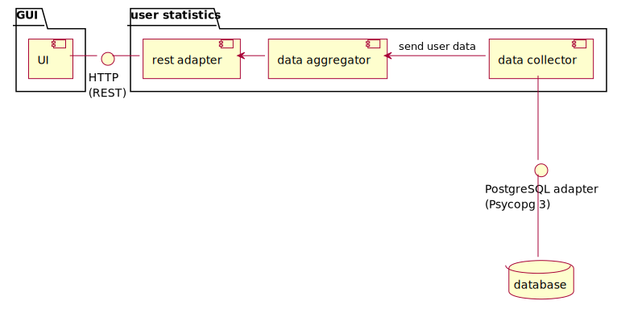

an interface is a shared boundary across which two or more separate components of a computer system [@enwiki:1244878409]

:::::::::::: {.columns .mt-3}
::::::::: {.column width="50%"}
 | [CC BY-SA](https://creativecommons.org/licenses/by-sa/4.0/)](figures/borrowed/RJ-45_Ethernet_socket_on_Lenovo_T410_Laptop.jpg){width=450}
:::::::::
::::::::: {.column width="50%"}
 [CC BY-SA](https://creativecommons.org/licenses/by-sa/4.0/)](figures/borrowed/KDE_Plasma_5.22.png){width=450}
:::::::::
::::::::::::


## interface is an agreement

{width=500}


#

{width=700}


## user statistics example - interfaces

:::::::::::: {.columns}
::::::::: {.column width="60%"}

:::::::::
::::::::: {.column width="40%"}
data sent to the UI


specify

:    - the JSON schema
     - endpoint
     - etc.

:::::::::
::::::::::::

# interface mocking

- an interface is a boundary where a module can be separated
- in the user statistics example there are two parts: a backend and a frontend
- with a well defined interface, the frontend can work regardless of the backends's state
    - e.g., using a mock backend

::: {.wide-quote .fragment}
> A mock, in software engineering, is a simulated object or module that acts as a stand-in for a real object or module.
<!-- Mocks are often used in testing to isolate the behavior of a particular module or component and to verify that it behaves as expected. -->
:::


## user statistics - mock backend

:::::::::::: {.columns}
::::::::: {.column width="60%" .text-smaller .pre-height-100}
```ruby {#sinatra .number-lines style="height:450px"}
require 'sinatra'

def generate_progress
  rand.round(2)
end

def generate_activity_matrix
  result = []
  (1..4).each do |_w|
    daily = []
    (1..7).each do |_d|
      daily.push rand(10)
    end
    result.push daily
  end
  result
end

get '/user-statistics' do
  data = {}
  data['name'] = 'Marvin'
  data['id'] = 42
  data['registration'] = '2019-10-02'
  data['progress'] = generate_progress
  data['activity'] = generate_activity_matrix
  return data.to_json
end
```
:::::::::
::::::::: {.column width="40%"}
::: {.text-smaller}
`http://localhost:4567/user-statistics`
:::

```json
{
    "name": "Marvin",
    "id": 42,
    "registration": "2019-10-02",
    "progress": 0.92,
    "activity": [
        [4,9,7,4,7,1,8],
        [9,8,1,8,4,1,7],
        [3,6,8,4,2,4,5],
        [3,5,5,3,2,9,7]
    ]
}
```
:::::::::
::::::::::::

## frontend development

:::::::::::: {.columns}
::::::::: {.column width="55%"}
a mock backend should be enough for a frontend developer to create and test the user statistics view of the user interface

```json
{
    "name": "Marvin",
    "id": 42,
    "registration": "2019-10-02",
    "progress": 0.92,
    "activity": [
        [4,9,7,4,7,1,8],
        [9,8,1,8,4,1,7],
        [3,6,8,4,2,4,5],
        [3,5,5,3,2,9,7]
    ]
}
```

::: {.fragment .mt-2}
it may be presented to the customer

::: {.text-smaller}
fast feedback, agile, and so on...
:::
:::

:::::::::
::::::::: {.column width="45%"}
{width=300}
:::::::::
::::::::::::


# do not change the interface (without notice)

:::::::::::: {.columns}
::::::::: {.column width="50%" }
do no break the userland

:::::::::
::::::::: {.column width="50%" }
](figures/borrowed/Linux kernel and OpenGL video games.svg)
:::::::::
::::::::::::

# NASA lost a 327 Million Dollar Mission

NASA and Lockheed Martin mixed up units for the Mars Climate Orbiter

:::::::::::: {.columns}
::::::::: {.column width="60%" .mt-1}
- spacecraft sent values back to Earth in **Newton seconds**
- the software in the ground station read those results as **pound seconds**
    - the guidance and navigation teams was off by a factor of 4.45 times
- this led to a miscalculated trajectory, which doomed the probe and the mission

:::::::::
::::::::: {.column width="40%"}
 [@enwiki:1248652445]]{.text-small}](figures/borrowed/Mars_Climate_Orbiter_2.jpg)
:::::::::
::::::::::::

::: {.text-smaller}
based on [@dodd2020metric], read the [full story](https://everydayastronaut.com/mars-climate-orbiter/) written by Tim Dodd
:::


# references

::: {#refs}
:::
