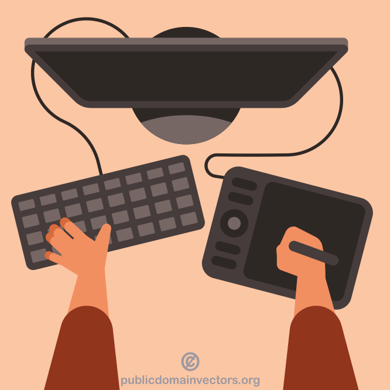
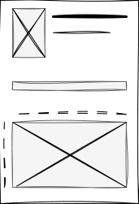
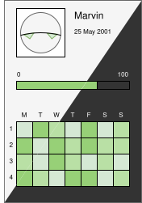
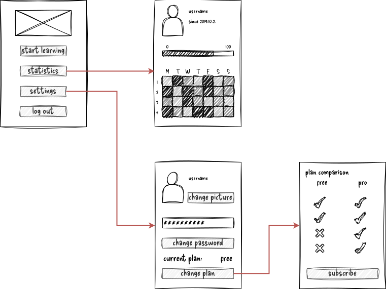
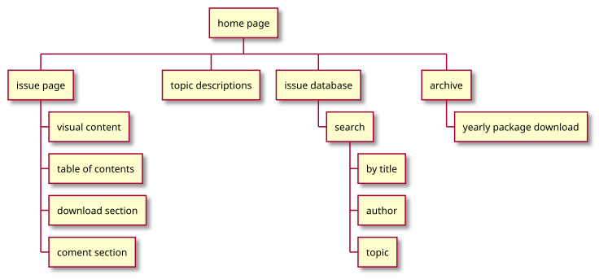
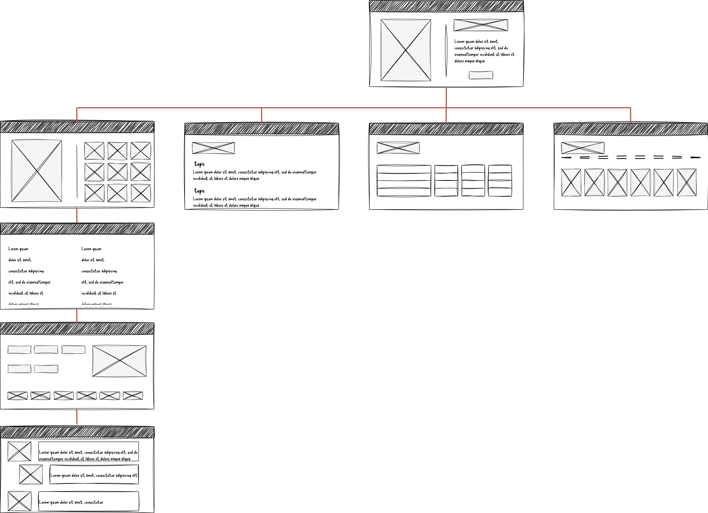

# user interface (UI) / user experience (UX)

> A person's perceptions and responses that result from the use or anticipated use of a product, system or service.
>
> -- ISO 9241-210, Ergonomics of human-system interaction

:::::::::::: {.columns .mt-3}
::::::::: {.column width="50" .mt-3}
- graphical user interface (GUI) is visual representation on digital control panels
- UX is about how one feels using that interface

:::::::::
::::::::: {.column width="50%"}
 [CC BY-SA](https://creativecommons.org/licenses/by-sa/4.0/)](figures/borrowed/KDE_Plasma_5.22.png){width=450}

:::::::::
::::::::::::

## user interface (UI) / user experience (UX)

<!--according to Scott Jenson, the most important thing in design is _empathy_

**understanding**

~ - learn about your "users", convert them into people
~ - market insight

**bridging**

~ - use that learning to mold technology into products that meet real needs
~ - new products

**flowing**

~ - simplify the structure of the product to streamline use
~ - intuitive design

**refining**

~ - sweat the details, get the little things right that save time and boost value
~ - delight users

::: {.text-smaller}
source: [The Paradox of Empathy](https://jenson.org/paradox/) by Scott Jenson
:::

## user interface (UI) / user experience (UX)-->

according to Scott Jenson, the most important thing in design is _empathy_

**understanding**

~ - learn about your "users", convert them into people
~ - market insight
~ - user tests, focus groups, surveys, interviews [| [requirement elicitation]{.background-color-lightblue}]{.fragment data-fragment-index=1}

**bridging**

~ - use that learning to mold technology into products that meet real needs
~ - new products
~ - what is easy/hard/important? [| [analysis and negotiation]{.background-color-lightblue}]{.fragment data-fragment-index=1}

::: {.text-smaller .mt-2}
source: [The Paradox of Empathy](https://jenson.org/paradox/) by Scott Jenson
:::

## user interface (UI) / user experience (UX)

according to Scott Jenson, the most important thing in design is _empathy_

**flowing**

~ - simplify the structure of the product to streamline use
~ - intuitive design
~ - paper sketches, [mockups]{.background-color-lightblue}, motion studies, journey maps [| [diagramming]{.background-color-lightblue}]{.fragment data-fragment-index=1}

**refining**

~ - sweat the details, get the little things right that save time and boost value
~ - delight users
~ - color themes, animations, [copywriting]{.tooltip title="'crafting clear, purposeful text that helps users navigate digital products effortlessly\' -- Sakshi Jonwal"}, styleguide, icons [| [implementation]{.background-color-lightblue}]{.fragment data-fragment-index=1}

::: {.text-smaller .mt-2}
source: [The Paradox of Empathy](https://jenson.org/paradox/) by Scott Jenson

optional reading on copywriting: [What is UX Copywriting?](https://www.youngurbanproject.com/what-is-ux-copywriting/) by Sakshi Jonwal [@jonwal2025what]
:::

<!--
# user interface (UI) / user experience (UX)

according to Scott Jenson, design is

:::::::::::: {.columns}
::::::::: {.column width="32"}
**understanding**

::: {.text-smaller}
- user tests
- focus groups
- surveys
- interviews
- personas

:::
:::::::::
::::::::: {.column width="24%"}
**bridging**

::: {.text-smaller}
- core tech pros/cons
- what is easy?
- what is hard?
- what is important?

:::
:::::::::
::::::::: {.column width="22%"}
**flowing**

::: {.text-smaller}
- "real UX"
- paper sketches
- UX mockups
- motion studies
- journey maps

:::
:::::::::
::::::::: {.column width="22%"}
**refining**

::: {.text-smaller}
- design systems
- color themes
- animations
- copywriting
- stylguide
- icons

:::
:::::::::
::::::::::::
-->

<!--
|             |            |
|:------------|------------|
|understanding|user tests  |
|             |focus groups|
|             |surveys     |
|             |interviews  |
|             |personas    |
|bridging     |pros/cons of core tech|
|             |what is easy?         |
|             |what is hard?         |
|             |what it important?    |
|flowing      |"real UX"             |
|             |paper sketches        |
|             |UX mockups            |
|             |motion studies        |
|             |journey maps          |
|refining     |design systems        |
|             |color themes          |
|             |animations            |
|             |copywriting           |
|             |stylguide             |
|             |icons                 |
-->

# principle of least astonishment

> If a necessary feature has a high astonishment factor, it may be necessary to redesign the feature.
>
> Michael F. Cowlishaw [@cowlishaw1984design]

- proposes that a component of a system should behave in a way that most users will expect it to behave
- therefore not to astonish or surprise users

::: {.text-smaller}
further regarding: [Laws of Software Engineering](https://lawsofsoftwareengineering.com/laws/principle-of-least-astonishment/), [Wikipedia](https://en.wikipedia.org/wiki/Principle_of_least_astonishment)
:::

# wireframe

:::::::::::: {.columns}
::::::::: {.column width="70" .mt-2}
- a wireframe is an outline / blueprint / concept art of a webpage or application
- can be hand drawn on paper or built out digitally
- provides visual understanding of page structure, layout, user flow, functionality and intended behaviours
- presented to stakeholders before the interface is coded

::: {.text-smaller}
source: [@bruton2022what]
:::
:::::::::
::::::::: {.column width="30%"}
{width=250}
:::::::::
::::::::::::

<!--https://www.uxdesigninstitute.com/blog/what-is-wireframing/
https://www.figma.com/resource-library/what-is-wireframing/-->

# wireframing

:::::::::::: {.columns}
::::::::: {.column width="65" .mt-2}
- responsibility of the UI/UX designers
- occurs during the exploratory design phase
    - experimenting
- iterative process
- iterations are presented to the stakeholders to gain feedback
- some professional tools: [Figma](https://www.figma.com/), [Balsamiq](https://balsamiq.com/), [Sketch](https://www.sketch.com/)
:::::::::
::::::::: {.column width="35%"}
{width=275}

:::::::::
::::::::::::

::: {.text-smaller}
based on: [@bruton2022what]
:::

## design prototyping

![Interaction Design Foundation [@ixdf2019what] | [CC BY-SA 4.0](https://creativecommons.org/licenses/by-sa/4.0/)](figures/borrowed/td-design-thinking-non-linear-process.webp){height=450 data-preview-image="figures/borrowed/td-design-thinking-non-linear-process.webp" data-preview-fit="contain"}

# types of wireframes

:::::::::::: {.columns}
::::::::: {.column width="33"}
{width=250}
:::::::::
::::::::: {.column width="33"}
{width=250}
:::::::::
::::::::: {.column width="33"}
{width=250}
:::::::::
::::::::::::

## low-fidelity wireframe

:::::::::::: {.columns}
::::::::: {.column width="70" .mt-2}
- first sketch
- simple
- rough visual representations of a webpage or application
- don't consider scale or pixel accuracy
- don't include actual content, typography, colors
    - image: boxes with an X
    - text: scrible
- might be hard to undersand

::: {.text-smaller}
source: [@bruton2022what]
:::
:::::::::
::::::::: {.column width="30%"}
{width=300}

:::::::::
::::::::::::

## mid-fidelity wireframe

:::::::::::: {.columns}
::::::::: {.column width="60" .mt-2}
- provides more precise representations of the layout
- for exploring design ideas, establishing spacing and buttons, and user flow
- still don't include images, typography or detailed content
    - but show more details regarding components and features
- no colors, grayscale
- usually made with digital tool

::: {.text-smaller}
source: [@bruton2022what]
:::
:::::::::
::::::::: {.column width="40%"}
{width=300}
:::::::::
::::::::::::

## hi-fidelity wireframe

:::::::::::: {.columns}
::::::::: {.column width="60" .mt-2}
- exploring complex concepts, finalising design
- provides pixel-specific layouts
- usually have actual images and written content
- created using a digital tool
- feature actual typography, detailed features, design elements (logos) and menu systems
- may presented as initial prototypes
    - interactive, clickable

::: {.text-smaller}
source: [@bruton2022what]
:::
:::::::::
::::::::: {.column width="40%"}
{width=300}
:::::::::
::::::::::::

# wireframe map

{height=500}

::: {.text-smaller}
shows user flow, ~ user story map flow 
:::

## prototype

- prototypes allow to experience interactions
- clickable, imitates the behaviour
- construction is similar to the wireframe map
    - screens are linked by flow,
    - the actual UI elements triggers the change
- low--high fidelity could work
    - mostly high, though
    - [Low fidelity prototype testing of the EE app](https://www.youtube.com/watch?v=yafaGNFu8Eg) [YT]

# sitemap

:::::::::::: {.columns}
::::::::: {.column width="25"}
- similar to a wireframe map but for web sites
- for design, documentation
- also for machine processing
    - for web scrawlers
    - sitemap.xml

:::::::::
::::::::: {.column width="75%"}
{width=600 data-preview-image="figures/sitemap_wbs.svg" data-preview-fit="contain"}

:::::::::
::::::::::::

## sitemap as wireframe map

{height=550}

# some free tools

- [Excalidraw](https://excalidraw.com/)
    - [Basic UX/wireframing elements](https://libraries.excalidraw.com/?theme=light&sort=default#gabrielamacakova-basic-ux-wireframing-elements)
    - [Lo-Fi Wireframing Kit](https://libraries.excalidraw.com/?theme=light&sort=default#spfr-lo-fi-wireframing-kit)
- [draw.io](https://app.diagrams.net/)
- [Google Drawings](https://docs.google.com/drawings)
- [Quant-UX](https://quant-ux.com/)
    - open source (self-hosted) or free as a service
- [wireframe.cc](https://wireframe.cc/)
    - only public and no export in free plan
- [Figma](https://www.figma.com/)
    - has a limited free plan

# references

::: {#refs}
:::

::: {.mt-5}
[more about UX design]{.text-size-2}

- [How to Create a Wireframe Map](https://blog.hubspot.com/website/wireframe-map) - by Maddy Osman
- [UI Prototypes](https://www.interaction-design.org/literature/topics/prototypes)
- [Practical training for creating more usable products](https://balsamiq.com/learn/) - by balsamiq
:::
