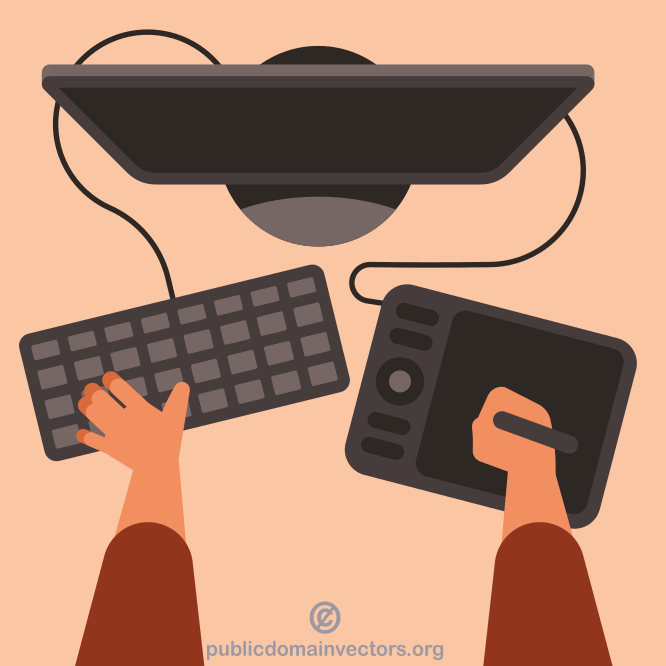

# wireframe

:::::::::::: {.columns}
::::::::: {.column width="70" .mt-2}
- a wireframe is an outline / blueprint / concept art of a webpage or application
- can be hand drawn on paper or built out digitally
- provides visual understanding of page structure, layout, user flow, functionality and intended behaviours
- presented to stakeholders before the interface is coded

::: {.text-smaller}
source: [@bruton2022what]
:::
:::::::::
::::::::: {.column width="30%"}
{width=250}
:::::::::
::::::::::::

<!--https://www.uxdesigninstitute.com/blog/what-is-wireframing/
https://www.figma.com/resource-library/what-is-wireframing/-->

# wireframing

:::::::::::: {.columns}
::::::::: {.column width="65" .mt-2}
- responsibility of the UI/UX designers
- occurs during the exploratory design phase
    - experimenting
- iterative process
- iterations are presented to the stakeholders to gain feedback
- some professional tools: [Figma](https://www.figma.com/), [Balsamiq](https://balsamiq.com/), [Sketch](https://www.sketch.com/)
:::::::::
::::::::: {.column width="35%"}
{width=275}

:::::::::
::::::::::::

::: {.text-smaller}
based on: [@bruton2022what]
:::

# types of wireframes

:::::::::::: {.columns}
::::::::: {.column width="33"}
{width=250}
:::::::::
::::::::: {.column width="33"}
{width=250}
:::::::::
::::::::: {.column width="33"}
{width=250}
:::::::::
::::::::::::

## low-fidelity wireframe

:::::::::::: {.columns}
::::::::: {.column width="70" .mt-2}
- first sketch
- simple
- rough visual representations of a webpage or application
- don't consider scale or pixel accuracy
- don't include actual content, typography, colors
    - image: boxes with an X
    - text: scrible
- might be hard to undersand

::: {.text-smaller}
source: [@bruton2022what]
:::
:::::::::
::::::::: {.column width="30%"}
{width=250}
:::::::::
::::::::::::

## mid-fidelity wireframe

:::::::::::: {.columns}
::::::::: {.column width="70" .mt-2}
- provides more precise representations of the layout
- for exploring design ideas, establishing spacing and buttons, and user flow
- still don't include images, typography or detailed content
    - but show more details regarding components and features
- no colors, grayscale
- usually made with digital tool

::: {.text-smaller}
source: [@bruton2022what]
:::
:::::::::
::::::::: {.column width="30%"}
{width=250}
:::::::::
::::::::::::

## hi-fidelity wireframe

:::::::::::: {.columns}
::::::::: {.column width="70" .mt-2}
- exploring complex concepts, finalising design
- provides pixel-specific layouts
- usually have actual images and written content
- created using a digital tool
- feature actual typography, detailed features, design elements (logos) and menu systems
- may presented as initial prototypes

::: {.text-smaller}
source: [@bruton2022what]
:::
:::::::::
::::::::: {.column width="30%"}
{width=250}
:::::::::
::::::::::::

## prototype

# wireframe map

{height=550}

# sitemap

:::::::::::: {.columns}
::::::::: {.column width="25"}
- similar to a wireframe map but for web sites
- for design, documentation
- also for machine processing
    - for web scrawlers
    - sitemap.xml

:::::::::
::::::::: {.column width="75%"}
{width=600}

:::::::::
::::::::::::

## sitemap as wireframe

{height=550}

# some free tools

- [Google Drawings](https://docs.google.com/drawings)
- [draw.io](https://app.diagrams.net/)
- [Quant-UX](https://quant-ux.com/)
    - open source (self-hosted) or free as a service
- [wireframe.cc](https://wireframe.cc/)
    - only public and no export in free plan
- [Figma](https://www.figma.com/)
    - has a limited free plan

# references

::: {#refs}
:::
