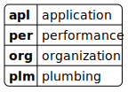

# manifesto for software craftsmanship

:::::: {.wide-quote .text-smaller}
> As aspiring Software Craftsmen we are raising the bar of professional software development by practicing it and helping others learn the craft. Through this work we have come to value:
>
> - Not only working software, but also **well-crafted software**
> - Not only responding to change, but also **steadily adding value**
> - Not only individuals and interactions, but also **a community of professionals**
> - Not only customer collaboration, but also **productive partnerships**
>
> That is, in pursuit of the items on the left we have found the items on the right to be indispensable.

::::::

::: {.text-smaller .mt-2}
[softwarecraftsmanship.org](https://manifesto.softwarecraftsmanship.org/)
:::
<!--::: {.text-small .mt-2}
© 2009, the undersigned. This statement may be freely copied in any form, but only in its entirety through this notice.

[softwarecraftsmanship.org](https://manifesto.softwarecraftsmanship.org/)
:::-->


# software design and architecture stack

![based on Khalil Stemmel's figure [@stemmler2019how]](figures/the_software_design_and_architecture_stack_generalized.drawio.svg){height=475}


# hierarchy in style guides

:::::::::::: {.columns}
::::::::: {.column width="55"}
- language level:
    - Python: [PEP 8](https://peps.python.org/pep-0008/) or [pep8.org](https://pep8.org/)
    - Ruby: [Ruby Style Guide](https://rubystyle.guide/)
    - Rust [The Rust Style Guide](https://doc.rust-lang.org/beta/style-guide/index.html)
    - etc.
- organization level:
    - [Google Style Guides](https://google.github.io/styleguide/)
        - [C# at Google Style Guide](https://google.github.io/styleguide/csharp-style.html)
        - [Google Python Style Guide](https://google.github.io/styleguide/pyguide.html)
        - [Google TypeScript Style Guide](https://google.github.io/styleguide/tsguide.html)

::: {.fragment}
not just style guides, also best practices
:::
:::::::::
::::::::: {.column width="45%"}
{width=300}

:::::::::
::::::::::::


# write idiomatic code

:::::::::::: {.columns}
::::::::: {.column width="70"}
::: {.text-align-left}
- a prog. language implements a prog. paradigm
- a paradigm defines a certain "way" of writing code
    - using different abstractions / building blocks
    - promoting a given concept
:::
::: {.fragment .text-align-left}
- some languages implements multiple paradigms
:::
::: {.fragment .text-align-left}
- and languages have their own way of doing things
    - languages have pros and cons
    - for a given problem
:::
:::::::::
::::::::: {.column width="30%"}
{width=250}

:::::::::
::::::::::::

::: {.fragment .mt-3}
just as in the case of natural languages, you ought to use a language properly
:::


## write idiomatic code

:::::::::::: {.columns .column-gapless}
::::::::: {.column width="55"}
```javascript
for (i = 0; i < 10; i++) {
    console.log(i);
}
```

::: {.fragment data-fragment-index="5"}
```javascript
[...Array(10).keys()].forEach(i => {
    console.log(i);
});
```

:::
:::::::::
::::::::: {.column width="20%"}
```python
i = 0
while i < 10:
    print(i)
    i += 1
```

::: {.fragment data-fragment-index="1"}
```python
for i in range(10):
    print(i)
```

:::
:::::::::
::::::::: {.column width="25%"}
::: {.fragment data-fragment-index="2"}
```ruby
for i in 0..9 do
   puts i
end
```

:::
::: {.fragment data-fragment-index="3"}
```ruby
(0..9).each do |i|
    puts i
end
```

:::
::: {.fragment data-fragment-index="4"}
```ruby
(0..9).each {|i| puts i}
```

:::
:::::::::
::::::::::::


# clean code

Clean Code: A Handbook of Agile Software Craftsmanship

by Robert C. Martin (2009) [@martin2009clean]

<!--::: {.fragment .text-smaller}
some recommendations are too specific to C-like languages
:::-->


# meaningful names

:::::::::::: {.columns}
::::::::: {.column width="60%" .mt-5}
this section is based on the book *Clean Code* (chapter 2) by Robert C. Martin [@martin2009clean]

:::::::::
::::::::: {.column width="40%"}
{height=300}

:::::::::
::::::::::::


## use intention-revealing names

:::::: {.text-size-3}
```c
int d; // elapsed time in days
```

::: {.text-size-2 .fragment data-fragment-index=1}
the definition is only available ad the declaration
:::

```c
int elapsedTimeInDays;
```

::: {.text-size-2 .fragment data-fragment-index=1}
the definition is available at every usage
:::
::::::


## multi-word names

:::::::::::: {.columns}
::::::::: {.column width="32"}
**camelCase**

::: {.mt-4}
```c
int elapsedTimeInDays;
```
:::

::: {.text-smaller}
- C (local variable)
- Java (variable, method)

:::
:::::::::
::::::::: {.column width="32%"}
**UpperCamelCase (PascalCase)**

```java
public class DataCollector {}
```

::: {.text-smaller}
- Java (class)
- Rust (Type, Enum)

:::
:::::::::
::::::::: {.column width="32%"}
**snake_case**

::: {.mt-4}
```python
elapsed_time_in_days = 17
```
:::

::: {.text-smaller}
- Python
- Rust (variable, function)

:::
:::::::::
::::::::::::

::: {.fragment .mt-4}
<!-- according to a study, camelCase is faster to type but snake_case is faster to read [@sharif2010eye] -->
a study states, camelCase is faster to type but snake_case is faster to read [@sharif2010eye]
:::

::: {.fragment .mt-2}
read the style guide
:::


## avoid disinformation

> Do not refer to a grouping of accounts as an `accountList` unless it’s actually a `List` [@martin2009clean].

::: {.text-smaller}
better to use `accounts`, it does not depend on the collection name
:::

::: {.fragment .mt-3}
inconsistent spelling is also disinformation
:::

::: {.fragment .mt-3}
> disinformative names would be the use of lower-case `L` or uppercase `O` [@martin2009clean]

- they can look almost like the one and zero, respectively -- use the right font
- PEP8 (Python style guide) [forbids](https://pep8.org/#names-to-avoid) to use them

:::


## make meaningful distinctions

> It is not sufficient to add number series or noise words, even though the compiler is satisfied. If names must be different, then they should also mean something different [@martin2009clean].

:::::: {.text-size-2}
```python
def calculate_distance(data: pd.DataFrame) -> pd.Series:
    # do something
```

```python
def calculate_distance2(data: pd.DataFrame) -> pd.Series:
    # do something else
```

::: {.fragment}
```python
def calculate_eucledian_distance(data: pd.DataFrame) -> pd.Series:
    # ...
```

```python
def calculate_levenshtein_distance(data: pd.DataFrame) -> pd.Series:
    # ...
```
:::
::::::


## make meaningful distinctions / noise words

> Noise words are another meaningless distinction.
> Imagine that you have a `Product` class.
> If you have another called `ProductInfo` or `ProductData`, you have made the names different without making them mean anything different [@martin2009clean]. 


## use pronounceable names

> If you can't pronounce it, you can't discuss it without sounding like an idiot [@martin2009clean].

- Should `etid` be an integer?
- Should `elapsed_time_in_days` be an integer?

::: {.fragment .mt-3}
could be especially important for non-native speakers as some words are more difficult to pronounce
:::


## use searchable names

:::::::::::: {.columns}
::::::::: {.column width="70%" .mt-4}

::: {.wide-quote}
> Single-letter names can ONLY be used as local variables inside short methods.
> The length of a name should correspond to the size of its scope [@martin2009clean].

:::

:::::::::::: {.columns}
::::::::: {.column width="40%"}
it's OK to do this:

```python
for i in range(10):
    print(i)
```

:::::::::
::::::::: {.column width="60%"}
it's NOT OK in a large scope:

```c
int d; // elapsed time in days
```
:::::::::
::::::::::::
:::::::::
::::::::: {.column width="30%"}
{width=250}

:::::::::
::::::::::::


## names for classes, functions

:::::::::::: {.columns .mt-3}
::::::::: {.column width="50%"}
- a class is a model / blueprint of *something*
- the name should be a noun
    - e.g., `User`, `Activity`
- an object is an instance of a class
    - still a noun
    - e.g., `user = User()`
:::::::::
::::::::: {.column width="50%"}
- a function *does* something
- the name should contain a verb
    - in imperative
    - e.g., `aggregate_activity`
    - ~~`activity_aggregation`~~

:::::::::
::::::::::::

    
## avoid encodings

with modern IDEs it is pointless to put type or role markers into names


:::::: {.r-frame .text-smaller}
**Hungarian notation**

- invented by Charles Simonyi at Microsoft
- adding a prefix to a name that gives information about type, length, or scope

```python
def fnFactorial(iNum):
    if iNum == 1:
        return iNum
    else:
        return iNum * fnFactorial(iNum - 1)
```

::: {.text-small}
source: [@bhargav2024hungarian]
:::
::::::


:::::::::::: {.columns .r-frame .mt-1}
::::::::: {.column width="50%"}
```csharp
interface IShapeArea // I is also a prefix
{
  void area(); 
}

```
:::::::::
::::::::: {.column width="50%"}
```csharp
interface ShapeArea 
{
  void area(); 
}

```
:::::::::
::::::::::::


## avoid mental mapping

> Readers shouldn't have to mentally translate your names into other names they already know [@martin2009clean].

<!-- CPU, USB, CLI, GUI, LED, RGB, ORM, PEP, RFC, GPS, etc... -->

:::::::::::: {.columns .mt-4}
::::::::: {.column width="50%"}
{width=200}
:::::::::
::::::::: {.column width="50%" .fragment}
{width=275}
:::::::::
::::::::::::


## don't pun or use humor

- no inside jokes
- no colloquialisms or slang
- be objective and professional

> Say what you mean. Mean what you say [@martin2009clean].


## pick one word per concept

>  it’s confusing to have `fetch` , `retrieve`, and `get` as equivalent methods of different classes [@martin2009clean]

it also helps to search for the term


## add meaningful context

> Imagine that you have variables named firstName, lastName, street, houseNumber, city, state, and zipcode.
> Taken together it’s pretty clear that they form an address.
> But what if you just saw the state variable being used alone in a method? [@martin2009clean]

- adding a prefix?
    - e.g., `addrCity`, `addrStreet`, `addrState`
- as notations are discouraged, use an `Address` class instead to add context


# functions

:::::::::::: {.columns}
::::::::: {.column width="60%" .mt-5}
this section is based on the book *Clean Code* (chapter 3) by Robert C. Martin [@martin2009clean]

:::::::::
::::::::: {.column width="40%"}
{height=300}

:::::::::
::::::::::::


## functions should be as small as possible

> Functions should hardly ever be 20 lines long [@martin2009clean]

- shorter functions are easier to understand


## do one thing (single responsibility principle)

:::::::::::: {.columns .column-gapless .fragment}
::::::::: {.column width="68%" .pre-height-100}
::: {.text-smaller .pre-height-100}
```python
import sqlite3
import pandas as pd

con = sqlite3.connect("data.db")
data = pd.read_sql(activity_query, con)

records = []
for woy in range(36, 40):
    for dow in range(1, 8):
        records.append([woy, dow, 0])
empty = pd.DataFrame.from_records(
    records, columns=["week_of_year", "day_of_week", "count"]
)
data = (
    pd.concat([data, empty])
    .drop_duplicates(subset=["week_of_year", "day_of_week"], keep="first")
    .sort_values(["week_of_year", "day_of_week"])
    .reset_index(drop=True)
)
activity = pd.pivot(
    data, index=["week_of_year"], columns=["day_of_week"], values=["count"]
).values
res = con.execute(progress_query)
progress = res.fetchone()[0]
```
:::
:::::::::
::::::::: {.column width="32%"}
::: { .text-smaller}
```sql
SELECT
    CAST(
        strftime('%W', timestamp) 
        AS INTEGER
    ) AS week_of_year,
    CAST(
        strftime('%u', timestamp)
        AS INTEGER
    ) AS day_of_week,
    count(*) AS count
FROM activity
WHERE
    user_id = 42 AND
    week_of_year > 35 AND
    week_of_year < 40
GROUP BY
    week_of_year,
    day_of_week;
```

```sql
SELECT
	lesson / 50.0 AS progress
FROM activity
WHERE
    user_id = 42 AND
    result = 'success'
ORDER BY lesson DESC
LIMIT 1;
```

:::
:::::::::
::::::::::::


## debug tables

:::::::::::: {.columns}
::::::::: {.column width="50%"}
::: {.text-smaller}
|week_of_year|day_of_week|count|
|------------|-----------|-----|
|          36|          2|    1|
|          38|          5|    1|
|          39|          6|    2|
Table: queried user activity

:::

::: {.text-smaller .mt-5}
|day_of_week |1|2|3|4|5|6|7|
|------------|-|-|-|-|-|-|-|
|week_of_year| | | | | | | |
|          36|0|1|0|0|0|0|0|
|          37|0|0|0|0|0|0|0|
|          38|0|0|0|0|1|0|0|
|          39|0|0|0|0|0|2|0|
Table: pivoted user activity table

:::

:::::::::
::::::::: {.column width="50%"}
::: {.text-smaller}
|week_of_year|day_of_week|count|
|------------|-----------|-----|
|          36|          1|    0|
|          36|          2|    0|
|         ...|        ...|  ...|
|          36|          7|    0|
|          37|          1|    0|
|         ...|        ...|  ...|
|          37|          7|    0|
|          38|          1|    0|
|         ...|        ...|  ...|
|          38|          5|    0|
|         ...|        ...|  ...|
|          39|          6|    0|
|          39|          7|    0|
Table: empty activity table

:::
:::::::::
::::::::::::


## the inverse scope law of function names

:::::::::::: {.columns}
::::::::: {.column width="70%"}
::: {.wide-quote}
> **The longer the scope of a function, the shorter its name should be.** Functions that are called locally from a few nearby places should have long descriptive names, and the longest function names should be given to those functions that are called from just one place.
>
> -- [Robert C. Martin](https://www.informit.com/articles/article.aspx?p=1323426)

:::

::: {.text-smaller .mt-3}
"longer scope": more general part of a code
:::
:::::::::
::::::::: {.column width="30%" .fragment}
{width=300}
:::::::::
::::::::::::


## function arguments

:::::::::::: {.columns .column-gapless}
::::::::: {.column width="45%"}
::: {.text-align-left}
- do not use more than three [@martin2009clean]
:::
::: {.text-align-left .fragment data-fragment-index=1}
- what if you'd need more?
    - wrap it into an object
:::
::: {.text-align-left .fragment data-fragment-index=2}
- do not use flags
    - ["Flag arguments are ugly \[...\] loudly proclaiming that this function does more than one thing [@martin2009clean]."]{.text-smaller}
:::

:::::::::
::::::::: {.column width="55%"}
```python
def build_empty_dataframe(start, end, cols):
    records = []
    for woy in range(start, end):
        for dow in range(1, 8):
            records.append([woy, dow, 0])
    return pd.DataFrame.from_records(
        records, columns=cols
    )
```
::: {.fragment data-fragment-index=2}
```python
def query_progress(as_percentage: bool):
    res = con.execute(progress_query)
    progress = res.fetchone()[0]

    if as_percentage:
        return progress * 100
    else:
        return progress
```
:::
:::::::::
::::::::::::


## no side effects

:::::::::::: {.columns}
::::::::: {.column width="50%" .wide-qoute}
> Side effects are lies.
> Your function promises to do one thing, but it also does other hidden things [@martin2009clean].
>
> -- Robert C. Martin

:::::::::
::::::::: {.column width="50%" .text-smaller .wide-qoute}
> an operation, function or expression is said to have a **side effect** if it modifies some state variable value(s) outside its local environment, that is to say has an observable effect besides returning a value (the main effect) to the invoker of the operation [@enwiki:1063806709].

:::::::::
::::::::::::


## side effect example

:::::::::::: {.columns .column-gapless}
::::::::: {.column width="50%"}
```python
class Something:
    foo = 0
    
    def increase(self, by):
        self.foo += by
    
    def decrease(self, by):
        self.foo -= by
    
something = Something()
print(something.foo)  # 0
something.increase(2)
print(something.foo)  # 2
```
:::::::::
::::::::: {.column width="50%" .fragment}
```python
smth = {"foo": 0}

def increase(what, by):
    return what + by

def decrease(what, by):
    return what - by

print(smth["foo"])  # 0
increase(smth["foo"], 2)  # 2
print(smth["foo"])  # 0
smth["foo"] = increase(smth["foo"], 2)
print(smth["foo"])  # 2
```
:::::::::
::::::::::::

## prefer exceptions to returning error codes

- in unix-like systems processes still return 0 if the execution was successful
- but returning error codes in functions are discouraged
- `FileNotFoundException` is better than `ERRCODE_26375`
    - meaningful name
    - no mental mapping
    - exception handling syntactically more readable

    
# denoting blocks

:::::::::::: {.columns .column-gapless}
::::::::: {.column width="50"}
```javascript
for (i = 0; i < 10; i++) {
    console.log(i);
}
```
```javascript
for (i = 0; i < 10; i++)
    console.log(i);

```
```javascript
var a = 0;
for (i = 0; i < 10; i++)
    a++;
    console.log(i);

```

:::::::::
::::::::: {.column width="25%"}

::: {.fragment data-fragment-index="1"}
```python
for i in range(10):
    print(i)
```
```python
a = 0
for i in range(10):
    a += 1
    print(i)
```

:::
:::::::::
::::::::: {.column width="25%"}
::: {.fragment data-fragment-index="2"}
<!--```ruby
a = 0
for i in 0..9 do
   a += 1
   puts i
end
```
```ruby
a = 0
for i in 0..9 {
   a += 1
   puts i
}
```-->
```go
package main
 
import (
    "fmt"
)
 
func main() {
    for i:=0; i<10; i++ {
        fmt.Println(i)
    }
}
```

```rust
fn main() {
    for i in 0..9 {
        println!("{}", i);
    }
}
```
:::

:::::::::
::::::::::::


## what could go wrong?

:::::: {.fragment}
::: {.text-smaller}
parts from [sslKeyExchange.c](https://opensource.apple.com/source/Security/Security-55471/libsecurity_ssl/lib/sslKeyExchange.c?txt)
:::

```c {.numberLines startFrom="623"}
if ((err = ReadyHash(&SSLHashSHA1, &hashCtx)) != 0)
    goto fail;
if ((err = SSLHashSHA1.update(&hashCtx, &clientRandom)) != 0)
    goto fail;
if ((err = SSLHashSHA1.update(&hashCtx, &serverRandom)) != 0)
    goto fail;
if ((err = SSLHashSHA1.update(&hashCtx, &signedParams)) != 0)
    goto fail;
    goto fail;
if ((err = SSLHashSHA1.final(&hashCtx, &hashOut)) != 0)
    goto fail;
```

```c {.numberLines startFrom="647"}
fail:
    SSLFreeBuffer(&signedHashes);
    SSLFreeBuffer(&hashCtx);
    return err;
```

::: {.fragment}
more about Apple's "goto fail" fiasco (2014): [@wheeler2014apple], [@migues2014understanding]
:::
::::::


# references

::: {#refs}
:::
