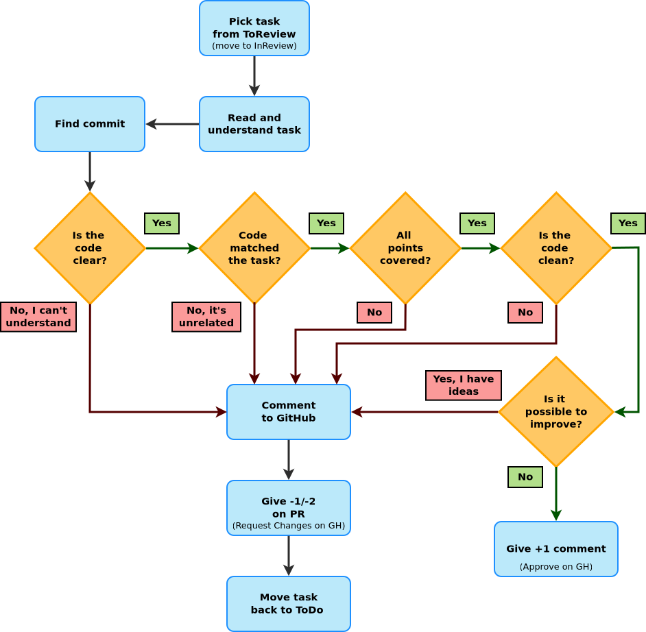

# V model [@forsberg1991relationship]

:::::::::::: {.columns}
::::::::: {.column width="50%" .mt-3}
- each phase has output and a _review process_
    - errors are found at early stage
    - decreases the risk of failure
- testing is done in a hierarchical perspective

:::::::::
::::::::: {.column width="50%"}
:::::: {.r-stack}
](figures/v_model.drawio.svg){width=500}
::::::
:::::::::
::::::::::::


## requirement analysis review

:::::::::::: {.columns}
::::::::: {.column width="40%"}
{width=400}

::: {.text-smaller .mt-3}
- can be discussed / reviewed
- even with a customer representative

:::
:::::::::
::::::::: {.column width="15%" .mt-5}
{width=100}

:::::::::
::::::::: {.column width="45%"}
{width=400}

:::::::::
::::::::::::

## architecture review

:::::::::::: {.columns}
::::::::: {.column width="40%"}
{width=400}

:::::::::
::::::::: {.column width="15%" .mt-5}
{width=100}

:::::::::
::::::::: {.column width="40%"}
{width=400}

:::::::::
::::::::::::


# 

|type       |formality     |led by                           |effort  |documentation                             |
|:---------:|:------------:|:-------------------------------:|:------:|:----------------------------------------:|
|informal   |not formal    |noone                            |minimal |undocumented                              |
|walkthrough|not formal[^1]|authors                          |very low|normal, fault-finding                     |
|technical  |less formal   |trained moderator, not the author|moderate|more detailed                             |
|inspection |most formal   |trained moderator                |high    |thorough; based on  standards, checklists |

[^1]:
Sometimes it can be somewhat formal.

# a review process

:::::::::::: {.columns .column-gapless}
::::::::: {.column width="60%"}
{width=500}

:::::::::
::::::::: {.column width="40%" .mt-5 .text-smaller}
- is it understandable (clear)
- is it clean (no code smells)
- does it match the task?
- does it fulfill the task?
    - every [DoD]{.tooltip title="Definition of Done"} point covered?
- is it possible to improve?
:::::::::
::::::::::::


#

:::::::::::: {.columns}
::::::::: {.column width="60%" .text-smaller}
```c
#include <stdio.h>
main()
{
    int a,b,c;
    int count = 1;
    for (b=c=10;a="- FIGURE?, UMKC,XYZHello Folks,\
    TFy!QJu ROo TNn(ROo)SLq SLq ULo+\
    UHs UJq TNn*RPn/QPbEWS_JSWQAIJO^\
    NBELPeHBFHT}TnALVlBLOFAkHFOuFETp\
    HCStHAUFAgcEAelclcn^r^r\\tZvYxXy\
    T|S~Pn SPm SOn TNn ULo0ULo#ULo-W\
    Hq!WFs XDt!" [b+++21]; )
    for(; a-- > 64 ; )
    putchar ( ++c=='Z' ? c = c/ 9:33^b&1);
    return 0;
}
```

::: {.fragment data-fragment-index=1}
via [How does this code generate the map of India?](https://stackoverflow.com/questions/3533348/how-does-this-code-generate-the-map-of-india)
:::

:::::::::
::::::::: {.column width="40%" .text-smaller .fragment data-fragment-index=1}


:::::::::
::::::::::::

##

:::::::::::: {.columns}
::::::::: {.column width="60%" .text-smaller}
```c
#include "stdio.h"
int main (void) {
    int a=10, b=0, c=10;
    char* bits ="TFy!QJu ROo TNn(ROo)SLq SLq ULo+UHs UJq TNn*R\
    Pn/QPbEWS_JSWQAIJO^NBELPeHBFHT}TnALVlBLOFAkHFOuFETpHCStHAU\
    FAgcEAelclcn^r^r\\tZvYxXyT|S~Pn SPm SOn TNn ULo0ULo#ULo-WH\
    q!WFs XDt!";
    a = bits[b];
    while (a != 0) {
        a = bits[b];
        b++;
        while (a > 64) {
            a--;
            if (++c == 'Z') {
                c /= 9;
                putchar(c);
            } else {
                putchar(33 ^ (b & 0x01));
            }
        }
    }
    return 0;
}
```

::: {}
[a less obfuscated version](https://stackoverflow.com/a/3533420/4737417) (with explanation)<br>by [bta](https://stackoverflow.com/users/79566/bta) CC&nbsp;BY-SA&nbsp;2.5
:::

:::::::::
::::::::: {.column width="40%" .text-smaller}


:::::::::
::::::::::::


# references

::: {#refs}
:::
