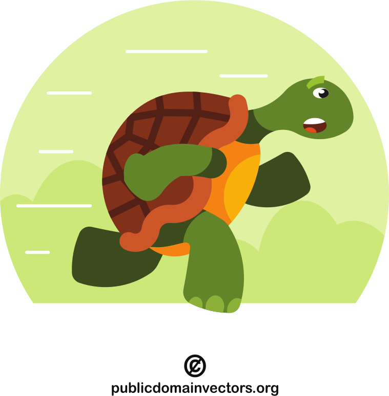
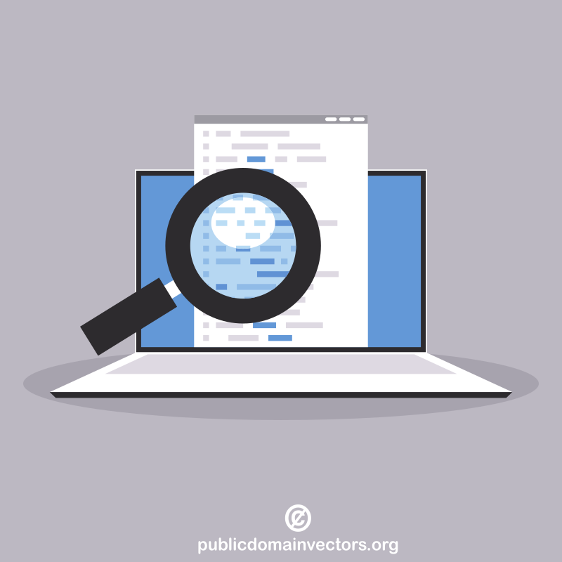
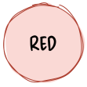
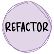
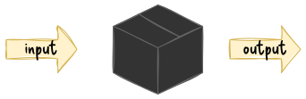

# V model [@forsberg1991relationship]

:::::::::::: {.columns .column-gapless .text-smaller}
::::::::: {.column width="50%" .mt-5}
- each phase has output and a _review process_
    - errors are found at early stage
    - decreases the risk of failure
- testing is done in a hierarchical perspective

:::::::::
::::::::: {.column width="50%"}
{width=450}

:::::::::
::::::::::::

<!-- https://lostechies.com/content/derekgreer/uploads/2011/03/TestDrivenDevelopment_thumb_107D31DD.png -->


## test pyramid

:::::::::::: {.columns .mt-3}
::::::::: {.column width="50%"}
{width=500}

:::::::::
::::::::: {.column width="50%" .fragment data-fragment-index=1}
:::::: {.r-stack}
::: {.fragment .fade-out data-fragment-index=2}
{width=500}

:::
::: {.fragment data-fragment-index=2}
{width=500}

:::

::::::
:::::::::
::::::::::::

::: {.fragment data-fragment-index=2 .text-size-1}
the turtle and rabbit figures by [Delapouite](https://delapouite.com/) under [CC&nbsp;BY&nbsp;3.0](https://creativecommons.org/licenses/by/3.0/) via [game-icons.net](https://game-icons.net)
:::


# what is a unit test?

:::::::::::: {.columns}
::::::::: {.column width="55%"}
- what is a unit?
    - smallest testable part of a program
    - usually a method
- a unit test is another piece of code, that tests the given unit 

:::::::::
::::::::: {.column width="45%"}
```python
def fizzbuzz(i: int) -> str:
    """
    >>> fizzbuzz(3)
    'Fizz'
    >>> fizzbuzz(5)
    'Buzz'
    >>> fizzbuzz(15)
    'FizzBuzz'
    >>> fizzbuzz(17)
    '17'
    """
    result = ""
    if i % 15 == 0:
        result += "FizzBuzz"
    elif i % 3 == 0:
        result += "Fizz"
    elif i % 5 == 0:
        result += "Buzz"
    else:
        result = str(i)
    return result
```

[doctest in Python]{.text-smaller}
:::::::::
::::::::::::


## what really is a unit?

- defined as a **single behaviour** exhibited by the system under test
    - usually corresponding to a requirement
- it may imply that it is a function or a module / method or a class
    - depending on the paradigm
- functions / methods, modules or classes don't always correspond to units
- "only entry points to externally-visible system behaviours define units"
    - by Kent Beck [@beck2002test]

<!-- > Unit is defined as a single behaviour exhibited by the system under test, usually corresponding to a requirement.
> While it may imply that it is a function or a module (in procedural programming) or a method or a class (in object-oriented programming) **it does not mean functions/methods, modules or classes always correspond to units**.
> From the system-requirements perspective only the perimeter of the system is relevant, thus **only entry points to externally-visible system behaviours define units**.
>
> -- Kent Beck via Wikipedia-->

::: {.text-smaller}
source: [@enwiki:1249792515]
:::


## unit vs integration testing

::: {.wide-quote}
> The terms 'unit test' and 'integration test' have always been rather murky, even by the slippery standards of most software terminology.
>
> -- [ Martin Fowler](https://martinfowler.com/articles/2021-test-shapes.html) [@fowler2021diverse]

:::

:::::::::::: {.columns .mt-3}
::::::::: {.column width="40%"}
unit test
~ tests a single behaviour

:::::::::
::::::::: {.column width="60%"}
integration test
~ test a set of units, working together

:::::::::
::::::::::::

::: {.text-smaller .mt-3}
in most of my examples a unit will be represented by a method
:::


## unit test example

:::::::::::: {.columns}
::::::::: {.column width="50%"}
`code/fizzbuzz.py`

```python
def fizzbuzz(i: int) -> str:
    result = ""
    if i % 15 == 0:
        result += "FizzBuzz"
    elif i % 3 == 0:
        result += "Fizz"
    elif i % 5 == 0:
        result += "Buzz"
    else:
        result = str(i)
    return result
```

:::::::::
::::::::: {.column width="50%"}
`code/test_fizzbuzz.py`

```python
from fizzbuzz import fizzbuzz


def test_fizzbuzz():
    assert fizzbuzz(3) == "Fizz"
    assert fizzbuzz(5) == "Buzz"
    assert fizzbuzz(10) == "Buzz"
    assert fizzbuzz(12) == "Fizz"
    assert fizzbuzz(15) == "FizzBuzz"
    assert fizzbuzz(17) == "17"
```

:::::::::
::::::::::::


## arrange, act, assert pattern

parts of a unit test

:::::::::::: {.columns}
::::::::: {.column width="50%"}
arrange
~ set up the testing environment (e.g., create objects)

act
~ call the tested unit

assert
~ compare the result of the 'act' step to the expected value

:::::::::
::::::::: {.column width="50%"}
```python
def test_fizzbuzz():
    # arrange
    test_input = 3
    # act
    result = fizzbuzz(test_input)
    # assert
    assert result == "Fizz"

```

:::::::::
::::::::::::

## arrange, act, assert(, annihilate) pattern

parts of a unit test

arrange
~ set up the testing environment
~ (e.g., create objects)

act
~ call the tested unit

assert
~ compare the result of the 'act' step to the expected value

annihilate
~ free resources
~ automatic in modern languages


# how to unit test this funciton?

:::::::::::: {.columns}
::::::::: {.column width="50%"}
```python
def query_progress(user_id: int) -> float:
    # establish database connection
    con = sqlite3.connect("data.db")
    # build query
    progress_query = f"""
    SELECT
        lesson / 50.0 AS progress
    FROM activity
    WHERE
        user_id = {user_id} AND
        result = 'success'
    ORDER BY
        lesson DESC
    LIMIT 1
    ;
    """
    # execute query
    res = con.execute(progress_query)
    progress = res.fetchone()[0]
    return progress
```

:::::::::
::::::::: {.column width="50%" .fragment .mt-1}
- short answer: you can't
- because it is not a unit
    - it does 3 things
- single responsibility principle makes unit testing easier
- a 'stable' database would be needed for testing
    - if the DB content changed, the expected value would become obsolete
:::::::::
::::::::::::


## separate business logic from persistence

<!-- {width=700} -->

:::::::::::: {.columns}
::::::::: {.column width="40%"}
architectural styles provides patterns to separate the business logic from the persistence layer

unit testing usually targets the business logic

:::::: {.fragment .text-smaller .mt-2}
which was embedded into the query in the previous example

```sql
SELECT
    lesson / 50.0 AS progress
FROM activity
WHERE
    user_id = 42 AND
    result = 'success'
ORDER BY lesson DESC
LIMIT 1;
```
::::::

:::::::::
::::::::: {.column width="30%"}
{width=200}

:::::::::
::::::::: {.column width="30%"}
{width=275}

{width=275}

:::::::::
::::::::::::


## separated business logic

:::::::::::: {.columns}
::::::::: {.column width="50%"}
```python
def query_last_finished_lesson(
    user_id: int
) -> float:
    # establish database connection
    con = sqlite3.connect("data.db")
    # build query
    query = f"""
    SELECT lesson
    FROM activity
    WHERE
        user_id = {user_id} AND
        result = 'success'
    ORDER BY lesson DESC
    LIMIT 1;
    """
    # execute query
    res = con.execute(query)
    return res.fetchone()[0]
```

:::::::::
::::::::: {.column width="50%"}
```python
def calculate_progress(
    finished: int, total: int
) -> float:
    return finished / total


def calculate_user_progress(
    user_id: int, total: int
) -> float:
    f = query_last_finished_lesson(user_id)
    return calculate_progress(f, total)
```

::: {.text-smaller}
- now, the query is only responsible for getting the last finished lesson
    - the DB connection is still in a bit out of the place, but the testability improved
:::
:::::::::
::::::::::::


## separated data connection

:::::::::::: {.columns}
::::::::: {.column width="50%"}
```python
def query_last_finished_lesson(
    con: sqlite3.Connection,
    user_id: int
) -> float:
    # build query
    query = f"""
    SELECT lesson
    FROM activity
    WHERE
        user_id = {user_id} AND
        result = 'success'
    ORDER BY lesson DESC
    LIMIT 1;
    """
    # execute query
    res = con.execute(query)
    return res.fetchone()[0]
```

:::::::::
::::::::: {.column width="50%"}
```python
def establish_database_connection(
    path: str = "data.db"
) -> sqlite3.Connection:
    return sqlite3.connect(path)
```

::: {.text-smaller}
- now, there is a function responsible for the DB connection
    - it is easy to use a test database from the test suite and the production database in the production code
- the test DB can store 'stable' values
    - the expected values in the assert statements are safe
:::
:::::::::
::::::::::::


## mocking

:::::::::::: {.columns}
::::::::: {.column width="70%" .mt-4}
- the whole _unit test_ suite should be able to run in milliseconds
    - to give immediate feedback
- slow elements of the software should be mocked
    - e.g., database, network connection
- part of arrange step

:::::::::
::::::::: {.column width="30%"}
{width=300}

:::::::::
::::::::::::


## test doubles -- mock objet types

there is no open standard for categories

:::::::::::: {.columns}
::::::::: {.column width="40%" .mt-2}
- dummy
- stub
- spy
- mock
- fake

:::::::::
::::::::: {.column width="60%"}
<!-- {width=200} -->
<!--  | [CC&nbsp;BY-NC-SA&nbsp;2.0](https://creativecommons.org/licenses/by-nc-sa/2.0/)](figures/borrowed/test_dummy.jpg){width=200} -->
![reproduction of figure 2 from [@seemann2007unit]](figures/spectrum_of_test_doubles.drawio.svg){width=400}
:::::::::
::::::::::::


::: {.text-smaller}
these are from the book _xUnit test patterns: Refactoring test code_ -- by Gerard Meszaros [@meszaros2007xunit]
:::


## test doubles -- test dummy

:::::::::::: {.columns .column-gapless}
::::::::: {.column width="70%"}
::: {.text-smaller}
> **The simplest, most primitive type of test double.**
> Dummies contain no implementation and are mostly used when required as parameter values, but not otherwise utilized.
> Nulls can be considered dummies, but real dummies are derivations of interfaces or base classes without any implementation at all.
>
> -- Mark Seemann [@seemann2007unit]

:::
:::::::::
::::::::: {.column width="30%"}
```ruby
require 'sinatra'

get '/user-statistics' do
  return {}.to_json
end
```
:::::::::
::::::::::::


## test doubles -- test stub

:::::::::::: {.columns .column-gapless}
::::::::: {.column width="58%"}
provides static input

::: {.text-smaller}
> A step up from dummies, stubs are minimal implementations of interfaces or base classes.
> Methods returning void will typically contain no implementation at all, while methods returning values will typically return hard-coded values.
>
> -- Mark Seemann [@seemann2007unit]

:::
:::::::::
::::::::: {.column width="42%"}
```ruby
require 'sinatra'

get '/user-statistics' do
  data = {}
  data['name'] = 'Marvin'
  data['id'] = 42
  data['registration'] = '2019-10-02'
  data['progress'] = 0.84
  data['activity'] = [
    [2, 0, 2, 3, 5, 3, 2],
    [5, 2, 4, 4, 0, 3, 4],
    [6, 3, 0, 6, 8, 3, 0],
    [9, 7, 4, 7, 0, 9, 9]
  ]
  return data.to_json
end
```
:::::::::
::::::::::::


## test doubles -- test spy

:::::::::::: {.columns .column-gapless}
::::::::: {.column width="60%"}
::: {.text-smaller}
> A test spy is similar to a stub, but besides giving clients an instance on which to invoke members, a spy will also record which members were invoked so that unit tests can verify that members were invoked as expected.
>
> -- Mark Seemann [@seemann2007unit]

:::
:::::::::
::::::::: {.column width="40%" .text-smaller}
> One form of this might be an email service that records how many messages it was sent.
>
> -- Martin Fowler [@fowler2006test]

::: {.mt-2}
or keeping track of the test user (of the learning app) and give back values according to the input parameter
:::
:::::::::
::::::::::::


## test doubles -- test fake

:::::::::::: {.columns .column-gapless}
::::::::: {.column width="58%"}
::: {.text-smaller}
> A fake contains more complex implementations, typically handling interactions between different members of the type it's inheriting.
> While not a complete production implementation, a fake may resemble a production implementation, albeit with some shortcuts.
>
> -- Mark Seemann [@seemann2007unit]

:::

when you add logic for the test double, that might be tested as well
:::::::::
::::::::: {.column width="42%" .text-smaller}
```ruby
require 'sinatra'

def generate_progress
  rand.round(2)
end

def generate_activity_matrix
  result = []
  (1..4).each do |_w|
    daily = []
    (1..7).each {|_d| daily.push rand(10)}
    result.push daily
  end
  result
end

get '/user-statistics' do
  data = {}
  data['name'] = 'Marvin'
  data['id'] = 42
  data['registration'] = '2019-10-02'
  data['progress'] = generate_progress
  data['activity'] = generate_activity_matrix
  return data.to_json
end
```
:::::::::
::::::::::::


## test doubles -- test mock

:::::::::::: {.columns .column-gapless}
::::::::: {.column width="65%"}
::: {.text-smaller}
> **A mock is dynamically created by a mock library** (the others are typically produced by a test developer using code).
> The test developer never sees the actual code implementing the interface or base class, but can configure the mock to provide return values, expect particular members to be invoked, and so on.
> Depending on its configuration, a mock can behave like a dummy, a stub, or a spy.
>
> -- Mark Seemann [@seemann2007unit]

:::
:::::::::
::::::::: {.column width="35%"}
![reproduction of figure 2 from [@seemann2007unit]](figures/spectrum_of_test_doubles.drawio.svg){width=400}
:::::::::
::::::::::::


# test-driven development (TDD)

:::::::::::: {.columns}
::::::::: {.column width="55%" .mt-5}
- write test _before_ writing the tested code
- without the called unit the test fill fail
    - the called function does not exist
- write code, that makes the test pass
- improve the code quality
    - e.g., make it clear and clean
    - both the test and tested code

:::::::::
::::::::: {.column width="45%"}
{width=350}

:::::::::
::::::::::::


## red

:::::::::::: {.columns}
::::::::: {.column width="75%" .mt-3}
- test only one thing at a time
- the test should be very simple
- increase the complexity of the test cases continuously
- mock the (external) dependencies
    - bit later

:::::::::
::::::::: {.column width="25%"}
{width=250}

:::::::::
::::::::::::


## green

:::::::::::: {.columns}
::::::::: {.column width="75%" .mt-3}
- use the possible simplest code to pass the test
- it does not matter if the solution is 'ugly'
    - but the test must pass
- as soon as the test passes, this step is done
    - and all of the old tests as well

:::::::::
::::::::: {.column width="25%"}
{width=250}

:::::::::
::::::::::::


## refactor

:::::::::::: {.columns}
::::::::: {.column width="75%"}
::: {.text-smaller}
> Refactoring is a disciplined technique for restructuring an existing body of code, altering its internal structure without changing its external behavior.
>
> -- Martin Fowler [@fowler_refactoringcom]

:::

- on code level
    - [style guide, best practices, idiomatic code]{.text-smaller}
- on architecture level
    - [design patterns like SOLID, DRY, etc.]{.text-smaller}
- part of day-to-day programming
    - ['campground rule': leave the code better than you found it]{.text-smaller}
    
:::::::::
::::::::: {.column width="25%"}
{width=250}

:::::::::
::::::::::::


## test-driven development -- fizzbuzz example

:::::::::::: {.columns}
::::::::: {.column width="55%"}
[fizzbuzz.py]{.text-smaller}

:::::: {.r-stack}
::: {.fragment .fade-out data-fragment-index=1 .width-100}
```python
```
:::
::: {.fragment .current-visible data-fragment-index=1 .width-100}
```python
def fizzbuzz():
    pass
```
:::
::: {.fragment .current-visible data-fragment-index=2 .width-100}
```python
def fizzbuzz(i):
    pass
```
:::
::: {.fragment .current-visible data-fragment-index=3 .width-100}
```python
def fizzbuzz(i):
    return "Fizz"
```
:::
::: {.fragment .current-visible data-fragment-index=4 .width-100}
```python
def fizzbuzz(i):
    return "Fizz"
```
:::
::: {.fragment .current-visible data-fragment-index=5 .width-100}
```python
def fizzbuzz(i):
    if i % 3 == 0:
        return "Fizz"
    elif i % 5 == 0:
        return "Buzz"
```
:::
::: {.fragment .current-visible data-fragment-index=6 .width-100}
```python
def fizzbuzz(i):
    if i % 3 == 0:
        return "Fizz"
    elif i % 5 == 0:
        return "Buzz"
```
:::
::: {.fragment .current-visible data-fragment-index=7 .width-100}
```python
def fizzbuzz(i):
    if i % 15 == 0:
        return "FizzBuzz"
    elif i % 3 == 0:
        return "Fizz"
    elif i % 5 == 0:
        return "Buzz"
```
:::
::: {.fragment .current-visible data-fragment-index=8 .width-100}
```python
def fizzbuzz(i):
    if i % 15 == 0:
        return "FizzBuzz"
    elif i % 3 == 0:
        return "Fizz"
    elif i % 5 == 0:
        return "Buzz"
```
:::
::: {.fragment .current-visible data-fragment-index=9 .width-100}
```python
def fizzbuzz(i):
    if i % 15 == 0:
        return "FizzBuzz"
    elif i % 3 == 0:
        return "Fizz"
    elif i % 5 == 0:
        return "Buzz"
    else:
        return str(i)
```
:::
::::::
:::::::::
::::::::: {.column width="45%"}
[test_fizzbuzz.py]{.text-smaller}

:::::: {.r-stack}
::: {.fragment .fade-out data-fragment-index=4 .width-100}
```python
from fizzbuzz import *

def test_fizzbuzz():
    assert fizzbuzz(3) == "Fizz"
```
:::
::: {.fragment .current-visible data-fragment-index=4 .width-100}
```python
from fizzbuzz import *

def test_fizzbuzz():
    assert fizzbuzz(3) == "Fizz"
    assert fizzbuzz(5) == "Buzz"
```
:::
::: {.fragment .current-visible data-fragment-index=5 .width-100}
```python
from fizzbuzz import *

def test_fizzbuzz():
    assert fizzbuzz(3) == "Fizz"
    assert fizzbuzz(5) == "Buzz"
```
:::
::: {.fragment .current-visible data-fragment-index=6 .width-100}
```python
from fizzbuzz import *

def test_fizzbuzz():
    assert fizzbuzz(3) == "Fizz"
    assert fizzbuzz(5) == "Buzz"
    assert fizzbuzz(15) == "FizzBuzz"
```
:::
::: {.fragment .current-visible data-fragment-index=7 .width-100}
```python
from fizzbuzz import *

def test_fizzbuzz():
    assert fizzbuzz(3) == "Fizz"
    assert fizzbuzz(5) == "Buzz"
    assert fizzbuzz(15) == "FizzBuzz"
```
:::
::: {.fragment .current-visible data-fragment-index=8 .width-100}
```python
from fizzbuzz import *

def test_fizzbuzz():
    assert fizzbuzz(3) == "Fizz"
    assert fizzbuzz(5) == "Buzz"
    assert fizzbuzz(15) == "FizzBuzz"
    assert fizzbuzz(17) == "17"
```
:::
::: {.fragment .current-visible data-fragment-index=9 .width-100}
```python
from fizzbuzz import *

def test_fizzbuzz():
    assert fizzbuzz(3) == "Fizz"
    assert fizzbuzz(5) == "Buzz"
    assert fizzbuzz(15) == "FizzBuzz"
    assert fizzbuzz(17) == "17"
```
:::
::::::
:::::::::
::::::::::::

:::::: {.r-stack}
::: {.fragment .fade-out data-fragment-index=1}
NameError: name 'fizzbuzz' is not defined
:::
::: {.fragment .current-visible data-fragment-index=1}
TypeError: fizzbuzz() takes 0 positional arguments but 1 was given
:::
::: {.fragment .current-visible data-fragment-index=2}
AssertionError: assert None == 'Fizz'
:::
::: {.fragment .current-visible data-fragment-index=3}
passed
:::
::: {.fragment .current-visible data-fragment-index=4}
AssertionError: assert 'Fizz' == 'Buzz' (5)
:::
::: {.fragment .current-visible data-fragment-index=5}
passed
:::
::: {.fragment .current-visible data-fragment-index=6}
AssertionError: assert 'Fizz' == 'FizzBuzz' (15)
:::
::: {.fragment .current-visible data-fragment-index=7}
passed
:::
::: {.fragment .current-visible data-fragment-index=8}
AssertionError: assert None == '17' (17)
:::
::: {.fragment .current-visible data-fragment-index=9}
passed

[there is not much to improve on the code, except that according to the PEP8 Python style guide the 'star import' is not allowed; it should be `import fizzbuzz`]{.text-smaller}
:::
::::::

##

> As the tests get more specific, the code gets more generic.
>
> -- Robert C. Martin, [The Cycles of TDD](http://blog.cleancoder.com/uncle-bob/2014/12/17/TheCyclesOfTDD.html) [@martin2014cycles]

{width=375 .mt-4}


## transformation priority premise

1. ({} -> nil) _from no code at all to code that employs nil_
2. (nil -> constant)
3. (constant -> constant+) _a simple constant to a more complex constant_
4. (constant -> scalar) _replacing a constant with a variable or an argument_
5. (statement -> statements) _adding more unconditional statements_
6. (unconditional -> if) _splitting the execution path_
7. (scalar -> array)
8. (array -> container)
9. (statement -> tail-recursion)
10. (if -> while)
11. (expression -> function) _replacing an expression with a function or algorithm_
12. (variable -> assignment) _replacing the value of a variable_

::: {.text-smaller}
source: Robert C. Martin, [The Transformation Priority Premise](https://blog.cleancoder.com/uncle-bob/2013/05/27/TheTransformationPriorityPremise.html) [@martin2013transformation]
:::


## coding kata

:::::::::::: {.columns}
::::::::: {.column width="60%"}
kata (型)
~ set sequence of positions and movements in martial arts

::: {.mt-2}
- code/coding kata is a (relatively) simple programming task, that is meant to practised over and over again (in TDD)
    - in different languages, different praradigms, different coding styles
- some coding kata
    - [codewars.com](https://www.codewars.com/kata/), [codekata.com](http://codekata.com/), etc.

:::
:::::::::
::::::::: {.column width="40%"}
{width=300}

:::::::::
::::::::::::


# too strict TDD

:::::::::::: {.columns}
::::::::: {.column width="60%" .mt-5}
- [TDD]{.tooltip title="test-driven development"} requires adding one test (case) at a time and then make the code pass
- this is often unrealistic
    - e.g., on existing codebase, in research
- strict TDD is good for learning, practising
    - coding kata
- but tests are still important!
- [what I to do is to turn experiments into tests]{.fragment data-fragment-index=1}
:::::::::
::::::::: {.column width="40%" .text-smaller .r-frame .fragment data-fragment-index=1}
**experiment-driven testing**

::: {.text-smaller}
task: get day from a date string like [`Nov 08, 13:11`]{style="display: inline-block;"}
:::

1. do experiment

```python
>>> "Nov 08, 13:11"[3:5]
' 0'
>>> "Nov 08, 13:11"[4:6]
'08'
```
2. put it to a function
```python
def extract_day(s: str) -> int:
    return int(s[4:6])
```    
3. add test based on the experiment
```python
def test_extract_day():
    actual = extract_day("Nov 08, 13:11")
    expected = 8
    assert actual == expected
```
:::::::::
::::::::::::


## behaviour-driven development (BDD)

:::::::::::: {.columns}
::::::::: {.column width="55%" .mt-3}
- BDD is an extension of [TDD]{.tooltip title="test-driven development"}
- using BDD can help you to turn an idea for a requirement into implemented, **tested**, production-ready code
- BDD starts from a user story and focuses on adding the acceptance criteria
    - which can be turned into unit tests

:::::::::
::::::::: {.column width="45%"}
```
Title (one line describing the story)

Narrative:
As a [role]
I want [feature]
So that [benefit]

Acceptance Criteria: (presented as Scenarios)

Scenario 1: Title
Given [context]
  And [some more context]...
When  [event]
Then  [outcome]
  And [another outcome]...

Scenario 2: ...
```

:::::::::
::::::::::::

::: {.text-smaller}
taken from [@north2007what] by Daniel Terhorst-North | CC-BY 4.0
:::

::: notes
- the strict TDD does not allow more than one new test at a time
:::


## acceptance criteria

:::::::::::: {.columns}
::::::::: {.column width="55%" .mt-2}
- describes how a system should behave under certain circumstances
    - may originate from domain experts
- the 'rules' are written in natural language, but in a structured form
    - easy to discuss with non-developers
- based on the acceptance criteria multiple tests can be written

:::::::::
::::::::: {.column width="45%"}
```
Title (one line describing the story)

Narrative:
As a [role]
I want [feature]
So that [benefit]

Acceptance Criteria: (presented as Scenarios)

Scenario 1: Title
Given [context]
  And [some more context]...
When  [event]
Then  [outcome]
  And [another outcome]...

Scenario 2: ...
```

::: {.text-smaller}
taken from [@north2007what] by Daniel Terhorst-North | CC-BY 4.0
:::
:::::::::
::::::::::::


## acceptance test-driven development

:::::::::::: {.columns}
::::::::: {.column width="70%" .mt-4}
- extends [TDD]{.tooltip title="test-driven development"} and [BDD]{.tooltip title="behaviour-driven development"}
- instead of a unit, ATDD focuses on the acceptance criteria of the whole system
- advocates writing acceptance tests before developers begin coding

::: {.mt-3}
test format like [BDD]{.tooltip title="behaviour-driven development"}, example from [@enwiki:1091258091]:

```
Given Book that has not been checked out
And User who is registered on the system
When User checks out a book
Then Book is marked as checked out
```
:::
:::::::::
::::::::: {.column width="30%"}
{width=300}

:::::::::
::::::::::::


## readme driven development

::: {.wide-quote}
> beautifully crafted library with no documentation is damn near worthless
> [...]
>
> So how do we solve this problem?
> Write your Readme first.
>
> -- by Tom Preston-Werner [@prestonwerner2010readme]

:::

::: {.text-smaller}
readme ~ user manual, but brief, concise
:::

::: {.mt-2}
- before you write any code or tests or behaviors or stories or anything
- document how a user would use the software
- you'll know what you need to implement
- a lot simpler to have a discussion based on something written down
:::

::: {.text-smaller}
source: [Readme Driven Development](https://tom.preston-werner.com/2010/08/23/readme-driven-development.html) -- by Tom Preston-Werner [@prestonwerner2010readme]
:::


# test coverage

- the percentage of the code lines 'protected' or covered by tests

:::::::::::: {.columns}
::::::::: {.column width="50%"}
[`code/fizzbuzz.py`]{.text-smaller}

:::::: {.r-stack}
::: {.fragment .fade-out .width-100 data-fragment-index=1}
```{.python line-numbers="2-6,9,11" data-highlight-background="#c6ff8c"}
def fizzbuzz(i: int) -> str:
    result = ""
    if i % 15 == 0:
        result += "FizzBuzz"
    elif i % 3 == 0:
        result += "Fizz"
    elif i % 5 == 0:
        result += "Buzz"
    else:
        result = str(i)
    return result
```
:::
::: {.fragment .current-visible .width-100 data-fragment-index=1}
```{.python line-numbers="2-9,11" data-highlight-background="#c6ff8c"}
def fizzbuzz(i: int) -> str:
    result = ""
    if i % 15 == 0:
        result += "FizzBuzz"
    elif i % 3 == 0:
        result += "Fizz"
    elif i % 5 == 0:
        result += "Buzz"
    else:
        result = str(i)
    return result
```
:::
::: {.fragment .current-visible .width-100 data-fragment-index=2}
```{.python line-numbers="2-11" data-highlight-background="#c6ff8c"}
def fizzbuzz(i: int) -> str:
    result = ""
    if i % 15 == 0:
        result += "FizzBuzz"
    elif i % 3 == 0:
        result += "Fizz"
    elif i % 5 == 0:
        result += "Buzz"
    else:
        result = str(i)
    return result
```
:::
::::::
:::::::::
::::::::: {.column width="50%"}
[`code/test_fizzbuzz.py`]{.text-smaller}

:::::: {.r-stack}
::: {.fragment .fade-out .width-100 data-fragment-index=1}
```python
from fizzbuzz import fizzbuzz


def test_fizzbuzz():
    assert fizzbuzz(3) == "Fizz"
    assert fizzbuzz(15) == "FizzBuzz"
```
:::
::: {.fragment .current-visible .width-100 data-fragment-index=1}
```python
from fizzbuzz import fizzbuzz


def test_fizzbuzz():
    assert fizzbuzz(3) == "Fizz"
    assert fizzbuzz(5) == "Buzz"
    assert fizzbuzz(15) == "FizzBuzz"
```
:::
::: {.fragment .current-visible .width-100 data-fragment-index=2}
```python
from fizzbuzz import fizzbuzz


def test_fizzbuzz():
    assert fizzbuzz(3) == "Fizz"
    assert fizzbuzz(5) == "Buzz"
    assert fizzbuzz(15) == "FizzBuzz"
    assert fizzbuzz(17) == "17"
```
:::
:::::
:::::::::
::::::::::::

:::::: {.r-stack}
::: {.fragment .fade-out data-fragment-index=1}
test coverage: 70%
:::
::: {.fragment .current-visible data-fragment-index=1}
test coverage: 90%
:::
::: {.fragment .current-visible data-fragment-index=2}
test coverage: 100%

four control flow branch, all of them needs to be tested
:::
::::::

<!-- #F72388 -->


## how to measure code quality?

it is hard to objectively measure the quality of code

:::::::::::: {.columns}
::::::::: {.column width="60%"}
- [number of source lines of code (SLOC)]{.alpha-50}
- style guide compliance [-- is the code clean?]{.fragment data-fragment-index=1 .text-color-secondary}
- [Halstead metrics]{.alpha-50}
- cyclomatic complexity [-- is the code simple?]{.fragment data-fragment-index=1 .text-color-secondary}
- [maintainability index]{.alpha-50}
- test coverage [-- is the code tested?]{.fragment data-fragment-index=1 .text-color-secondary}

:::::::::
::::::::: {.column width="40%"}
{width=400}

:::::::::
::::::::::::


## when unit tests are not more than a measure

:::::::::::: {.columns}
::::::::: {.column width="70%" .mt-4}
- zombie scrum: doing something without heart, without its essence
- if you write unit tests _just_ to increase the test coverage they loose its function
    - and collect badges: {width=150 .no-margin .va-middle} {width=150 .no-margin .va-middle}

:::::::::
::::::::: {.column width="30%"}
 | [source](https://xkcd.com/2899/)](figures/borrowed/xkcd/goodharts_law_2x.png){width=300}

:::::::::
::::::::::::


## what to test?

:::::::::::: {.columns}
::::::::: {.column width="40%"}
```python
def calculate_progress(
    finished: int,
    total: int,
    as_percentage: bool,
) -> float:
    progress = finished / total

    if as_percentage:
        return progress * 100
    else:
        return progress
```

:::::::::
::::::::: {.column width="60%"}
:::::: {.r-stack}
::: {.width-100}
```python
from progress import calculate_progress


def test_progress():
    total = 50
    for i in range(total + 1):
        expected = i / total
        actual = calculate_progress(i, total, False)
        assert actual == expected


def test_progress_percentage():
    total = 50
    for i in range(total + 1):
        expected = i / total * 100
        actual = calculate_progress(i, total, True)
        assert actual == expected
```
:::
::: {.fragment data-fragment-index=1}
{width=500 height=325}
:::
::::::
:::::::::
::::::::::::

::: {.fragment data-fragment-index=1}
test coverage: 100%, achievement obtained, but this is completely stupid
:::


## test the edge cases!

:::::::::::: {.columns}
::::::::: {.column width="40%"}
```python
def calculate_progress(
    finished: int,
    total: int,
    as_percentage: bool,
) -> float:
    progress = finished / total

    if as_percentage:
        return progress * 100
    else:
        return progress
```

::: {.fragment data-fragment-index=1}
this function need some value checking
:::
:::::::::
::::::::: {.column width="60%"}
what does this function do?
~ - divides the number of finished lessons by the total number of lessons
~ - returns progress in the closed interval of [0, 1] or [0, 100]

::: {.fragment data-fragment-index=1 .text-align-left}
edge cases
~ - total is 0
~ - total is less than 0
~ - finished is less than 0
~ - finished is greater than total
:::
:::::::::
::::::::::::

::: {.fragment data-fragment-index=2 .r-frame .mt-1}
test coverage only measures that every control flow branch is tested

the point of testing is testing for the edge cases
:::


## how to find edge cases

- interval boundaries
- requirements
- defining of done
- acceptance criteria of [BDD]{.tooltip title="behaviour-driven development"}-style scenarios
    - [extended user user stories]{.text-smaller}

:::::::::::: {.columns}
::::::::: {.column width="50%"}
```
Story: Account Holder withdraws cash

As an Account Holder
I want to withdraw cash from an ATM
So that I can get money when the bank is closed
```

:::::::::
::::::::: {.column width="50%"}
::: {.text-smaller}
story example taken from [What's in a Story?](https://dannorth.net/whats-in-a-story/) [@north2007what] by Daniel Terhorst-North | CC-BY&nbsp;4.0
:::
:::::::::
::::::::::::

:::::::::::: {.columns .column-gapless}
::::::::: {.column width="50%"}
[an acceptance criterion:]{.text-smaller}


```
Scenario 1: Account has sufficient funds
Given the account balance is $100
 And the card is valid
 And the machine contains enough money
When the Account Holder requests $20
Then the ATM should dispense $20
 And the account balance should be $80
 And the card should be returned
```

:::::::::
::::::::: {.column width="10%" .mt-5}
{width=100}

:::::::::
::::::::: {.column width="40%"}
[a test function:]{.text-smaller}

```python
def test_withdraw():
    account = Account(balance=100)
    withdraw_money(account, 20)
    assert account.balance == 80
    account = Account(balance=10)
    withdraw_money(account, 20)
    assert account.balance == 10
```

:::::::::
::::::::::::


<!-- # fuzz testing (fuzzing) -->


# legacy code

:::::::::::: {.columns .column-gapless}
::::::::: {.column width="60%"}
- old, inherited code
- difficult-to-change code that we don't understand
- rotten
    - [degraded, deteriorated, or lost its use or performance over time [@enwiki:1236668404]]{.text-smaller}
- spaghetti code
    - ["has a complex and tangled control structure, resulting in a program flow that is like a bowl of spaghetti, twisted and tangled" [@horstmann2007java] via [@enwiki:1245199146]]{.text-smaller}

:::::::::
::::::::: {.column width="40%" .r-frame}
**technical debt**

::: {.text-smaller}
implied cost of future reworking because a solution prioritized short-term solution over long-term design [@beal2011technical] [@enwiki:1253473056]

[some reasons:]{.text-smaller}
~ - ignoring style guides, coding&nbsp;standards
~ - lack of test suite
~ - tight coupling
~ - temporary quick fixes
~ - lack of documentation
~ - laziness
:::
:::::::::
::::::::::::

<!--this chapter is based on the book _Working Efficiently with Legacy Code_

by Michael Feathers [@feathers2004working]-->


## what is legacy code?

:::::::::::: {.columns .column-gapless}
::::::::: {.column width="80%"}
> Code without tests is bad code.
> It doesn’t matter how well written it is; it doesn’t matter how pretty or object-oriented or well-encapsulated it is.
> With tests, we can change the behavior of our code quickly and verifiably.
> Without them, we really don’t know if our code is getting better or worse.
>
> -- Michael Feathers, Working Effectively with Legacy Code: Preface [@feathers2004working]

::: {.mt-2}
- there is a change request, which results on code change
- the test suite is like a safety net that can prevent that a code change breaks an existing function
:::
:::::::::
::::::::: {.column width="20%"}
![[tests mark the goal]{.text-smaller}](figures/tests_mark_the_place.drawio.svg){width=175}

![[without tests]{.text-smaller}](figures/without_tests.drawio.svg){width=175}

::: {.text-x-small}
the footprint, the compass and the flag figures by [Lorc](https://lorcblog.blogspot.com/) under [CC&nbsp;BY&nbsp;3.0](https://creativecommons.org/licenses/by/3.0/) via [game-icons.net](https://game-icons.net)
:::
:::::::::
::::::::::::

<!--- [További definíciók](https://dzone.com/articles/defining-legacy-code)
- Legacy Code
    - [What are the key points of Working Effectively with Legacy Code?](http://programmers.stackexchange.com/questions/122014/what-are-the-key-points-of-working-effectively-with-legacy-code)-->


## the legacy code dilemma

> When we change code, we should have tests in place.
> To put tests in place, we often have to change code.
>
> -- Michael Feathers, Working Effectively with Legacy Code [@feathers2004working]
>
> (Part I / Chapter 2)


## the legacy code change algorithm

<!--:::::::::::: {.columns}
::::::::: {.column width="60%"}-->
1. identify change points
2. find test points 
3. break dependencies
4. write tests
5. make changes and refactor

<!--:::::::::
::::::::: {.column width="50%"}
{width=110}

:::::::::
::::::::::::-->

:::::::::::: {.columns .column-gapless .fragment}
::::::::: {.column width="50%"}
when?
~ - not for the sake of refactoring
~ - along with other changes
~ - leave the code cleaner than you found it 
:::::::::
::::::::: {.column width="50%"}
how?
~ - in small, safe steps
~ - understand the code you change
~ - use your IDE
~ - sensing, separation, mocking

:::::::::
::::::::::::

::: {.text-smaller}
source: Working Effectively with Legacy Code by Michael Feathers [@feathers2004working]
:::


## sensing

:::::::::::: {.columns .column-gapless}
::::::::: {.column width="70%"}
> We break dependencies to **sense** when we can’t access values our code computes.
>
> -- Michael Feathers, Working Effectively with Legacy Code [@feathers2004working]

::: {.fragment data-fragment-index=1 .mt-4}
e.g., misspelled function name
:::
:::::::::
::::::::: {.column width="30%"}
:::::: {.r-stack}
::: {.fragment .fade-out data-fragment-index=1}
{width=300}
:::
::: {.fragment data-fragment-index=1}
{width=300}
:::
::::::
:::::::::
::::::::::::


## separation

> We break dependencies to **separate** when we can’t even get a piece of code into a test harness to run.
>
> -- Michael Feathers, Working Effectively with Legacy Code [@feathers2004working]


## seams

:::::::::::: {.columns .column-gapless}
::::::::: {.column width="75%" .wide-quote .text-smaller}
> A seam is a place where you can alter behavior in your program without editing in that place.
>
> -- Michael Feathers, Working Effectively with Legacy Code: Part I / chp. 4 [@feathers2004working]

> A seam is a place in the code that you can insert a modification in behavior.
> [...]
> One way to take advantage of a seam is to insert some sort of fake.
>
> -- tallseth via [Stackoverflow](https://stackoverflow.com/a/15336160/4737417) | CC&nbsp;BY-SA&nbsp;3.0

::: {.mt-1}
- using inheritance
    - [subclass can do the same as parent class]{.text-smaller}
    - [but can be extended with sensing code]{.text-smaller}
- preprocessing seam
- link seam
    - [using build script, e.g., "same" class in different directory]{.text-smaller}

:::
:::::::::
::::::::: {.column width="25%"}
{width=300}

<!-- branching control flow for examining the behavior -->
:::::::::
::::::::::::


#  changing the software

|                  | add feature | fix a bug | refactor | optimize |
| ---------------- | ----------- | --------- | -------- | -------- |
| structure        | changes     | changes   | changes  |          |
| new funcionality | changes     |           |          |          |
| functionality    |             | changes   |          |          |
| resource usage   |             |           |          | changes  |

::: {.text-smaller .mt-4}
Michael Feathers, Working Effectively with Legacy Code: part 1 pp 6 [@feathers2004working]
:::


# testing approaches

:::::::::::: {.columns}
::::::::: {.column width="50%"}
**black box**

{width=350}

- examining / testing the functionality without knowing the inner structure
- works at all levels: unit, integration, system, acceptance
- also for debugging a legacy code

:::::::::
::::::::: {.column width="50%"}
**white box**

{width=225}

- testing the internal structure as opposed to its functionality
- often associated to unit testing, but also works on higher levels (i.e., integration, system)

:::::::::
::::::::::::


## smoke testing

:::::::::::: {.columns}
::::::::: {.column width="75%" .mt-2}
- preliminary testing
- smoke tests are a **subset of test cases** that cover the **most important functionality** of a component or system
- set of tests run on each new build to verify that it is testable before sent to the test team

::: {.text-small}
source: [Smoke testing (software), Wikipedia](https://en.wikipedia.org/wiki/Smoke_testing_(software)) [@enwiki:1251780629]
:::
:::::::::
::::::::: {.column width="25%"}
{width=250}
:::::::::
::::::::::::

::: {.text-smaller}
"The phrase smoke test comes from electronic hardware testing. You plug in a new board and turn on the power. If you see smoke coming from the board, turn off the power. You don't have to do any more testing. [@bach2002lessons]"
:::


## rubber duck debugging

:::::::::::: {.columns}
::::::::: {.column width="60%" .mt-1}
- a method of debugging code by articulating a problem in natural language
- originates from a story in the book _The Pragmatic Programmer_ [@hund2019pragmatic]
- in which a programmer explains the code, line by line, to a rubber duck
- rationale: teaching / explaining something can provide a deeper understanding
- also for reviewing

:::::::::
::::::::: {.column width="40%"}
{width=300}

:::::::::
::::::::::::


# references

::: {#refs .text-smaller}
:::
