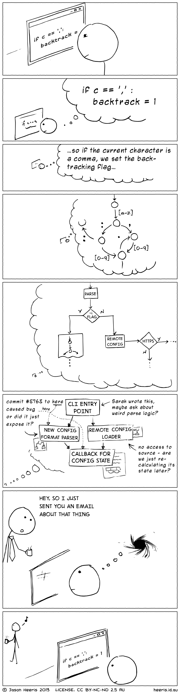

# interruption

- the code is one thing, the logic behind it is another

https://www.brightdevelopers.com/the-cost-of-interruption-for-software-developers/

<!-- the greatest "enemy" of a developer is interruption -->

## interruption

:::::: {.r-stack}
::: {.fragment .fade-out data-fragment-index=1}
{style="width: 375px; height: 555px; object-fit: cover; object-position: 100% 0;"}
:::
::: {.fragment .current-visible data-fragment-index=1}
{style="width: 375px; height: 410px; object-fit: cover; object-position: 100% -555px;"}
:::
::: {.fragment .current-visible data-fragment-index=2}
{style="width: 375px; height: 410px; object-fit: cover; object-position: 100% -965px;"}
:::
::::::

## the cost of interruption

:::::::::::: {.columns}
::::::::: {.column width="50%"}

:::::::::
::::::::: {.column width="50%"}
 used with the author's permission](figures/borrowed/quick_call.jpg){width=350}

:::::::::
::::::::::::

# continuous integration

## build script

example: [build script](https://github.com/pintergreg/software-engineering/blob/main/.github/workflows/main.yaml){target="_blank"} of the course website

# continuous deployment

# versioning

- a software is identified by a version number

## semantic versioning

:::::::::::: {.columns .column-gaplexss}
::::::::: {.column width="50%"}
{width=500}

:::::::::
::::::::: {.column width="50%" .text-medium .mt-3}
- **alpha**: incomplete feature-wise, external release is uncommon for proprietary software
    - whitebox testing

- **beta**: the software is feature-complete but contains several known or unknown bugs
    - blackbox testing

- **rc**: release candidate, final touches
    - highest level testing
:::::::::
::::::::::::

::: {.mt-1}
1. **major** version when you make incompatible [API]{.tooltip title="application programming interface"} changes
    - [a way of communicating changes]{.text-smaller}
2. **minor** version when you add functionality in a backward compatible manner
3. **patch** version when you make backward compatible bug fixes

::: {.text-smaller}
additional labels for pre-release and build metadata are available as extensions to the `major.minor.patch` format | from [semver.org](https://semver.org)
:::
:::

::: notes
optional reading: [Why I don't like SemVer anymore](https://snarky.ca/why-i-dont-like-semver/)
:::

## calendar versioning

:::::::::::: {.columns}
::::::::: {.column width="50%"}
{width=450}

:::::::::
::::::::: {.column width="50%" .mt-4}
format examples:

- YYYY.MINOR.PATCH
    - [micro is used instead of patch]{.text-smaller}
- YYYY.MM.MINOR.PATCH
:::::::::
::::::::::::

"*CalVer* is a versioning convention based on your project's release calendar, instead of arbitrary numbers." | [calver.org](https://calver.org)

## ZeroVer: 0-based versioning

"Your software's major version should never exceed the first and most important number in computing: zero." | [0ver.org](https://0ver.org)

- e.g.: **0.4.1**
- popular among open source software projects
    - [some may reach 1.0.0 eventually]{.text-smaller}

::: {.text-smaller .mt-2}
[[semver]{.tooltip title="semantic versioning"}](https://semver.org): "If your software is being used in production, it should probably already be 1.0.0." 
:::

## Fibonacci releases

| version | type           | release date   | delta |
|:-------:|----------------|----------------|------:|
| 6.1.0   | Release        | Tue 2024-06-18 | 0     |
| 6.1.1   | Bugfix Release | Tue 2024-06-25 | 1     |
| 6.1.2   | Bugfix Release | Tue 2024-07-02 | 1     |
| 6.1.3   | Bugfix Release | Tue 2024-07-16 | 2     |
| 6.1.4   | Bugfix Release | Tue 2024-08-06 | 3     |
| 6.1.5   | Bugfix Release | Tue 2024-09-10 | 5     |

table: KDE / Plasma 6.1 series [release schedule](https://community.kde.org/Schedules/Plasma_6)

# references

::: {#refs}
:::
