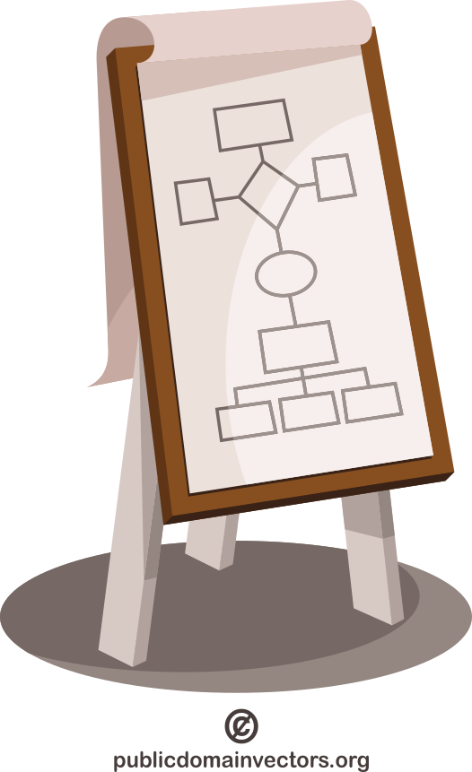

# the project

An event organizer company entrusts your software development company to create a drone show choreography designer software.
They have just bought 256 drones and they want to be able to do smaller-scale drone shows on parties, birthdays and weddings.

The software should be able to manage the position of every drone in a given space in respect of the time.
Every drone is capable of switch on RGB LEDs with a given light intensity.
The software should be able to manage not just the position, but the state (light) of the drone.

The software generates a trajectory for every drone that it will follow.

Your task is to design this software.

## drone show example

[Dragon Boat Show with 1500 drones in Shenzhen, China](https://www.youtube.com/watch?v=3G1KBu6H6BM)

# contents

- introduction
    - what the software is -- practically the project assignment
    - team members -- students working on the assignment
- stakeholder identification
- methodology
- detailed requirements
    - functional requirements
    - non-functional requirements
- diagrams and models
- prioritization of requirements
- constraints and assumptions
- acceptance criteria
- appendices
- version history and approvals

## diagrams

:::::::::::: {.columns}
::::::::: {.column width="70%"}
- user stories
    - user story maps
    - with BDD-style acceptance criteria
- flowcharts
- first 3 level of C4
- also static and dynamic models of the software
    - UML
- UI mockups

:::::::::
::::::::: {.column width="30%"}
{height=300}

:::::::::
::::::::::::

## diagrams details

- create a user story map in details for one role's set of features
    - for example the choreography design
- you don't have to detail every single role
    - but give an overview of the system
    - illustrate the every roles and the connections between them

> overview first, zoom and filter, then details on demand
>
> -- Ben Shneiderman

    
## work in agile methodology

:::::::::::: {.columns}
::::::::: {.column width="65%"}
- imagine how you would use a software like this
    - what functions would you need
- identify dependencies between the functions / modules
- plan sprints with usable increments
- deadline: **3 December 2024** (week 13)
    - when the team also presents the design as a presentation
- practical classes are workshops
    - possible feedback from the instructor
- **NO CODING**

:::::::::
::::::::: {.column width="35%"}

:::::::::
::::::::::::

# suggested software for

- the document: [Google Docs](https://docs.google.com/docs)
- user story map: [Google Drawings](https://docs.google.com/drawings)
- flowchart: [Google Drawings](https://docs.google.com/drawings)
- team management: [Trello](https://trello.com/)
- UML: [draw.io](https://app.diagrams.net/)
- C4: [Google Drawings](https://docs.google.com/drawings)
    - [create C4 diagrams in draw.io](https://www.drawio.com/blog/c4-modelling)

# submission

- you have to submit the main design document
- you may indicate who was responsible for each part
- including every diagram
    - please keep every version of the diagrams and attach them to the submission
        - I would like to see the evolution of your design
- and the presentation

you should the submit these by 3 December 2024 via Moodle,
when you also present your work

# presentation

- the presentation should contain the purpose of the software
    - practically the project assignment
    - but with your interpretation
- team members
    - maybe with responsibilities
- the introduction of your design
    - from high level to the low level (according to C4)
    - describe the overall design
    - focusing on the interactions between your components
    - detail at least one of the component to the class level
    - attach UI mockups

    
## presentation

- you may separate the presentation by target audience
    - for the customer almost as if you wanted "sell" the software and introduce it from the user's perspective
        - C4 system context, use case, user story flows with UI mockups and explanation
    - and a more technical part focusing on the internal structures
        - zoom into the system as C4 modelling propagates
        - detail the interfaces and the environments where a software will operate
