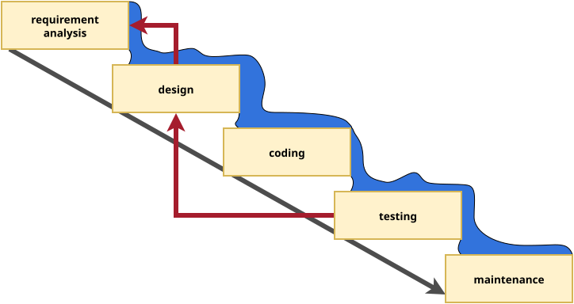

# evolution of software life cycle models (incomplete)

:::::::::::: {.columns}
::::::::: {.column width="50%"}
- software life cycle models 
    - waterfall
        - improved waterfall
    - V model
    - iterative
    - agile
- regarding to change management

:::::::::
::::::::: {.column width="50%"}
:::::: {.r-stack}
{width=500}
::::::
:::::::::
::::::::::::

## waterfall model

:::::::::::: {.columns}
::::::::: {.column width="50%"}
- sequential, rigid model
    - (originally) not possible to step back to a previous phase
- testing is after the implementation, errors are found late in the process
- not possible to make changes during the development
- could take years

:::::::::
::::::::: {.column width="50%"}
:::::: {.r-stack}
{width=500}

{width=500 .fragment}
::::::
:::::::::
::::::::::::

## V model

:::::::::::: {.columns}
::::::::: {.column width="50%"}
- still rigid
- each phase has output and a review process
    - errors are found at early stage
    - decreases the risk of failure
- large to small: testing is done in a hierarchical perspective

:::::::::
::::::::: {.column width="50%"}
:::::: {.r-stack}
{width=500}
::::::
:::::::::
::::::::::::

## iterative model

:::::::::::: {.columns}
::::::::: {.column width="50%"}
- software is built incrementally,
    - with each iteration adding new features or refining existing ones
- possible to get feedback after each iteration
- can be rigid within an iteration

:::::::::
::::::::: {.column width="50%"}
:::::: {.r-stack}
{width=500}
::::::
:::::::::
::::::::::::

## agile model

:::::::::::: {.columns}
::::::::: {.column width="50%"}
- continuous collaboration and fast response to change, while the iterative model takes a more gradual approach, building up the final product over multiple iterations
- scrum is an agile methodology

:::::::::
::::::::: {.column width="50%"}
:::::: {.r-stack}
{width=500}
::::::
:::::::::
::::::::::::

# scrum team

- optimally 3 to 9 people
- cross-functional
- self-organizing

## roles

- scrum master
    - responsible establishing scrum as defined in [the Scrum Guide](/software-engineering/slides/02_scrum.html)
        - by helping everyone understand the theory and practice, both within the scrum team and the organization
    - responsible for the scrum team's effectiveness
- product owner
    - responsible for maximizing the value of the product resulting from the work of the scrum team
    - also responsible for effective product backlog management
- developers

# sprint planning

- initiates the sprint
- maximum of eight hours for a one-month sprint
- define a sprint goal
    - definition of done
- it is up to the developers how to turn product backlog items into increments

{height=300}

# sprint

- 1-4 week long
- considered a short project
- turns backlog items into increments
- includes daily scrum

{height=300}

# sprint review

- scrum team presents the their work to the stakeholders
    - increment is evaluated
- the attendees collaborate on what to do next
- maximum of four hours for a one-month sprint 

{height=300}

# sprint retrospective

- concludes the sprint
- maximum of three hours for a one-month sprint
- the scrum team discusses what went well/bad, what problems encountered

{height=300}

# kanban

:::::::::::: {.columns}
::::::::: {.column width="60%"}
- uses a visual workflow
- pull-based system
    - no task in the workflow without request
- uses columns for states of the product
- defines conditions when to move a task between columns
- conditions flow
    - no iterations (sprints)
    - no roles
- encourages to improve the workflow

:::::::::
::::::::: {.column width="40%"}

:::::::::
::::::::::::
