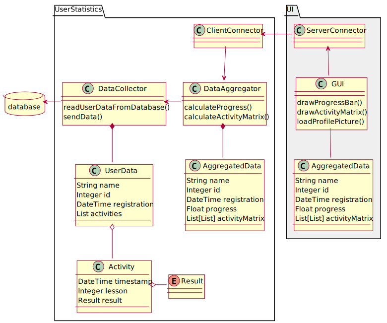

# what is the issue with UML?

:::::::::::: {.columns}
::::::::: {.column width="60%" .mt-4}
- closely connected with OOP
- propagates object-oriented modelling
    - however the design should not consider the implementation

:::::::::
::::::::: {.column width="40%"}
{width=300}

:::::::::
::::::::::::

    
# C4 model

> overview first, zoom and filter, then details on demand
>
> -- Ben Shneiderman

- hierarchical set of software architecture diagrams
    - different levels of abstraction for different audience
- has four levels:
    - context, containers, components and code
- popularized by Simon Brown

::: {.text-smaller .mt-2}
this chapter is based on [c4model.com](https://c4model.com/)
:::

## level 1: system context diagram

:::::::::::: {.columns}
::::::::: {.column width="60%" .mt-2}
- shows how the software fits into the world
  - [who use it]{.text-smaller}
  - [what other software does it interacts]{.text-smaller}
- high diagram
  - [technologies, protocols and other low-level details are not important]{.text-smaller}
- similar to use case diagram
- understandable for non-technical people

:::::::::
::::::::: {.column width="40%"}
{width=400}

::: {.text-smaller}
other possible users:

administrator, course planner
:::
:::::::::
::::::::::::

## level 2: container diagram

:::::::::::: {.columns .column-gapless}
::::::::: {.column width="50%"}
- zooms into the software system
- shows the containers that make up that software system
  - [applications, data stores, microservices, etc.]{.text-smaller}
- technology decisions are also a key part of this diagram
  - [what database management system to use, e.g., PostgreSQL]{.text-smaller}
  - [what e-mail service to use, e.g., Mailchimp]{.text-smaller}
  - [what language to use]{.text-smaller}
  - [what UI framework to use]{.text-smaller}

:::::::::
::::::::: {.column width="50%"}
{width=400}
:::::::::
::::::::::::

## level 3: component diagram

:::::::::::: {.columns}
::::::::: {.column width="60%"}
- decomposition of each container to identify the major structural building blocks and their interactions
- shows how a container is made up of a number of "components" 
  - what these components are, 
  - what they are responsibilities for, and
  - what also shows technology / implementation details
- roughly equivalent with the UML component diagram

:::::::::
::::::::: {.column width="40%"}
{width=400}

:::::::::
::::::::::::

## level 4: code

:::::::::::: {.columns}
::::::::: {.column width="60%"}
- optional level of detail 
- ideally this diagram would be automatically generated
- if you really want or need to, you can zoom into an individual component
  - but show only those attributes and methods that really needed for the storytelling
- UML class diagram can be used

:::::::::
::::::::: {.column width="40%"}
{width=400}

:::::::::
::::::::::::

# references

::: {#refs}
:::
