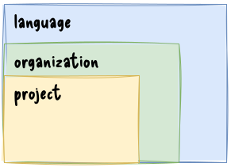

# wireframing

:::::::::::: {.columns .column-gapless}
::::::::: {.column width="65" .mt-2}
- responsibility of the UI/UX designers
- occurs during the exploratory design phase
    - experimenting
- iterative process
- iterations are presented to the stakeholders to gain feedback
- some professional tools: [Figma](https://www.figma.com/), [Balsamiq](https://balsamiq.com/), [Sketch](https://www.sketch.com/)
  - [any drawing/diagramming tool can be used for the low or mid fidelity wireframes]{.text-smaller}
:::::::::
::::::::: {.column width="35%"}
![Interaction Design Foundation [@ixdf2019what] | [CC BY-SA 4.0](https://creativecommons.org/licenses/by-sa/4.0/)](figures/borrowed/td-design-thinking-non-linear-process.webp){width=300}

:::::::::
::::::::::::

::: {.text-smaller}
based on: [@bruton2022what]
:::

## wireframe

:::::::::::: {.columns}
::::::::: {.column width="70" .mt-2}
- a wireframe is an outline / blueprint / concept art of a webpage or application
- can be hand drawn on paper or built out digitally
- provides visual understanding of page structure, layout, user flow, functionality and intended behaviours
- presented to stakeholders before the interface is coded

::: {.text-smaller}
source: [@bruton2022what]
:::
:::::::::
::::::::: {.column width="30%"}
{width=250}
:::::::::
::::::::::::

## types of wireframes

:::::::::::: {.columns}
::::::::: {.column width="33"}
{width=250}
:::::::::
::::::::: {.column width="33"}
{width=250}
:::::::::
::::::::: {.column width="33"}
{width=250}
:::::::::
::::::::::::

## wireframe map

{height=500}

::: {.text-smaller}
shows user flow, ~ user story map flow 
:::

# software design and architecture stack

![based on Khalil Stemmel's figure [@stemmler2019how]](figures/the_software_design_and_architecture_stack_generalized.drawio.svg){height=475}

## hierarchy in style guides

:::::::::::: {.columns}
::::::::: {.column width="55"}
- language level:
    - Python: [PEP 8](https://peps.python.org/pep-0008/) or [pep8.org](https://pep8.org/)
    - Ruby: [Ruby Style Guide](https://rubystyle.guide/)
    - Rust [The Rust Style Guide](https://doc.rust-lang.org/beta/style-guide/index.html)
    - etc.
- organization level:
    - [Google Style Guides](https://google.github.io/styleguide/)
        - [C# at Google Style Guide](https://google.github.io/styleguide/csharp-style.html)
        - [Google Python Style Guide](https://google.github.io/styleguide/pyguide.html)
        - [Google TypeScript Style Guide](https://google.github.io/styleguide/tsguide.html)

::: {.fragment}
not just style guides, also best practices
:::
:::::::::
::::::::: {.column width="45%"}
{width=300}

:::::::::
::::::::::::

## write idiomatic code

:::::::::::: {.columns .column-gapless}
::::::::: {.column width="70" .mt-1}
::: {.text-align-left}
- a prog. language implements a prog. paradigm
- a paradigm defines a certain "way" of writing code
    - using different abstractions / building blocks
    - promoting a given concept
:::
::: {.fragment .text-align-left}
- some languages implements multiple paradigms
:::
::: {.fragment .text-align-left}
- and languages have their own way of doing things
    - languages have pros and cons for a given problem
:::
:::::::::
::::::::: {.column width="30%"}
{width=250}

:::::::::
::::::::::::

::: {.fragment .mt-3}
just as in the case of natural languages, you ought to use a language properly
:::

# clean code / meaningful names [@martin2009clean]

:::::::::::: {.columns}
::::::::: {.column width="60%"}

- use intention-revealing names
- pick one word per concept
- avoid disinformation
- make meaningful distinctions
  - d[on't use names like `doSomething()` and `doSomething2()`]{.text-smaller}
- use pronounceable names
- use searchable names
  - ["The longer the scope of a function, the shorter its name should be." -- Robert C. Martin]{.text-smaller}
- avoid encodings
  - [`intNumberOfDays = 0`]{.text-smaller}
- don't pun or use humor, be professional

:::::::::
::::::::: {.column width="40%"}
{height=300}

:::::::::
::::::::::::

## names for classes, functions

:::::::::::: {.columns .mt-3}
::::::::: {.column width="50%"}
- a class is a model / blueprint of *something*
- the name should be a noun
    - e.g., `User`, `Activity`
- an object is an instance of a class
    - still a noun
    - e.g., `user = User()`
:::::::::
::::::::: {.column width="50%"}
- a function *does* something
- the name should contain a verb
    - in imperative
    - e.g., `aggregate_activity`
    - ~~`activity_aggregation`~~

:::::::::
::::::::::::

# clean code / functions [@martin2009clean]

:::::::::::: {.columns}
::::::::: {.column width="70%"}
- "Functions should hardly ever be 20 lines long" [@martin2009clean]
  - shorter functions are easier to understand
- do one thing (single responsibility principle)
- "The longer the scope of a function, the shorter its name should be." -- Robert C. Martin
- do not use more than three arguments
- do not use flags
- no side effects
- prefer exceptions to returning error codes
:::::::::
::::::::: {.column width="30%"}
{height=300}

:::::::::
::::::::::::

# clean code / comments [@martin2009clean]

:::::::::::: {.columns .column-gapless}
::::::::: {.column width="60%"}
**avoid**

- journal comments
- noise comments
- writing something that is already in the code
- closing brace comments
- separating comments

**however, comments can be used if they help to understand the code**

- legal comments (licence information)
- informative comments, that explain what is happening
- documentation
:::::::::
::::::::: {.column width="40%"}
](figures/borrowed/geek_and_poke/good_comments.jpg){width=375}

:::::::::
::::::::::::

# references

::: {#refs}
:::
