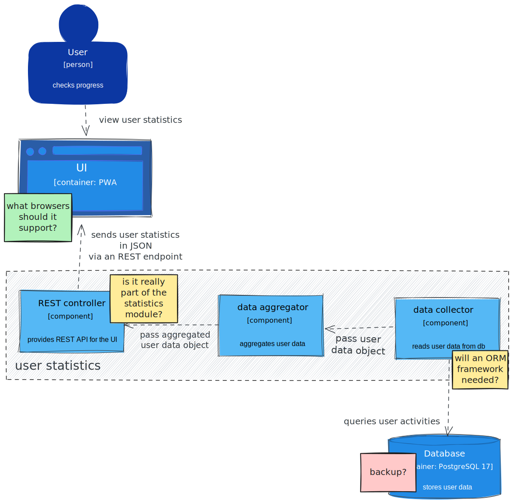

# V model [@forsberg1991relationship]

:::::::::::: {.columns}
::::::::: {.column width="50%" .mt-3}
- each phase has output and a _review process_
    - errors are found at early stage
    - decreases the risk of failure
- testing is done in a hierarchical perspective

:::::::::
::::::::: {.column width="50%"}
:::::: {.r-stack}
](figures/v_model.drawio.svg){width=500}
::::::
:::::::::
::::::::::::


## requirement analysis review

:::::::::::: {.columns}
::::::::: {.column width="40%"}
{width=400}

::: {.text-smaller .mt-3}
- can be discussed / reviewed
- even with a customer representative

:::
:::::::::
::::::::: {.column width="15%" .mt-5}
{width=100}

:::::::::
::::::::: {.column width="45%"}
{width=400}

:::::::::
::::::::::::


## architecture review

:::::::::::: {.columns}
::::::::: {.column width="40%"}
{width=400}

:::::::::
::::::::: {.column width="15%" .mt-5}
{width=100}

:::::::::
::::::::: {.column width="40%"}
{width=400}

:::::::::
::::::::::::


## code review

:::::::::::: {.columns}
::::::::: {.column width="50%"}
```python
def query_progress(user_id:int) -> float:
    # establish connection
    con= sqlite3.connect("data.db")
    # build query
    progress_query = f"""
    SELECT
        lesson / 50.0 AS progress
    FROM activity
    WHERE
        user_id = {user_id} AND
        result = 'success'
    ORDER BY
        lesson DESC
    LIMIT 1
    ;
    """
    # execute query
    res =con.execute(progress_query)
    progress=res.fetchone()[0]
    return progress
```

:::::::::
::::::::: {.column width="50%" .mt-4}
- does not respect style guide
- does 3 things
    - establish DB connection
    - build query
    - execute query
- contains separation comments
- hard coded divisor
    - magic number
:::::::::
::::::::::::


##

::: {.r-fit-text}
every work product can and _should_ be reviewed
:::


# review types by formality

|type       |formality     |led by                           |effort  |documentation                           |
|:---------:|:------------:|:-------------------------------:|:------:|:--------------------------------------:|
|informal   |not formal    |noone                            |minimal |undocumented                            |
|walkthrough|not formal[^1]|authors                          |very low|normal, fault-finding                   |
|technical  |less formal   |trained moderator, not the author|moderate|more detailed                           |
|inspection |most formal   |trained moderator                |high    |thorough; based on standards, checklists|


[^1]:
Sometimes it can be somewhat formal.


# review -- author's perspective

- be humble
    - mind that everybody's code can be improved
    - you are not perfect, accept that you will make mistakes
- open to feedback
- you are not your code
- the goal is to deliver higher quality code, not about arguing who was right
    - you and the reviewer are in the same side
- you and the reviewer are not only talking about the code,
    - you are exchanging best practices and experiences
- you can learn from the review

::: {.text-smaller}
source: [Code Review Guidelines for Humans](https://phauer.com/2018/code-review-guidelines/) [@hauer2018code]
:::


# review -- reviewer's perspective

- use I-messages
- talk about the code, not the coder
- ask questions instead of making statements
- refer to the behavior, not the traits of the author
- accept that there are different solutions
- respect and trust the author
- mind the OIR-rule of giving feedback
    - [observation, impact, request]{.text-smaller}
- before giving feedback, ask yourself:
    - [is it true? (opinion != truth)]{.text-smaller}
    - [is it necessary? (avoid nagging, focus on the current work product)]{.text-smaller}
    - [is it kind? (no shaming)]{.text-smaller}
- be humble; you are not perfect and you can also improve
- it's fine to say: Everything is good!
- don't forget to praise

::: {.text-smaller}
source: [Code Review Guidelines for Humans](https://phauer.com/2018/code-review-guidelines/) [@hauer2018code]
:::


# references

::: {#refs}
:::


<!--:::::::::::: {.columns}
::::::::: {.column width="50%" }

:::::::::
::::::::: {.column width="50%"}

:::::::::
::::::::::::-->
