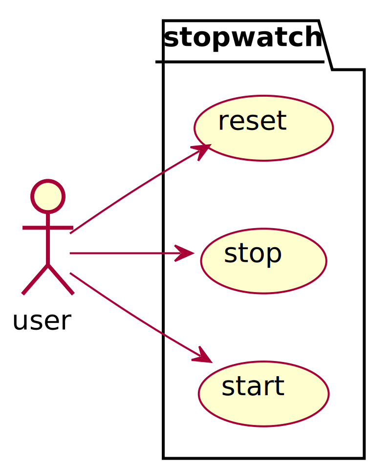

# user story -- stopwatch

:::::::::::: {.columns .mt-4}
::::::::: {.column width="70%"}
> Develop a stopwatch application, that can measure the elapsed time.
> The measurement can be started and stopped.
> After the measurement stopped, value should be displayed until it is explicitly reseted to zero.
> It should have two buttons, one for starting and stopping the measurement and one for resetting the value.

:::::::::
::::::::: {.column width="30%"}
{width=300}
:::::::::
::::::::::::

::: notes
A stopwatch application will be the example for this lecture.
The task is to develop a stopwatch application the can measure the elapsed time.
The measurement can be started and stopped.
After the measurement stopped, value should be displayed until it is explicitly reseted to zero.
It should have two buttons, one for starting and stopping the measurement and one for resetting the value.
:::

## user story excerpt -- stopwatch

:::::::::::: {.columns .mt-4}
::::::::: {.column width="70%"}
- measures time
- the measurement can be 
    - started
    - stopped
    - reseted
- has two buttons
:::::::::
::::::::: {.column width="30%"}
{width=300}
:::::::::
::::::::::::

# use case

{width=400}
