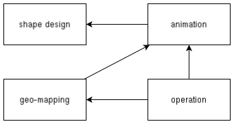
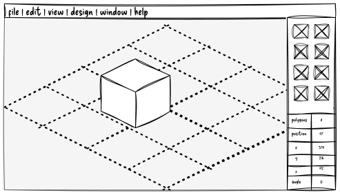
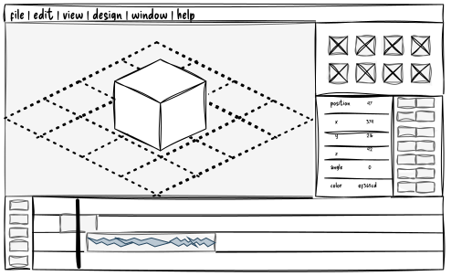
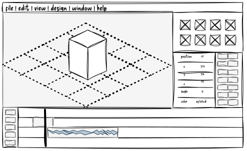
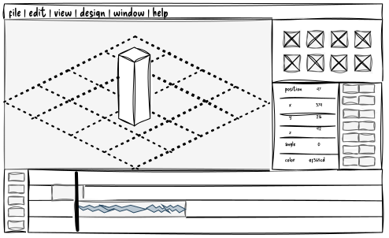
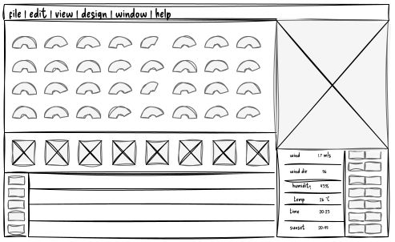
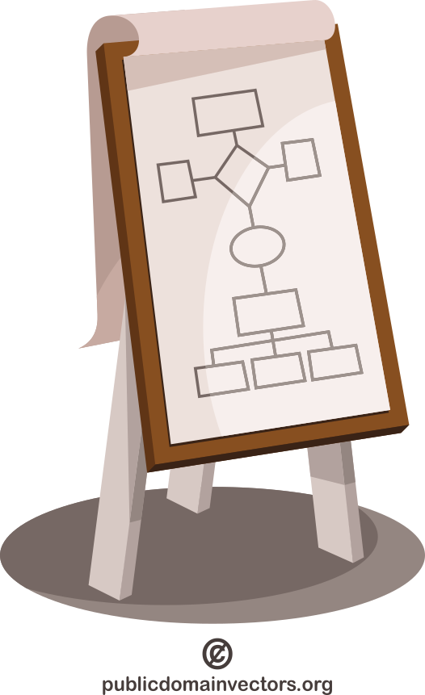

# the project

An event organizer company entrusts your software development company to create a choreography designer software for drone shows.
They have just bought 768 drones and they want to be able to do smaller-scale drone shows on parties, birthdays, and weddings.

The software should be able to manage the position of every drone in a given space in respect of the time.
Every drone is capable of switch on RGB LEDs with a given light intensity.
The software should be able to manage not just the position, but the state (light) of the drone.

The software generates a trajectory for every drone that it will follow.

Your task is to design this software.

## drone show example

:::::::::::: {.columns}
::::::::: {.column width="60%"}
](../lectures/figures/borrowed/wikipedia/drone_show_at_sydney_2023.jpg)

:::::::::
::::::::: {.column width="40%" .text-smaller .mt-3}

example

: [Dragon Boat Show with 1500 drones in Shenzhen, China](https://www.youtube.com/watch?v=3G1KBu6H6BM){target="_blank"}

background

: [How Drone Shows Work](https://www.youtube.com/watch?v=7fKfBb7x9WQ) by Julius Moorman

:::::::::
::::::::::::

## choreography design in focus

:::::::::::: {.columns}
::::::::: {.column width="60%" .mt-3}
- the client company wants to design and operate the show
- the software has to focus on the choreography design
    - not the software running on the drone
- you can assume there's a software (SDK) from the drone manufacturer
    - which deals with the hardware
    - it is an external "component" of the software system

:::::::::
::::::::: {.column width="40%"}

:::::::::
::::::::::::

## architecture sketch

{width=700}

::: {.text-smaller}
There are some dependency between the modules. For example, the _shape design_ produces reusable shapes, so the _animation_ depend on the a _shape design_. 
:::

## shape design

:::::::::::: {.columns}
::::::::: {.column width="70%"}
- responsible for creating models/shapes/objects
   - saving, loading, modifying
- 3D sculpting 
- the exported model is used by the animation component

DEMO: [Nomad Sculpt](https://nomadsculpt.com/demo/){target="_blank"} -- a web-based sculpting and painting application

:::::::::
::::::::: {.column width="30%"}

:::::::::
::::::::::::

## animation

- responsible for animating premade models
    - in a 3D space and time
- handles a timeline, which consist of frames
- each frame holds some models in a position, orientation, color
- allows modifications of a model
- computes transformations between frames
<!-- - video editor demo: [VidStudio](https://vidstudio.app/video-editor) -->

2D DEMO: [Motionity](https://www.motionity.app/){target="_blank"} -- a web-based motion graphics editor

:::::::::::: {.columns .mt-2 .column-gapless}
::::::::: {.column width="33%"}
{.m-0}
:::::::::
::::::::: {.column width="33%"}
{.m-0}
:::::::::
::::::::: {.column width="33%"}
{.m-0}

:::::::::
::::::::::::

[animation GUI mockup]{.text-smaller}

## geo-mapping

- responsible for determining the location of the drone show
- using GPS coordinates
- saving/loading/editing area description files
- mapping the animation trajectory to real world (GPS) coordinates
- DEMO: [geojson.io](https://geojson.io/?map=15.43/47.52645/19.04699)

::: {.mt-1}
](../lectures/figures/choreographer/geojson_io.png){height=300}

:::

## operation

:::::::::::: {.columns}
::::::::: {.column width="60%"}
- responsible for starting / stopping the show
- monitoring the drones during the show
- check the status of the drones / environment
- makes it possible to preview the show
- initiate uploading trajectories
    - show choreography
- download telemetry from the drones

:::::::::
::::::::: {.column width="40%"}

:::::::::
::::::::::::

# contents -- outline

- introduction
    - what the software is -- practically the project assignment
    - team members -- students working on the assignment
- stakeholder identification
- methodology
- detailed requirements
    - functional requirements
    - non-functional requirements
- diagrams and models
- prioritization of requirements
- constraints and assumptions
- acceptance criteria
- appendices
- version history and approvals

## diagrams

:::::::::::: {.columns}
::::::::: {.column width="70%"}
- user stories
    - user story maps
<!--     - with BDD-style acceptance criteria -->
- flowcharts
- first 3 level of C4
<!--- also static and dynamic models of the software
    - 4th level / UML-->
- UI mockups

:::::::::
::::::::: {.column width="30%"}
{height=300}

:::::::::
::::::::::::

## diagrams details

> overview first, zoom and filter, then details on demand
>
> -- Ben Shneiderman

::: {.mt-2}
- create a **user story map** in details for one role's set of features
    - for example the choreography design
- you don't have to detail every single role
    - but give an overview of the system
    - illustrate the every roles and the connections between them

:::

    
## work in agile methodology

:::::::::::: {.columns}
::::::::: {.column width="70%"}
- imagine how you would use a software like this
    - what functions would you need
- identify dependencies between the features / modules
- plan sprints with usable increments
- deadline: **2 December 2026** (week 12)
    - when the team also presents the work as a presentation (10 minutes)
- practical classes are workshops
    - main source of feedback from the instructor
- NO CODING

:::::::::
::::::::: {.column width="30%"}

:::::::::
::::::::::::

# suggested software for

:::::::::::: {.columns}
::::::::: {.column width="70%"}
- the document: [Google Docs](https://docs.google.com/docs)
- user story map:
    1. [excalidraw](https://excalidraw.com/)
    2. [Google Drawings](https://docs.google.com/drawings)
    3. [user story map template for Google Sheets](https://www.avion.io/blog/user-story-mapping-template/)
    4. [draw.io](https://app.diagrams.net/)
- flowchart: [Google Drawings](https://docs.google.com/drawings), [draw.io](https://app.diagrams.net/)
- C4: 
    1. [excalidraw](https://excalidraw.com/) with a [C4 plugin](https://libraries.excalidraw.com/?target=_excalidraw&referrer=https://excalidraw.com/&useHash=true&token=3a8D0OOR3Rbh7B5J_pkNT&theme=light&version=2#dmitry-burnyshev-c4-architecture)
    2. [Google Drawings](https://docs.google.com/drawings)
    3. [create C4 diagrams in draw.io](https://www.drawio.com/blog/c4-modelling)
- UML: [excalidraw](https://excalidraw.com/), [draw.io](https://app.diagrams.net/), [PlantUML](https://plantuml.com/)
<!-- - team management: [Trello](https://trello.com/) -->

::: {.text-smaller}
excalidraw has excelent shared work functionality
:::

:::::::::
::::::::: {.column width="30%" .exclude}

:::::::::
:::::::::::: 

    
# submission

:::::::::::: {.columns}
::::::::: {.column width="70%"}
- you have to submit the main design document
- you may indicate who was responsible for each part
- including every diagram
    - please keep every version of the diagrams and attach them to the submission as I would like to see the evolution of your design
- and the presentation

you have to submit these (zipped)
by 2 December 2026 via Moodle, when you also present your work

it is enough to upload it by one person from each team

:::::::::
::::::::: {.column width="30%" .exclude}

:::::::::
:::::::::::: 

# presentation

:::::::::::: {.columns}
::::::::: {.column width="70%"}
- the presentation should contain the purpose of the software component
    - based on the project assignment
    - but with your interpretation
- team members
    - with responsibilities
- the introduction of your design
    - from high level to the low level (according to C4)
    - describe the overall design
    - highlight on the interactions / interfaces between the components
<!--     - detail at least one of the component to the class level -->
    - attach UI mockups when necessary

:::::::::
::::::::: {.column width="30%" .exclude}

:::::::::
:::::::::::: 
    
## presentation

- you may separate the presentation by target audience
    - for the customer almost as if you wanted "sell" the software and introduce it from the user's perspective
        - C4 system context, use case, user story flows with UI mockups and explanation
    - and a more technical part focusing on the internal structures
        - zoom into the system as C4 modelling propagates
        - detail the interfaces and the environments where a software will operate
