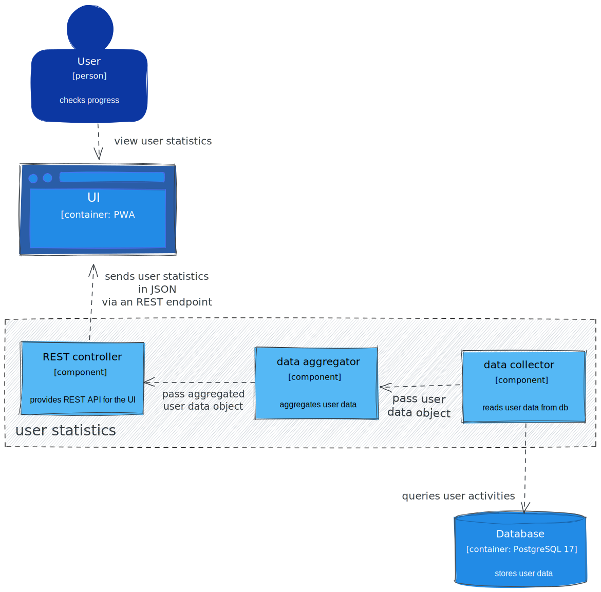

# flashcard application requirements

- Android and iOS (tablets should be supported)
    - at least 5 years old devices should be supported
- offline app, no subscription plans, one-time payment via the store
- how the words are groupped
    - by chapters of the textbook
- the customer provides a wordlist (with meaning) for each chapter
    - in Excel format (xlsx)
- user will not be able to add new words
- there is only one interface language
    - the majority language of the country

## requirements part 2

- logo of the language association should appear on the main screen
- GUI customization: light/dark theme, font size settings
- a learning mode is required, which just goes through the words of a chapter
- and a practicing mode, which selects words randomly from every group
    - words with more left-swipe should appear more frequent
    - if a word was swiped left, three right swipes needed to consider it learnt
- users should be able to check the statistics
    - progress bar (learnt words / total)
    - which days they learned in the last month, how many cards they've learnt

## simple, offline architecture

# Level 1: System Context diagram

:::::::::::: {.columns}
::::::::: {.column width="70%"}

- high level relation with other systems or users
- similar to use case diagram
- technologies, protocols and other low-level details are not important
- understandable for non-technical people

::: {.wide-quote .mt-2}
> Shows the software system you are building and how it fits into the world in terms of the people who use it and the other software systems it interacts with.
>
>  Simon Brown - [The C4 Model for Software Architecture](https://www.infoq.com/articles/C4-architecture-model/)

:::
:::::::::
::::::::: {.column width="30%"}
](c4/system_context.excalidraw.svg)

:::::::::
::::::::::::

# Level 2: Container diagram

- a container is an application or a data store
    - [e.g., a server-side web application, a desktop application, a mobile app]{.text-smaller}
- shows the high-level shape of the software architecture and how responsibilities are distributed across it
    - also shows the major technology choices
    - and how the containers communicate with one another (interfaces)
- simple, high-level technology focused diagram that is useful for software developers and support/operations staff alike

::: {.wide-quote .mt-2}
> Zooms into the software system, and shows the containers (applications, data stores, microservices, etc.) that make up that software system. Technology decisions are also a key part of this diagram.
>
>  Simon Brown - [The C4 Model for Software Architecture](https://www.infoq.com/articles/C4-architecture-model/)

:::

## container diagram of the flashcard application

:::::::::::: {.columns}
::::::::: {.column width="35%"}
{height=375}

:::::::::
::::::::: {.column width="65%" .fragment}
{height=425}
:::::::::
::::::::::::

[open in Excalidraw](https://excalidraw.com/#json=mE5CzLnnozx6w-Pjm36Pr,70ja8EODQBrBVSNrggSnAw)

# Level 3: Component diagram

- shows the major structural building blocks of the application (with interfaces)
- roughly like the UML component diagram
    - but the concept of a component is more relaxed
    - as the implementation is not necessarily OO
- basically the actual blueprint of the software
- focus on this level in the project assigment

::: {.wide-quote .mt-2}
> Zooms into an individual container to show the components inside it. These components should map to real abstractions (e.g., a grouping of code) in your codebase.
>
>  Simon Brown - [The C4 Model for Software Architecture](https://www.infoq.com/articles/C4-architecture-model/)

:::

## component diagram for statistics module

:::::::::::: {.columns}
::::::::: {.column width="60%"}
{width=400 preview-image="../lectures/figures/user_statistics/c4_component.excalidraw.svg" preview-fit="contain"}

[open in Excalidraw](https://excalidraw.com/#json=R0T17732fAGdyAXSdkQO9,vF377cD9ucud_0AoSlF0ag)

:::::::::
::::::::: {.column width="40%"}
{width=300}

:::::::::
::::::::::::

# Level 4: Code

::: {.wide-quote}
> Finally, if you really want or need to, you can zoom into an individual component to show how that component is implemented.
>
>  Simon Brown - [The C4 Model for Software Architecture](https://www.infoq.com/articles/C4-architecture-model/)

:::

::: {.mt-3}
- this could be, for example, class diagram with UML
- we're skipping it (also not required for the project assignment)
:::

# customer wants to add telemetry {visibility="uncounted" background="#ebcb8b40"}

